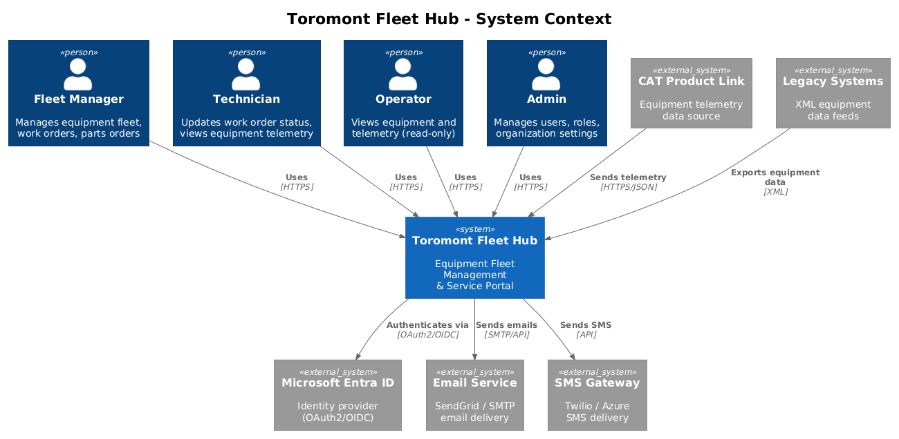
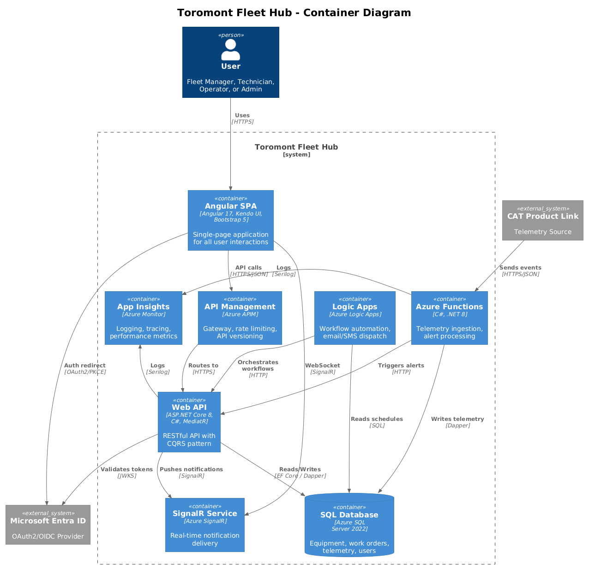
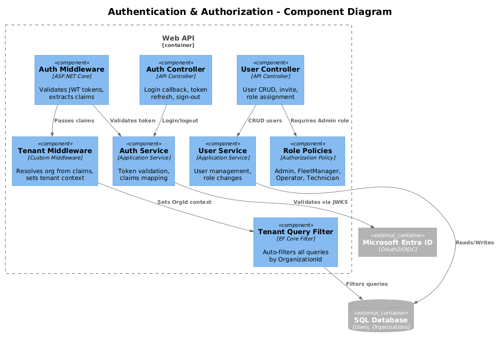
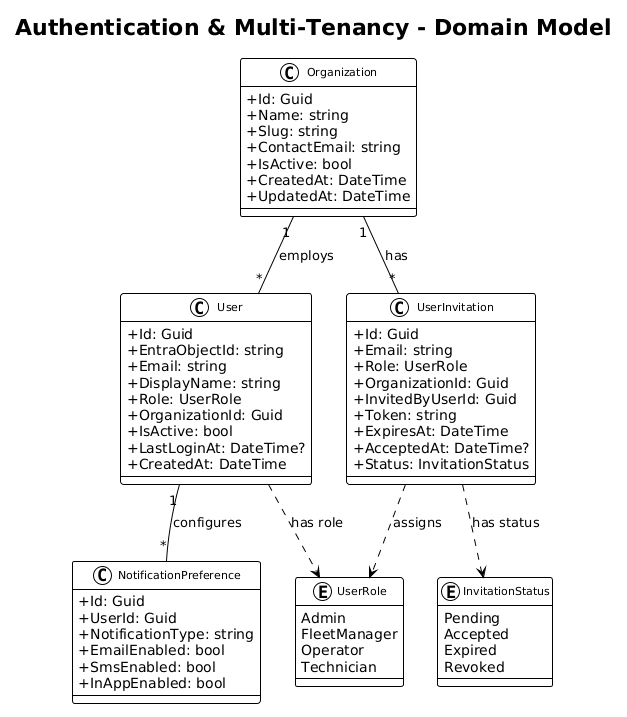
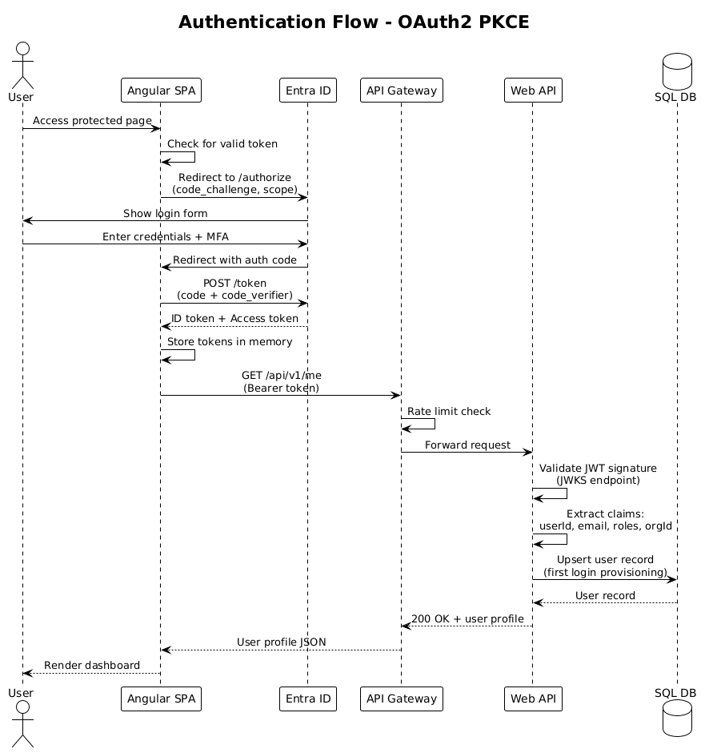

# Authentication & Multi-Tenancy — Detailed Design

## 1. Overview

This feature provides identity management, authentication, authorization, and multi-tenant data isolation for the Toromont Fleet Hub. All users authenticate via Microsoft Entra ID using OAuth2 Authorization Code flow with PKCE. The system enforces role-based access control (RBAC) with four roles and claims-based multi-tenant isolation ensuring complete data separation between customer organizations.

**Traces to:** L1-010, L1-007, L1-013 | **L2:** L2-017, L2-018, L2-023, L2-024, L2-029, L2-030

**Actors:** Admin, Fleet Manager, Operator, Technician

## 2. Architecture

### 2.1 C4 Context Diagram


### 2.2 C4 Container Diagram


### 2.3 C4 Component Diagram


## 3. Component Details

### 3.1 Angular Auth Module (`auth.module.ts`)
- **Responsibility**: Manages the client-side OAuth2 PKCE flow using `@azure/msal-angular`. Handles login redirects, token acquisition, silent token renewal, and sign-out.
- **Key Classes**:
  - `MsalGuard` — route guard redirecting unauthenticated users to Entra ID
  - `MsalInterceptor` — HTTP interceptor attaching Bearer tokens to API requests
  - `AuthStateService` — NgRx-backed service exposing current user, role, and org
- **Dependencies**: `@azure/msal-browser`, `@azure/msal-angular`, NgRx Store

### 3.2 Auth Middleware (`JwtBearerMiddleware`)
- **Responsibility**: Validates incoming JWT bearer tokens on every API request using Entra ID's JWKS endpoint. Extracts standard claims (sub, email, name) and custom claims (roles, organizationId).
- **Configuration**: `AddAuthentication().AddJwtBearer()` in `Program.cs` with `Authority` set to Entra ID tenant endpoint.
- **Token Validation**: Signature (RS256), issuer, audience, expiration, and required claims.

### 3.3 Tenant Context Middleware (`TenantContextMiddleware`)
- **Responsibility**: Runs after auth middleware. Extracts `organizationId` from JWT claims, resolves the Organization entity, and stores it in `ITenantContext` (scoped service) for the request lifetime.
- **Interface**: `ITenantContext { Guid OrganizationId; string OrganizationName; }`
- **Failure Behavior**: Returns 403 if the org claim is missing or the org is inactive.

### 3.4 EF Core Global Query Filter (`TenantQueryFilter`)
- **Responsibility**: Automatically appends `WHERE OrganizationId = @tenantId` to all EF Core queries on tenant-scoped entities (Equipment, WorkOrder, User, etc.).
- **Implementation**: `modelBuilder.Entity<Equipment>().HasQueryFilter(e => e.OrganizationId == _tenantContext.OrganizationId)`
- **Bypass**: Only the system-level background job context can bypass tenant filters using `IgnoreQueryFilters()`.

### 3.5 Authorization Policies (`RolePolicies`)
- **Responsibility**: Defines named authorization policies mapped to roles.
- **Policies**:
  - `RequireAdmin` — only Admin role
  - `RequireFleetManager` — Admin or Fleet Manager
  - `RequireWrite` — Admin, Fleet Manager, or Technician
  - `RequireRead` — any authenticated user
- **Usage**: `[Authorize(Policy = "RequireFleetManager")]` on controllers/actions

### 3.6 User Controller (`UsersController`)
- **Responsibility**: User CRUD operations and invitation management.
- **Endpoints**:
  - `GET /api/v1/users` — list org users (Admin only)
  - `GET /api/v1/users/{id}` — get user detail
  - `PUT /api/v1/users/{id}/role` — change role (Admin only)
  - `POST /api/v1/users/invite` — send invitation (Admin only)
  - `POST /api/v1/users/accept-invite` — accept invitation callback
- **Authorization**: All endpoints require Admin role except `accept-invite` (public with valid token).

### 3.7 Auth Service (`AuthService`)
- **Responsibility**: Handles first-login user provisioning. When a user authenticates for the first time, looks up their invitation, creates a User record linked to their Entra Object ID, and associates them with the correct Organization.
- **Dependencies**: `IUserRepository`, `IInvitationRepository`, `ITenantContext`

## 4. Data Model

### 4.1 Class Diagram


### 4.2 Entity Descriptions

| Entity | Table | Description |
|--------|-------|-------------|
| Organization | `Organizations` | Tenant root entity. All data is scoped to an organization. |
| User | `Users` | Linked to Entra ID via `EntraObjectId`. Belongs to one Organization. |
| UserInvitation | `UserInvitations` | Tracks pending invitations with expiry tokens. |
| NotificationPreference | `NotificationPreferences` | Per-user channel preferences for notification types. |

### 4.3 Key Database Indexes
- `IX_Users_EntraObjectId` (unique) — fast lookup during token validation
- `IX_Users_OrganizationId_Email` (unique) — prevent duplicate users per org
- `IX_UserInvitations_Token` (unique) — invitation acceptance lookup

## 5. Key Workflows

### 5.1 OAuth2 PKCE Authentication Flow


1. User accesses a protected route in the Angular SPA
2. `MsalGuard` detects no valid token and redirects to Entra ID `/authorize` with PKCE code challenge
3. User authenticates (credentials + MFA) on Entra ID
4. Entra ID redirects back with authorization code
5. SPA exchanges code for tokens via `/token` endpoint
6. SPA stores access token in memory (not localStorage — XSS mitigation)
7. Subsequent API calls include `Authorization: Bearer <token>` header
8. API validates JWT, extracts claims, provisions user on first login

### 5.2 User Invitation Flow
1. Admin submits invitation via `POST /api/v1/users/invite` with email and role
2. System generates a unique invitation token (crypto-random, 48 chars)
3. Invitation email sent via Logic App with link: `https://app/accept?token=xxx`
4. Invited user clicks link, authenticates via Entra ID
5. System matches Entra email to invitation, creates User record with assigned role
6. Invitation marked as Accepted

### 5.3 Multi-Tenant Data Access
1. Every API request passes through `TenantContextMiddleware`
2. `OrganizationId` extracted from JWT `org_id` custom claim
3. `ITenantContext` populated for the request scope
4. All EF Core queries automatically filtered by `OrganizationId` via global query filter
5. Direct ID access to cross-tenant resources returns 404 (not 403) to prevent information leakage (L2-018)

## 6. API Contracts

### POST /api/v1/users/invite
```json
// Request
{
  "email": "sarah@customer.com",
  "role": "FleetManager"
}

// Response 201
{
  "id": "guid",
  "email": "sarah@customer.com",
  "role": "FleetManager",
  "status": "Pending",
  "expiresAt": "2026-04-08T00:00:00Z"
}
```

### PUT /api/v1/users/{id}/role
```json
// Request
{ "role": "Technician" }

// Response 200
{
  "id": "guid",
  "email": "mike@customer.com",
  "role": "Technician",
  "updatedAt": "2026-04-01T10:30:00Z"
}
```

## 7. Security Considerations

- **Token Storage**: Access tokens stored in memory only, never localStorage/sessionStorage (XSS mitigation)
- **Token Refresh**: Silent refresh via hidden iframe before expiry
- **Session Timeout**: 30-minute sliding window; idle sessions force re-authentication (L2-023)
- **CSRF**: SPA-to-API communication uses Bearer tokens (not cookies), so CSRF is inherently mitigated for API calls
- **Rate Limiting**: Azure API Management enforces 100 req/min per IP (L2-030)
- **Security Headers**: `X-Content-Type-Options: nosniff`, `X-Frame-Options: DENY`, `Strict-Transport-Security`, `Content-Security-Policy` on all responses (L2-030)
- **Input Validation**: All user inputs validated server-side with FluentValidation (L2-029)
- **Information Leakage**: Cross-tenant access returns 404 not 403 (L2-018)

## 8. Open Questions

1. Should we support multiple organizations per user (e.g., consultants working across clients)?
2. What is the invitation token expiry period — 7 days or 30 days?
3. Should deactivated users have their tokens immediately revoked, or wait for natural expiry?
