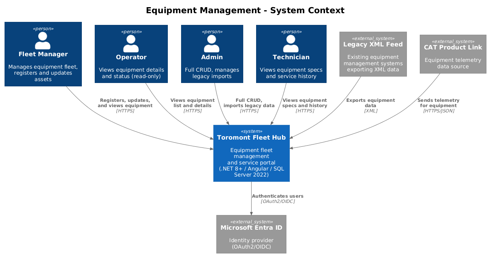
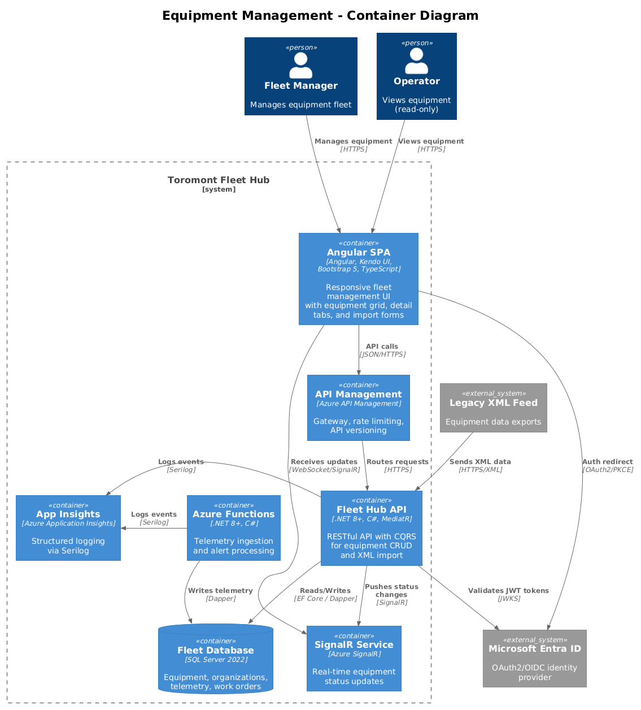
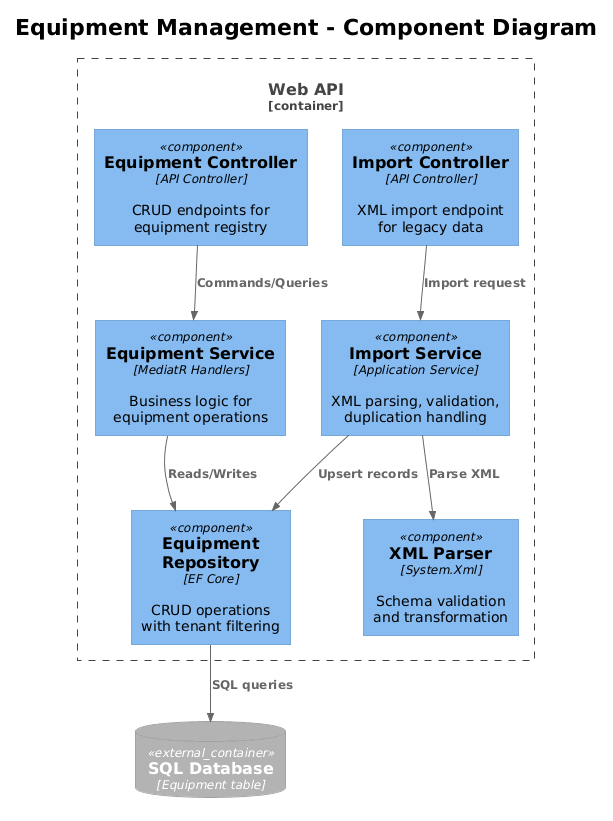
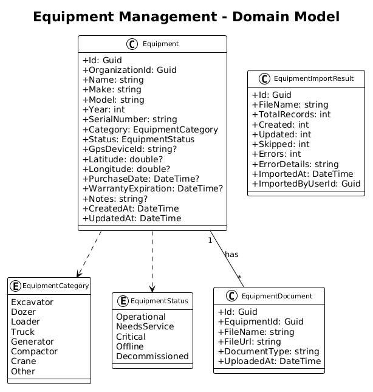
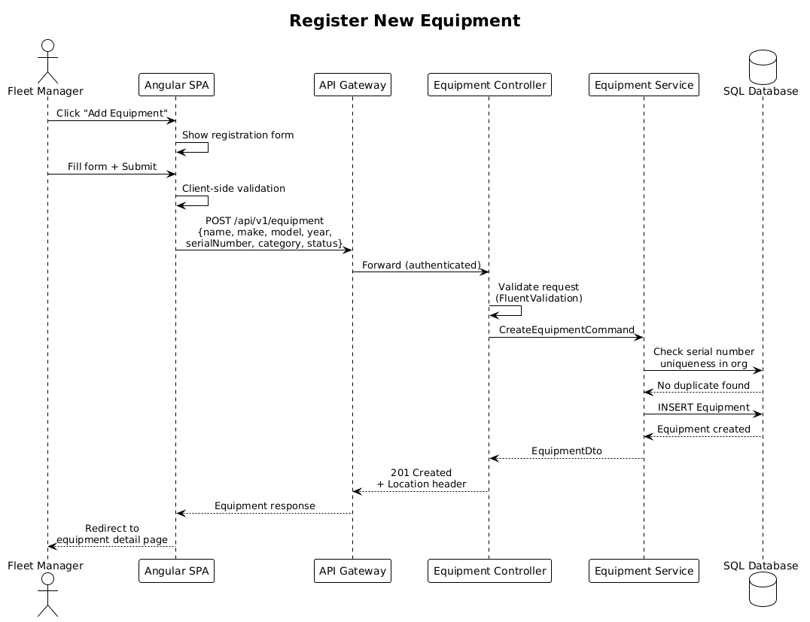

# Equipment Management — Detailed Design

## 1. Overview

This feature provides the core equipment registry for Toromont Fleet Hub. Users can register, view, edit, and decommission heavy equipment assets. The system maintains complete records including specifications, GPS location, service history references, and telemetry summaries. Legacy XML data imports from existing systems are supported.

Per the UI design in `docs/ui-design.pen`, screen **"03 - Equipment List"** (frame `8WCf1`) displays a sidebar with Equipment as the active nav item and a **Kendo UI Grid** with filters and search for browsing the equipment registry. Screen **"04 - Equipment Detail"** (frame `JIdQ4`) presents a tabbed detail view with specs, service history, and telemetry summary panels. The **"02 - Dashboard"** (frame `pmjuI`) includes KPI cards and alerts that surface equipment status at a glance.

**Tech Stack**: Angular SPA with **Kendo UI** components (Grid, Charts) and **Bootstrap 5** responsive layout | **.NET 8+** RESTful API with **MediatR** (CQRS) | **SQL Server 2022** via **Entity Framework Core** and **Dapper** (for reporting queries) | **Microsoft Entra ID** (OAuth2/OIDC) | **Azure App Services**, **Azure Functions** (telemetry ingestion), **Azure API Management** | **Serilog** structured logging to **Azure Application Insights** | **SignalR** for real-time updates

**Traces to:** L1-002, L1-011 | **L2:** L2-004, L2-005, L2-006, L2-026

**Actors:** Admin (full CRUD), Fleet Manager (full CRUD), Operator (read-only), Technician (read-only)

## 2. Architecture

### 2.1 C4 Context Diagram


### 2.2 C4 Container Diagram


### 2.3 C4 Component Diagram


## 3. Component Details

### 3.1 Equipment Controller (`EquipmentController`)
- **Responsibility**: RESTful CRUD endpoints for equipment management, hosted on **.NET 8+** with **MediatR** CQRS pattern
- **Endpoints**:
  - `GET /api/v1/equipment` — paginated list with filters (status, category, location, search)
  - `GET /api/v1/equipment/{id}` — detail with specs, latest telemetry, recent service history
  - `POST /api/v1/equipment` — register new equipment (Admin, Fleet Manager)
  - `PUT /api/v1/equipment/{id}` — update equipment (Admin, Fleet Manager)
  - `DELETE /api/v1/equipment/{id}` — decommission (Admin only, soft delete)
- **Pagination**: `?page=1&pageSize=20&sortBy=name&sortDir=asc`
- **Filters**: `?status=Operational&category=Excavator&search=CAT+320`

### 3.2 Import Controller (`ImportController`)
- **Responsibility**: Handles legacy XML equipment data imports from existing systems
- **Endpoint**: `POST /api/v1/equipment/import` — multipart file upload (max 10MB)
- **Authorization**: Admin and Fleet Manager only (RBAC via JWT claims)
- **Process**: Validates XML schema → parses records → upserts by serial number → returns summary

### 3.3 Equipment Service (MediatR Handlers)
- **CreateEquipmentHandler**: Validates serial number uniqueness within org, creates record in **SQL Server 2022** via **Entity Framework Core**
- **UpdateEquipmentHandler**: Validates ownership, applies updates, records audit trail
- **GetEquipmentListHandler**: Builds query with filters, pagination, sorting via **EF Core**; uses **Dapper** for performance-sensitive reporting aggregations
- **GetEquipmentDetailHandler**: Joins equipment with latest telemetry and 5 most recent work orders

### 3.4 Import Service (`EquipmentImportService`)
- **Responsibility**: Parses XML files from legacy systems, validates against XSD schema, transforms to Equipment entities
- **Duplicate Handling**: Matches on `SerialNumber` within organization — updates existing, creates new
- **Error Handling**: Skips invalid records, continues processing, returns detailed error report

### 3.5 Angular Equipment Module
- **EquipmentListComponent**: **Kendo UI Grid** with server-side pagination, sorting, and filtering. Renders the equipment list per `docs/ui-design.pen`, screen "03 - Equipment List" (frame `8WCf1`). Uses **Bootstrap 5** responsive grid for layout.
- **EquipmentDetailComponent**: Tabbed view with specs, map, telemetry cards, service timeline. Matches `docs/ui-design.pen`, screen "04 - Equipment Detail" (frame `JIdQ4`).
- **EquipmentFormComponent**: Reactive form with validation for add/edit
- **Responsive**: **Bootstrap 5** responsive breakpoints — Grid layout collapses to card layout below 768px (L2-032)

## 4. Data Model

### 4.1 Class Diagram


### 4.2 Entity Descriptions

| Entity | Field | Type | Description |
|--------|-------|------|-------------|
| Equipment | Id | Guid | Primary key |
| Equipment | OrganizationId | Guid | FK to Organization (tenant isolation) |
| Equipment | Name | string | Display name (e.g., "CAT 320 GC Excavator") |
| Equipment | Make | string | Manufacturer (e.g., Caterpillar) |
| Equipment | Model | string | Model designation |
| Equipment | Year | int | Year of manufacture |
| Equipment | SerialNumber | string | Unique serial number within organization |
| Equipment | Category | string | Equipment category (Excavator, Loader, etc.) |
| Equipment | Status | enum | Operational, NeedsService, OutOfService, Idle |
| Equipment | Latitude | decimal? | GPS latitude |
| Equipment | Longitude | decimal? | GPS longitude |
| Equipment | Location | string | Human-readable location |
| Equipment | LastServiceDate | DateTime? | Date of most recent service |
| Equipment | CreatedAt | DateTime | Record creation timestamp |
| Equipment | UpdatedAt | DateTime | Last modification timestamp |

### 4.3 Key Database Indexes
- `IX_Equipment_OrganizationId_SerialNumber` (unique) — prevent duplicates per org
- `IX_Equipment_OrganizationId_Status` — fast status filtering
- `IX_Equipment_OrganizationId_Category` — fast category filtering

## 5. Key Workflows

### 5.1 Register New Equipment


1. Fleet Manager fills out equipment form in the **Angular SPA** (EquipmentFormComponent)
2. SPA submits `POST /api/v1/equipment` with JWT Bearer token via **Azure API Management**
3. **.NET 8+ API** validates JWT via **Microsoft Entra ID** JWKS, extracts tenant context
4. `CreateEquipmentHandler` validates serial number uniqueness within org in **SQL Server 2022**
5. Equipment record persisted via **Entity Framework Core**
6. **SignalR** broadcasts real-time update to connected dashboard clients
7. Response 201 returned with new equipment details

### 5.2 Legacy XML Import
1. Admin uploads XML file via `POST /api/v1/equipment/import`
2. Server validates file size (<=10MB) and content type
3. `EquipmentImportService` validates XML against XSD schema
4. Each record is parsed: serial number matched against existing equipment in org via **EF Core** against **SQL Server 2022**
5. Existing records updated, new records created, invalid records skipped
6. Import result summary returned with counts and error details
7. Activity logged via **Serilog** to **Azure Application Insights**

## 6. API Contracts

### GET /api/v1/equipment
```json
// Response 200
{
  "data": [
    {
      "id": "guid",
      "name": "CAT 320 GC Excavator",
      "make": "Caterpillar",
      "model": "320 GC",
      "year": 2024,
      "serialNumber": "ZAP00321",
      "category": "Excavator",
      "status": "Operational",
      "location": "Toronto, ON",
      "latitude": 43.7001,
      "longitude": -79.4163,
      "lastServiceDate": "2026-03-15"
    }
  ],
  "pagination": {
    "page": 1,
    "pageSize": 20,
    "totalCount": 156,
    "totalPages": 8
  }
}
```

### POST /api/v1/equipment
```json
// Request
{
  "name": "CAT 336 Next Gen",
  "make": "Caterpillar",
  "model": "336 NG",
  "year": 2025,
  "serialNumber": "NGX00543",
  "category": "Excavator",
  "status": "Operational",
  "gpsDeviceId": "GPS-4521",
  "purchaseDate": "2025-01-15",
  "warrantyExpiration": "2028-01-15",
  "notes": "Purchased for Hamilton site"
}

// Response 201
{ "id": "guid", ...equipment fields... }
```

## 7. Security Considerations

- Serial number uniqueness enforced at both application and database constraint level in **SQL Server 2022**
- XML import validates against XSD schema to prevent XXE attacks — `DtdProcessing.Prohibit` (OWASP Top 10)
- File upload limited to 10MB with content-type validation
- All queries automatically tenant-filtered via **EF Core** global query filter
- RBAC enforced via **Microsoft Entra ID** JWT claims and .NET 8+ authorization policies
- All equipment mutations logged via **Serilog** to **Azure Application Insights** for audit trail
- Rate limiting enforced by **Azure API Management**
- Input validation via FluentValidation on all API endpoints

## 8. Design Decisions (Resolved)

1. **Hard delete for decommissioned equipment** — Use hard delete with a confirmation dialog. No soft-delete/archival infrastructure. Related work orders and telemetry are cascade-deleted. If audit trail is later required, the existing Serilog structured logs capture the deletion event. This is the simplest and cheapest approach.
2. **GPS precision** — Store raw device coordinates as `double` (standard SQL Server `float`). No geocoding service — display coordinates on the map directly using Leaflet/OpenStreetMap (free). Location name is a free-text field entered manually during registration.
3. **Legacy XML import** — Manual upload only via the `POST /api/v1/equipment/import` endpoint. No scheduled Azure Functions import. This avoids additional Azure Functions compute costs and complexity. If automated import is needed later, a simple timer-triggered Function can be added.
