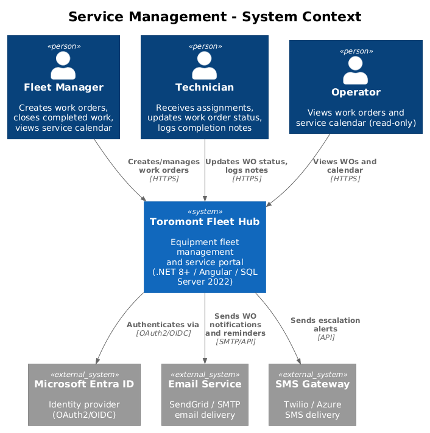
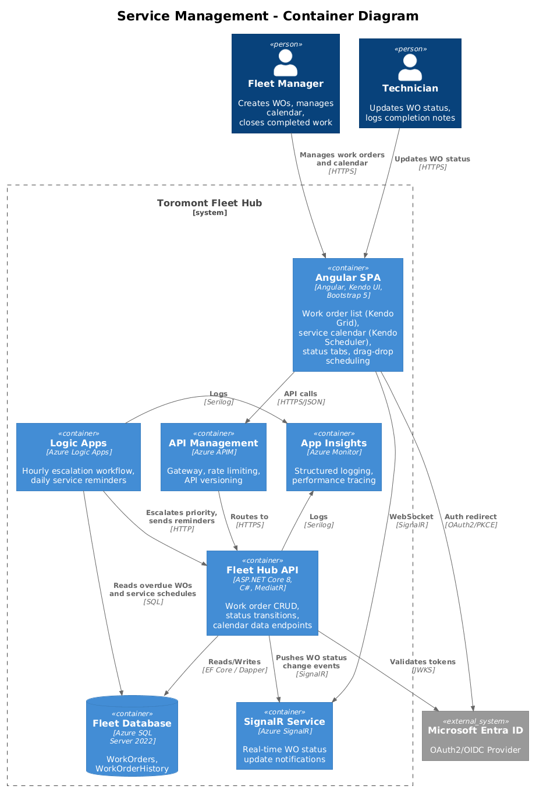
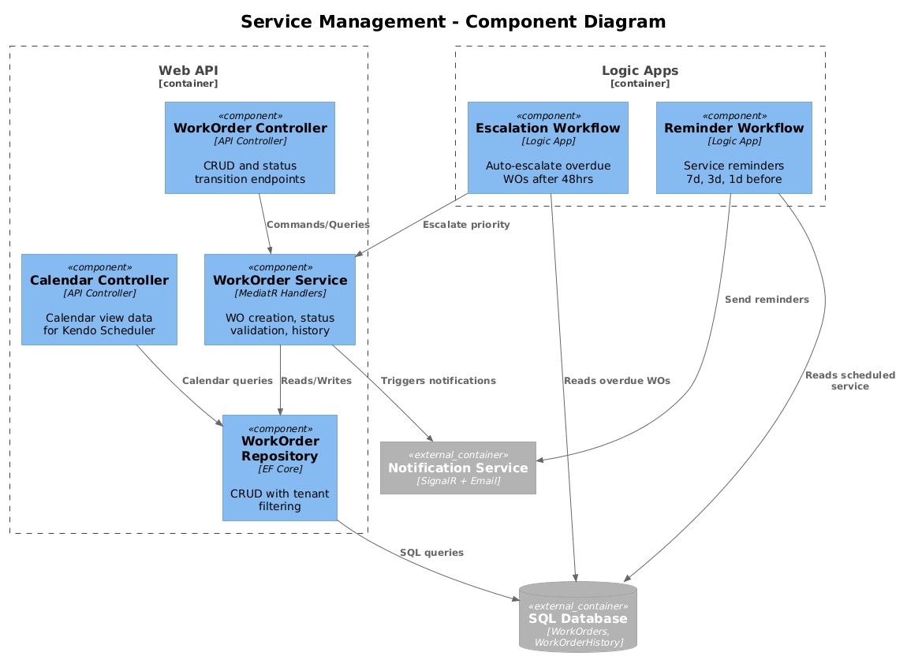
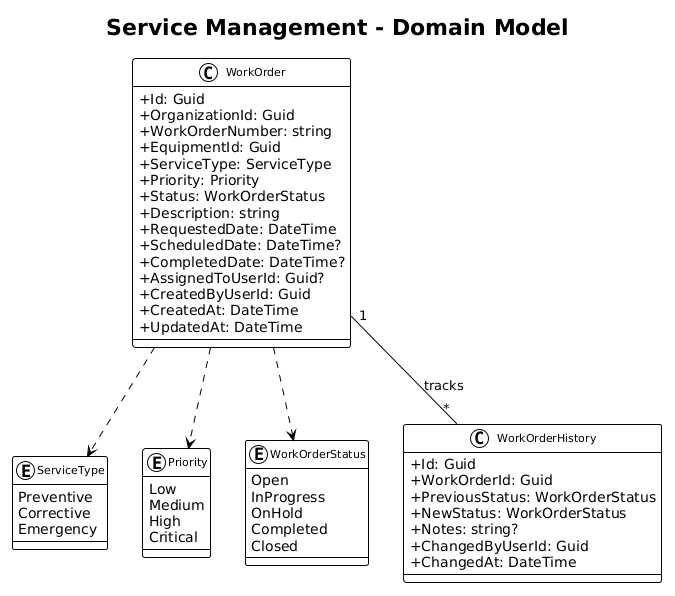
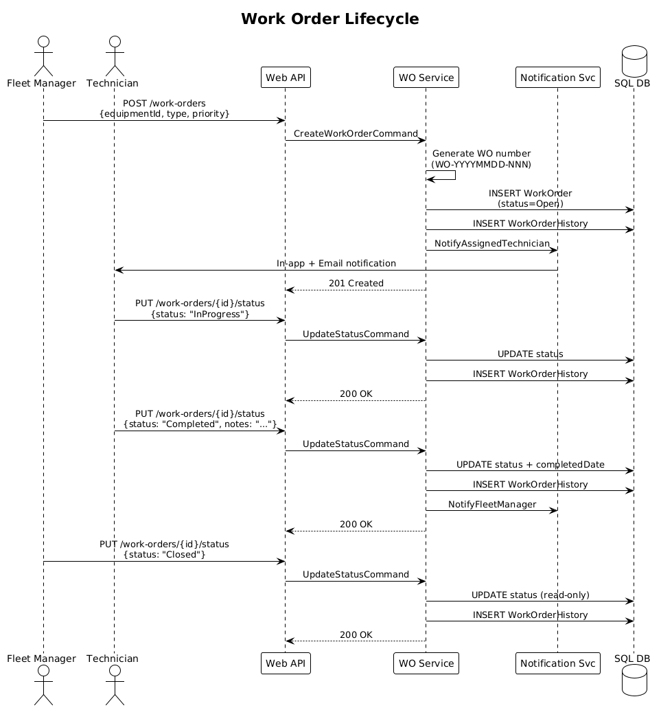

# Service Management — Detailed Design

## 1. Overview

This feature enables scheduling, tracking, and managing equipment maintenance through work orders. Work orders follow a defined lifecycle (Open -> In Progress -> On Hold -> Completed -> Closed) with full audit history. Per the UI design in `docs/ui-design.pen`, screen "05 - Work Orders" (frame 17hIx), the interface features a sidebar with Work Orders active, a header bar, and a content area with a Kendo Grid displaying work orders with status tabs and work order management actions. A calendar view provides visual scheduling using Kendo UI Scheduler with day/week/month views and drag-drop rescheduling. Azure Logic Apps automate service reminders and work order escalation.

**Tech Stack:** .NET 8+ (ASP.NET Core, MediatR, EF Core), SQL Server 2022, Angular SPA with Kendo UI Scheduler and Kendo UI Grid, Bootstrap 5 responsive layout, Azure Logic Apps, SignalR real-time notifications, Azure Application Insights with Serilog structured logging, OAuth2/OpenID Connect via Microsoft Entra ID with RBAC.

**Traces to:** L1-003, L1-015 | **L2:** L2-007, L2-008, L2-009, L2-034

**Actors:** Fleet Manager (create, close), Technician (create, update status), Operator (read-only)

## 2. Architecture

### 2.1 C4 Context Diagram


### 2.2 C4 Container Diagram


### 2.3 C4 Component Diagram


## 3. Component Details

### 3.1 WorkOrder Controller (`WorkOrdersController`)
- **Runtime:** ASP.NET Core 8 (.NET 8+), C#
- **Endpoints**:
  - `GET /api/v1/work-orders` — paginated list with status/priority/equipment filters
  - `GET /api/v1/work-orders/{id}` — detail with history timeline
  - `POST /api/v1/work-orders` — create (Fleet Manager, Technician)
  - `PUT /api/v1/work-orders/{id}/status` — transition status with notes
  - `GET /api/v1/work-orders/calendar?start=&end=` — calendar view data
- **Authorization:** JWT Bearer via Microsoft Entra ID, RBAC + claims-based auth
- **Status Transition Rules**:
  - Open -> InProgress (Technician, Fleet Manager)
  - InProgress -> OnHold (Technician, Fleet Manager)
  - OnHold -> InProgress (Technician, Fleet Manager)
  - InProgress -> Completed (Technician, Fleet Manager)
  - Completed -> Closed (Fleet Manager only)
  - Closed -> no further transitions (read-only)

### 3.2 WorkOrder Service (MediatR Handlers)
- **CreateWorkOrderHandler**: Generates unique WO number (WO-YYYYMMDD-NNN), validates equipment exists in org, creates WO with Open status, records initial history entry, triggers notification to assigned technician via SignalR + email.
- **UpdateWorkOrderStatusHandler**: Validates transition is allowed for current status + user role, records history entry with timestamp/user/notes, triggers relevant notifications via SignalR.
- **GetCalendarDataHandler**: Returns work orders within date range formatted for Kendo Scheduler (title, start, end, color by priority). Uses Dapper for optimized read performance.

### 3.3 Logic App Workflows (Azure Logic Apps)
- **Escalation Workflow**: Runs hourly. Queries WOs in "Open" status for >48 hours via SQL Server 2022. Escalates priority by one level (Low -> Medium, Medium -> High, High -> Critical). Notifies Fleet Manager. Logged via Serilog to Azure Application Insights. (L2-034)
- **Service Reminder Workflow**: Runs daily. Queries equipment with scheduled service within 7/3/1 days. Sends reminder notifications to assigned Fleet Manager via email. (L2-034)

### 3.4 Angular Service Module
Per the UI design in `docs/ui-design.pen`, screen "05 - Work Orders" (frame 17hIx):
- **WorkOrderListComponent**: Kendo UI Grid with status filter tabs (All, Open, In Progress, On Hold, Completed, Closed). Responsive layout via Bootstrap 5.
- **WorkOrderDetailComponent**: Status badge, context-sensitive action buttons, history timeline with user/date/notes.
- **ServiceCalendarComponent**: Kendo UI Scheduler with day/week/month views, drag-and-drop rescheduling, color-coded by priority.
- **CreateWorkOrderDialogComponent**: Modal form with equipment autocomplete search, date picker, priority selector.

## 4. Data Model

### 4.1 Class Diagram


### 4.2 Entity Descriptions

| Entity | Table | Storage | Description |
|--------|-------|---------|-------------|
| WorkOrder | `WorkOrders` | SQL Server 2022 | Core work order entity with lifecycle status, assigned technician, and equipment reference. Tenant-scoped via OrganizationId. |
| WorkOrderHistory | `WorkOrderHistory` | SQL Server 2022 | Immutable audit trail of every status transition with user, timestamp, and notes. |

### 4.3 Key Indexes
- `IX_WorkOrders_OrganizationId_Status` — status tab queries
- `IX_WorkOrders_EquipmentId` — equipment detail service history
- `IX_WorkOrders_AssignedToUserId_Status` — technician's active WOs
- `IX_WorkOrders_ScheduledDate` — calendar range queries (Dapper-optimized)

## 5. Key Workflows

### 5.1 Work Order Lifecycle


1. Fleet Manager creates a work order via `POST /api/v1/work-orders`
2. MediatR `CreateWorkOrderHandler` generates WO number (WO-YYYYMMDD-NNN), persists to SQL Server 2022 via EF Core, and records the initial history entry
3. SignalR pushes real-time notification to the assigned technician
4. Technician transitions status (Open -> InProgress -> Completed) via `PUT /api/v1/work-orders/{id}/status`
5. Each transition is validated server-side and recorded in `WorkOrderHistory`
6. Fleet Manager closes the completed work order (Completed -> Closed)
7. Closed work orders become immutable

### 5.2 Automated Escalation (Logic App)
1. Azure Logic App runs hourly, querying SQL Server 2022 for WOs in Open status >48 hours
2. Priority escalated one level (Low -> Medium -> High -> Critical)
3. Fleet Manager notified via email and in-app SignalR notification
4. All escalation actions logged to Azure Application Insights via Serilog

## 6. API Contracts

### POST /api/v1/work-orders
```json
// Request
{
  "equipmentId": "guid",
  "serviceType": "Corrective",
  "priority": "High",
  "description": "Hydraulic leak on boom cylinder",
  "requestedDate": "2026-04-05",
  "assignedToUserId": "guid"
}
// Response 201
{
  "id": "guid",
  "workOrderNumber": "WO-20260401-001",
  "status": "Open",
  "equipmentId": "guid",
  "serviceType": "Corrective",
  "priority": "High",
  "description": "Hydraulic leak on boom cylinder",
  "requestedDate": "2026-04-05T00:00:00Z",
  "assignedToUserId": "guid",
  "createdAt": "2026-04-01T09:00:00Z"
}
```

### PUT /api/v1/work-orders/{id}/status
```json
// Request
{ "status": "InProgress", "notes": "Starting repair" }
// Response 200
{ "id": "guid", "status": "InProgress", "updatedAt": "2026-04-01T10:15:00Z" }
```

### GET /api/v1/work-orders/calendar?start=2026-04-01&end=2026-04-30
```json
// Response 200
[
  {
    "id": "guid",
    "title": "WO-20260401-001 - Hydraulic leak",
    "start": "2026-04-05T08:00:00Z",
    "end": "2026-04-05T16:00:00Z",
    "color": "#e74c3c",
    "status": "Open",
    "priority": "High"
  }
]
```

## 7. Security Considerations
- **Authentication:** OAuth2/OpenID Connect via Microsoft Entra ID, JWT Bearer tokens validated server-side
- **Authorization:** RBAC + claims-based auth. Status transitions validated server-side -- UI button visibility is convenience, not enforcement
- Only the assigned technician or a Fleet Manager/Admin can transition a specific WO
- Closed WOs are immutable -- no further modifications allowed
- Multi-tenant isolation via EF Core global query filters on `OrganizationId`
- All API inputs validated with FluentValidation
- Audit trail via `WorkOrderHistory` is append-only and immutable

## 8. Open Questions
1. Should WO numbers reset annually (WO-2026-001) or be globally sequential?
2. Can a work order be reopened after being Closed, or is a new WO required?
3. Should drag-drop rescheduling on the Kendo Scheduler trigger a notification to the assigned technician?
