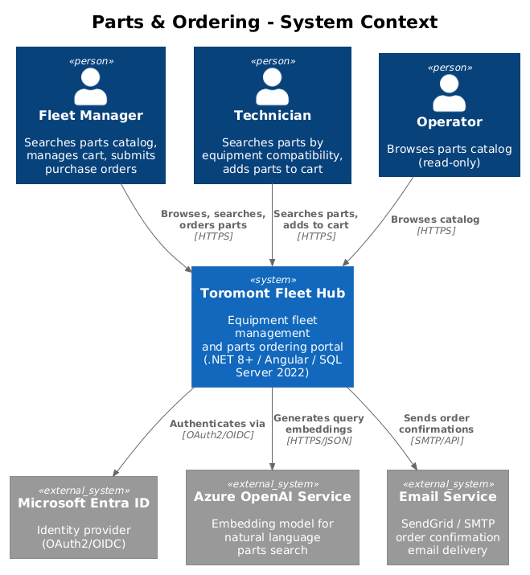
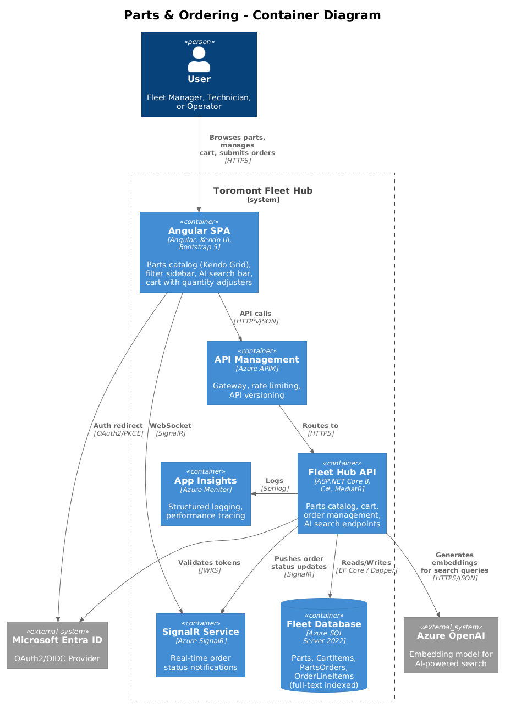
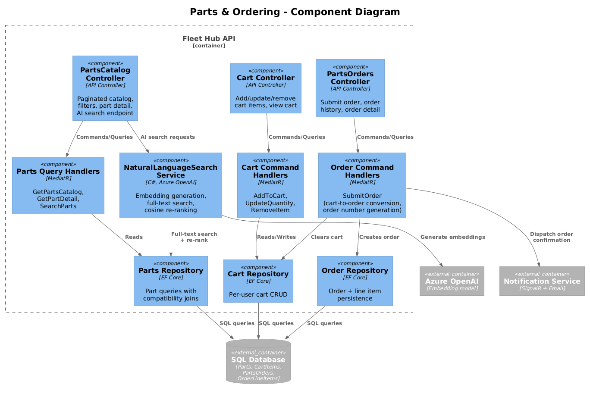
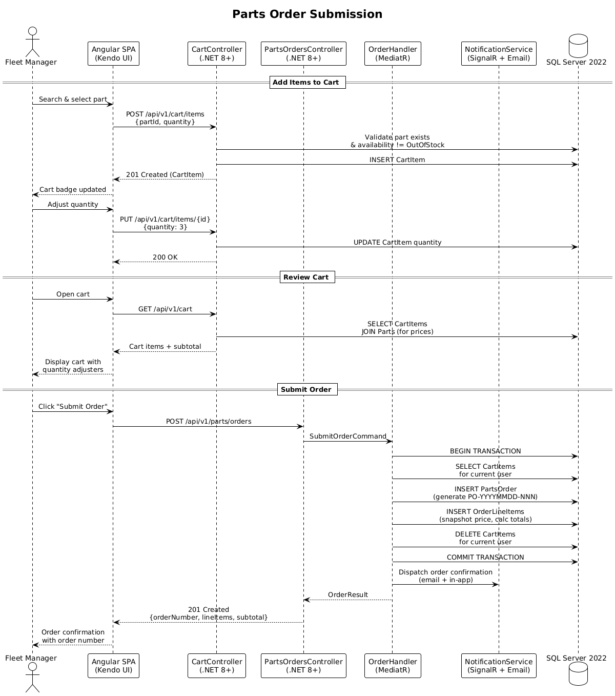

# Parts & Ordering — Detailed Design

## 1. Overview

This feature provides a searchable parts catalog with AI-powered natural language search, a shopping cart, and order submission workflow. Users can browse parts filtered by category and equipment compatibility, add items to a cart, and submit purchase orders. Order confirmations trigger email notifications. Per the UI design in `docs/ui-design.pen`, screen "06 - Parts Catalog" (frame 9VJUO), the interface features a sidebar with Parts active, a header bar, and a body with a filter sidebar alongside a parts Kendo Grid and an AI search bar.

**Tech Stack:** .NET 8+ (ASP.NET Core, MediatR, EF Core), SQL Server 2022 (full-text search), Azure OpenAI (embeddings), Angular SPA with Kendo UI Grid, Bootstrap 5 responsive layout, SignalR real-time notifications, Azure Application Insights with Serilog structured logging, OAuth2/OpenID Connect via Microsoft Entra ID with RBAC.

**Traces to:** L1-004, L1-006 | **L2:** L2-010, L2-011, L2-015

**Actors:** Fleet Manager (browse, search, cart, order), Technician (browse, search, cart), Operator (browse only)

## 2. Architecture

### 2.1 C4 Context Diagram


### 2.2 C4 Container Diagram


### 2.3 C4 Component Diagram


## 3. Component Details

### 3.1 Parts Catalog Controller (`PartsCatalogController`)
- **Runtime:** ASP.NET Core 8 (.NET 8+), C#
- **Endpoints:**
  - `GET /api/v1/parts/catalog` — paginated, filterable parts list
  - `GET /api/v1/parts/catalog/{id}` — part detail with compatibility list
  - `GET /api/v1/parts/catalog/search?q=` — AI natural language search
- **Filters**: `?category=Hydraulic&model=320+GC&availability=InStock`
- **Authorization:** JWT Bearer via Microsoft Entra ID, RBAC (RequireRead policy)

### 3.2 Cart Controller (`CartController`)
- **Runtime:** ASP.NET Core 8 (.NET 8+), C#
- **Endpoints:**
  - `GET /api/v1/cart` — current user's cart items with totals
  - `POST /api/v1/cart/items` — add part to cart `{partId, quantity}`
  - `PUT /api/v1/cart/items/{id}` — update quantity
  - `DELETE /api/v1/cart/items/{id}` — remove item
- **Authorization:** JWT Bearer, RequireWrite policy. Cart is scoped to authenticated user via claims.

### 3.3 Orders Controller (`PartsOrdersController`)
- **Runtime:** ASP.NET Core 8 (.NET 8+), C#
- **Endpoints:**
  - `POST /api/v1/parts/orders` — submit cart as order (generates order number PO-YYYYMMDD-NNN)
  - `GET /api/v1/parts/orders` — user's order history
  - `GET /api/v1/parts/orders/{id}` — order detail with line items
- **Authorization:** JWT Bearer, RequireWrite policy for order submission, RequireRead for history.

### 3.4 AI Search Service (`NaturalLanguageSearchService`)
- **Runtime:** C#, .NET 8+
- **Responsibility**: Interprets natural language queries, extracts equipment model references and part categories, handles misspellings via fuzzy matching, ranks results by relevance.
- **Implementation**: Azure OpenAI embedding model generates query vector -> SQL Server 2022 full-text search with synonym expansion -> re-rank by cosine similarity + compatibility match.
- **Fallback**: If Azure OpenAI service is unavailable, falls back to standard SQL `CONTAINS` full-text search.
- **Observability**: All search queries and latencies logged via Serilog to Azure Application Insights.

### 3.5 Angular Parts Module
Per the UI design in `docs/ui-design.pen`, screen "06 - Parts Catalog" (frame 9VJUO):
- **PartsCatalogComponent**: Filter sidebar (category, model, availability) + Kendo UI Grid with part rows, AI search bar with sparkle icon at the top. Bootstrap 5 responsive layout.
- **CartComponent**: Item list with quantity adjusters (+/- buttons), subtotal calculation, "Submit Order" button. Cart badge in header shows item count.
- **OrderHistoryComponent**: Kendo UI Grid showing past orders with status, date, and total.
- **Responsive**: Filter sidebar collapses to a drawer on mobile viewports via Bootstrap 5 breakpoints (L2-010 AC6).

## 4. Data Model

### 4.1 Class Diagram


### 4.2 Entity Descriptions

| Entity | Table | Storage | Description |
|--------|-------|---------|-------------|
| Part | `Parts` | SQL Server 2022 | Catalog entry with pricing, category, and availability status. Full-text indexed for search. |
| PartCompatibility | `PartCompatibility` | SQL Server 2022 | Many-to-many mapping of parts to compatible equipment models. |
| CartItem | `CartItems` | SQL Server 2022 | Per-user shopping cart item with quantity. Cleared on order submission. |
| PartsOrder | `PartsOrders` | SQL Server 2022 | Submitted order header with organization scope, order number, and subtotal. |
| OrderLineItem | `OrderLineItems` | SQL Server 2022 | Immutable snapshot of part details at time of order (price, quantity, line total). |

### 4.3 Key Indexes
- `IX_Parts_Category` — category filter queries
- `IX_PartCompatibility_EquipmentModel` — model compatibility filter
- `IX_CartItems_UserId` — user's cart retrieval
- `IX_PartsOrders_OrganizationId_UserId` — order history queries
- Full-text index on `Parts(Name, Description)` — SQL Server 2022 full-text search

## 5. Key Workflows

### 5.1 Parts Order Submission


1. User searches the parts catalog via the AI search bar or filter sidebar in the Angular SPA (Kendo UI Grid)
2. User adds parts to cart via `POST /api/v1/cart/items` -- server validates part availability against SQL Server 2022
3. User reviews cart via `GET /api/v1/cart` -- prices are server-authoritative, calculated via EF Core joins
4. User submits order via `POST /api/v1/parts/orders`
5. MediatR `SubmitOrderHandler` executes within a SQL transaction: creates `PartsOrder` with generated order number (PO-YYYYMMDD-NNN), creates `OrderLineItems` as immutable price snapshots, clears the user's `CartItems`
6. Notification dispatched via SignalR (in-app) and email (order confirmation with order number and line items)
7. Order confirmation displayed in Angular SPA

### 5.2 AI-Powered Natural Language Search
1. User types natural language query in the AI search bar (e.g., "hydraulic seals for 320 GC excavator")
2. Angular SPA sends query to `GET /api/v1/parts/catalog/search?q=...`
3. `NaturalLanguageSearchService` sends query text to Azure OpenAI to generate embedding vector
4. SQL Server 2022 full-text search executes with synonym expansion
5. Results re-ranked by cosine similarity between query embedding and part embeddings + equipment compatibility boost
6. Ranked results returned to Angular SPA and displayed in Kendo UI Grid
7. If Azure OpenAI is unavailable, service falls back to standard SQL `CONTAINS` full-text search

## 6. API Contracts

### GET /api/v1/parts/catalog?category=Hydraulic&availability=InStock&page=1&pageSize=20
```json
// Response 200
{
  "items": [
    {
      "id": "guid",
      "partNumber": "HYD-4521",
      "name": "Hydraulic Cylinder Seal Kit",
      "description": "Complete seal kit for 320 GC boom cylinder",
      "price": 284.50,
      "category": "Hydraulic",
      "availability": "InStock",
      "compatibleModels": ["320 GC", "323 GC"]
    }
  ],
  "totalCount": 47,
  "page": 1,
  "pageSize": 20
}
```

### POST /api/v1/cart/items
```json
// Request
{ "partId": "guid", "quantity": 2 }
// Response 201
{
  "id": "guid",
  "partId": "guid",
  "partNumber": "HYD-4521",
  "name": "Hydraulic Cylinder Seal Kit",
  "quantity": 2,
  "unitPrice": 284.50,
  "lineTotal": 569.00
}
```

### POST /api/v1/parts/orders
```json
// Response 201
{
  "id": "guid",
  "orderNumber": "PO-20260401-042",
  "status": "Submitted",
  "lineItems": [
    {
      "partNumber": "HYD-4521",
      "name": "Hydraulic Cylinder Seal Kit",
      "unitPrice": 284.50,
      "quantity": 2,
      "lineTotal": 569.00
    }
  ],
  "subtotal": 569.00,
  "createdAt": "2026-04-01T14:30:00Z"
}
```

### GET /api/v1/parts/orders
```json
// Response 200
{
  "items": [
    {
      "id": "guid",
      "orderNumber": "PO-20260401-042",
      "status": "Submitted",
      "subtotal": 569.00,
      "lineItemCount": 1,
      "createdAt": "2026-04-01T14:30:00Z"
    }
  ],
  "totalCount": 12,
  "page": 1,
  "pageSize": 20
}
```

## 7. Security Considerations
- **Authentication:** OAuth2/OpenID Connect via Microsoft Entra ID, JWT Bearer tokens validated server-side
- **Authorization:** RBAC + claims-based auth. Cart and order endpoints require RequireWrite policy; catalog browsing requires RequireRead.
- Cart is per-user -- users cannot access other users' carts (enforced via JWT claims, not URL parameters)
- Part prices are server-authoritative -- line totals calculated server-side via EF Core, not from client-submitted values
- "Add to Cart" disabled for OutOfStock parts both in UI (Kendo Grid button state) and validated server-side
- Multi-tenant isolation via EF Core global query filters on `OrganizationId` for orders
- Order line items are immutable snapshots -- price changes after order submission do not affect existing orders
- All API inputs validated with FluentValidation
- AI search queries sanitized before passing to Azure OpenAI and SQL full-text search

## 8. Design Decisions (Resolved)

1. **Per-organization catalog pricing** — Parts catalog is global (shared inventory) but pricing is per-organization via an `OrganizationPricing` table (`OrganizationId`, `PartId`, `Price`). Falls back to the default `Part.Price` if no org-specific price exists. This supports tiered pricing without duplicating the catalog.
2. **Azure OpenAI ada-002 embeddings** — Use `text-embedding-ada-002` for natural language parts search. It is the cheapest embedding model ($0.0001/1K tokens), sufficient for parts search queries. No fine-tuning — use the model out of the box with SQL full-text search as fallback.
3. **No order approval workflow** — All authorized users (Fleet Manager+) can submit orders without approval gates. This reduces complexity and avoids building a multi-step approval engine. If needed later, a simple threshold check can be added.
4. **No cart expiry** — Cart items persist indefinitely until the user removes them or submits an order. No background cleanup job needed — simplest approach. Stale carts have negligible storage cost.
