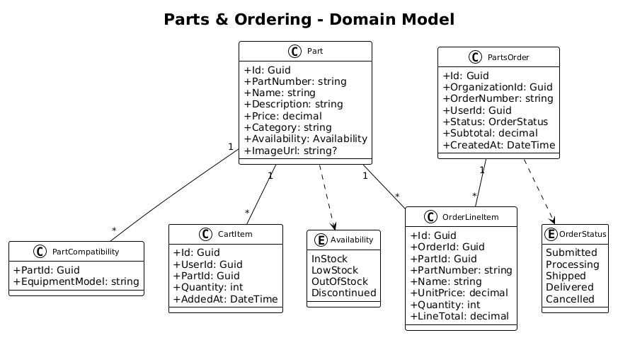

# Parts & Ordering — Detailed Design

## 1. Overview

This feature provides a searchable parts catalog with AI-powered natural language search, a shopping cart, and order submission workflow. Users can browse parts filtered by category and equipment compatibility, add items to a cart, and submit purchase orders. Order confirmations trigger email notifications.

**Traces to:** L1-004, L1-006 | **L2:** L2-010, L2-011, L2-015

## 2. Component Details

### 2.1 Parts Catalog Controller (`PartsCatalogController`)
- `GET /api/v1/parts/catalog` — paginated, filterable parts list
- `GET /api/v1/parts/catalog/{id}` — part detail with compatibility list
- `GET /api/v1/parts/catalog/search?q=` — AI natural language search
- **Filters**: `?category=Hydraulic&model=320+GC&availability=InStock`

### 2.2 Cart Controller (`CartController`)
- `GET /api/v1/cart` — current user's cart items with totals
- `POST /api/v1/cart/items` — add part to cart `{partId, quantity}`
- `PUT /api/v1/cart/items/{id}` — update quantity
- `DELETE /api/v1/cart/items/{id}` — remove item

### 2.3 Orders Controller (`PartsOrdersController`)
- `POST /api/v1/parts/orders` — submit cart as order (generates order number)
- `GET /api/v1/parts/orders` — user's order history
- `GET /api/v1/parts/orders/{id}` — order detail with line items

### 2.4 AI Search Service (`NaturalLanguageSearchService`)
- **Responsibility**: Interprets natural language queries, extracts equipment model references and part categories, handles misspellings via fuzzy matching, ranks results by relevance.
- **Implementation**: Azure OpenAI embedding model generates query vector → SQL full-text search with synonym expansion → re-rank by cosine similarity + compatibility match.
- **Fallback**: If AI service is unavailable, falls back to standard SQL `CONTAINS` full-text search.

### 2.5 Angular Parts Module
- **PartsCatalogComponent**: Filter sidebar + Kendo Grid, AI search bar with sparkle icon
- **CartComponent**: Item list with quantity adjusters, subtotal calculation, submit button
- **Responsive**: Filter sidebar collapses to drawer on mobile (L2-010 AC6)

## 3. Data Model

### 3.1 Class Diagram


### 3.2 Key Indexes
- `IX_Parts_Category` — category filter
- `IX_PartCompatibility_EquipmentModel` — model compatibility filter
- `IX_CartItems_UserId` — user's cart
- `IX_PartsOrders_OrganizationId_UserId` — order history

## 4. API Contracts

### POST /api/v1/parts/orders
```json
// Response 201
{
  "id": "guid",
  "orderNumber": "PO-20260401-042",
  "status": "Submitted",
  "lineItems": [
    { "partNumber": "HYD-4521", "name": "Hydraulic Cylinder Seal Kit", "unitPrice": 284.50, "quantity": 2, "lineTotal": 569.00 }
  ],
  "subtotal": 569.00,
  "createdAt": "2026-04-01T14:30:00Z"
}
```

## 5. Security Considerations
- Cart is per-user — users cannot access other users' carts
- Part prices are server-authoritative — line totals calculated server-side, not from client
- "Add to Cart" disabled for OutOfStock parts both in UI and validated server-side

## 6. Open Questions
1. Should parts catalog be global or per-organization (different pricing tiers)?
2. What AI model to use — Azure OpenAI ada-002 embeddings or a fine-tuned model?
