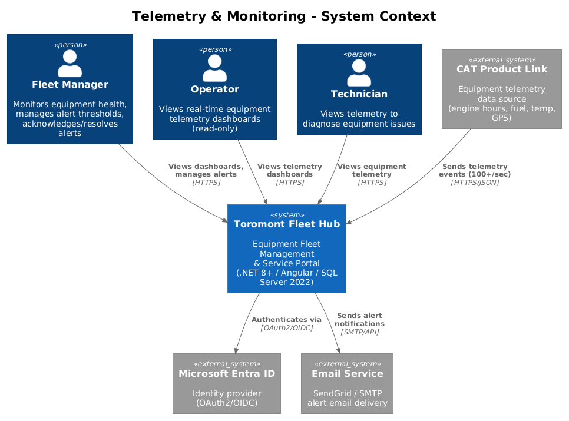
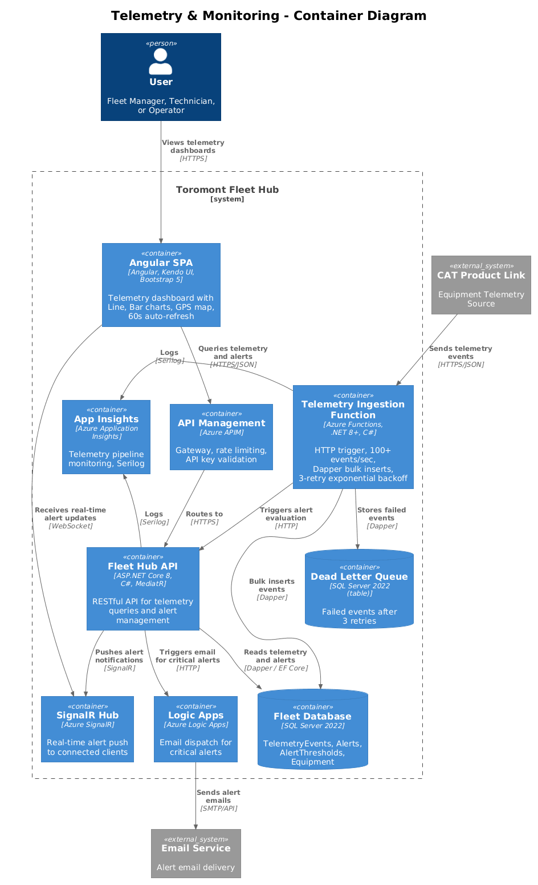
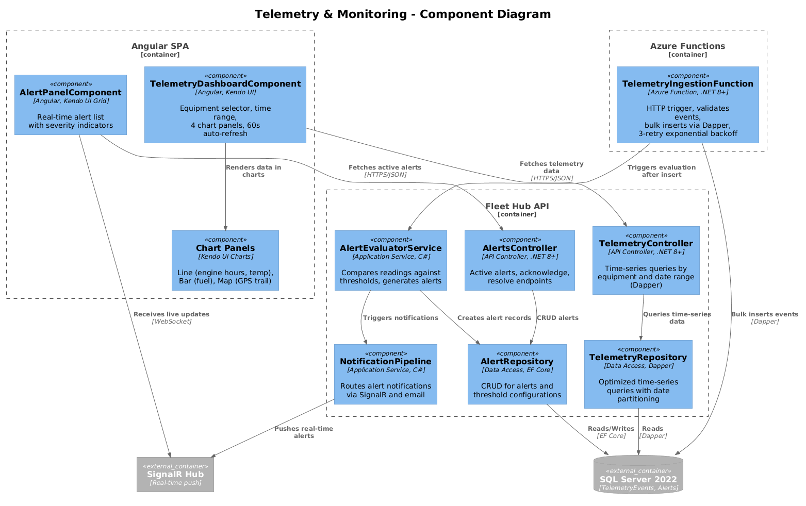
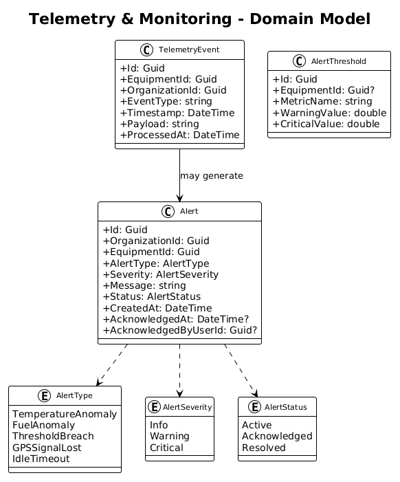
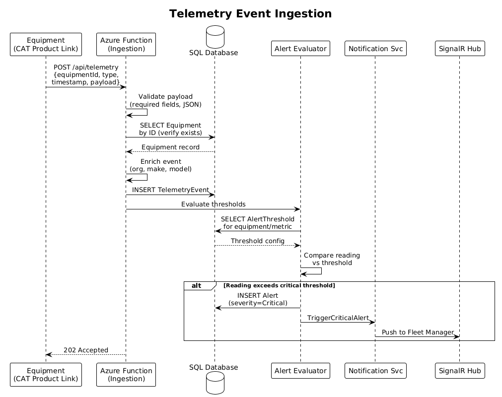

# Telemetry & Monitoring — Detailed Design

## 1. Overview

This feature handles ingestion, processing, and visualization of real-time equipment telemetry data. Azure Functions provide a high-throughput ingestion endpoint (100+ events/sec) using Dapper bulk inserts with 3-retry exponential backoff and a dead letter queue for failed events. Telemetry data feeds interactive Kendo UI charts showing engine hours, fuel consumption, temperature, and GPS trails. Alert thresholds trigger critical notifications when readings exceed configured limits, delivered in real-time via SignalR and email.

Per the UI design in `docs/ui-design.pen`, screen **"07 - Telemetry Dashboard"** (frame `0qYmJ`) presents a sidebar (Telemetry active) with a header and content area containing a time range selector, 4 chart panels (engine hours **Kendo UI Line Chart**, fuel **Kendo UI Bar Chart**, temperature **Kendo UI Line Chart**, GPS trail map), and 60-second auto-refresh.

**Tech Stack**: Angular SPA with **Kendo UI** components (Line Chart, Bar Chart) and **Bootstrap 5** responsive layout | **.NET 8+** RESTful API with **MediatR** (CQRS) | **Azure Functions** for telemetry ingestion | **SQL Server 2022** via **Dapper** (time-series queries, bulk inserts) and **Entity Framework Core** (alerts) | **SignalR** for real-time alert push | **Azure App Services**, **Azure API Management** | **Serilog** structured logging to **Azure Application Insights**

**Traces to:** L1-005, L1-015 | **L2:** L2-012, L2-013, L2-033

**Actors:** Fleet Manager, Operator, Technician

## 2. Architecture

### 2.1 C4 Context Diagram


### 2.2 C4 Container Diagram


### 2.3 C4 Component Diagram


## 3. Component Details

### 3.1 Telemetry Ingestion Function (`TelemetryIngestionFunction`)
- **Runtime**: Azure Functions on **.NET 8+**, C#
- **Trigger**: HTTP POST at `/api/telemetry`
- **Responsibility**: Validates event payload, enriches with equipment metadata from **SQL Server 2022**, persists via **Dapper** bulk inserts (not EF Core for throughput), triggers alert evaluation
- **Performance**: Handles 100+ events/second using Dapper bulk inserts
- **Retry Policy**: 3 retries with exponential backoff (1s, 4s, 16s) on transient DB errors
- **Dead Letter**: Events that fail after 3 retries stored in `TelemetryDeadLetterQueue` table in **SQL Server 2022**
- **Observability**: All ingestion metrics logged via **Serilog** to **Azure Application Insights**

### 3.2 Alert Evaluator (`AlertEvaluatorService`)
- **Responsibility**: Compares telemetry readings against configured thresholds stored in **SQL Server 2022**
- **Threshold Types**: Per-equipment custom thresholds, or global defaults by equipment model
- **Alert Generation**: Creates Alert record via **Entity Framework Core**, triggers notification pipeline via **SignalR** (real-time) + email (via **Azure Logic Apps**)
- **Severity Mapping**: Critical (immediate safety risk), High (degraded performance), Medium (maintenance needed), Low (informational)

### 3.3 Telemetry Controller (`TelemetryController`)
- **Runtime**: **.NET 8+** RESTful API with **MediatR**
- `GET /api/v1/equipment/{id}/telemetry?range=7d&metrics=engineHours,fuelConsumption,temperature`
- `GET /api/v1/equipment/{id}/telemetry/latest` — most recent readings
- `GET /api/v1/equipment/{id}/telemetry/gps-trail?range=7d` — GPS coordinate history
- **Performance**: Uses **Dapper** for time-series queries with date range partitioning against **SQL Server 2022**

### 3.4 Alerts Controller (`AlertsController`)
- **Runtime**: **.NET 8+** RESTful API with **MediatR**
- `GET /api/v1/alerts` — active alerts for org, sorted by severity then timestamp
- `PUT /api/v1/alerts/{id}/acknowledge` — mark alert as acknowledged
- `PUT /api/v1/alerts/{id}/resolve` — mark alert as resolved
- **Authorization**: Alert threshold management restricted to Admin and Fleet Manager roles (RBAC + claims-based auth via **Microsoft Entra ID**)

### 3.5 Angular Telemetry Module
- **TelemetryDashboardComponent**: Equipment selector, time range toggle (24h, 7d, 30d, custom), 4 chart panels as shown in `docs/ui-design.pen`, screen "07 - Telemetry Dashboard" (frame `0qYmJ`)
- **Charts**: **Kendo UI Line Chart** (engine hours, temperature), **Kendo UI Bar Chart** (fuel consumption), map panel (GPS trail)
- **Auto-refresh**: `interval(60000)` RxJS observable reloads chart data every 60 seconds
- **Responsive**: **Bootstrap 5** grid — charts stack vertically in single column below 768px breakpoint
- **Real-time Alerts**: Alert panel subscribes to **SignalR** hub for live alert push notifications

## 4. Data Model

### 4.1 Class Diagram


### 4.2 Entity Descriptions

| Entity | Table | Description |
|--------|-------|-------------|
| TelemetryEvent | `TelemetryEvents` | Individual telemetry reading from equipment. Fields: Id, EquipmentId, OrganizationId, EventType, Timestamp, Payload (JSON), ProcessedAt. Stored in **SQL Server 2022**. |
| Alert | `Alerts` | Threshold breach or anomaly notification. Fields: Id, OrganizationId, EquipmentId, AlertType, Severity (Critical/High/Medium/Low), Message, Status (Active/Acknowledged/Resolved), CreatedAt, AcknowledgedAt, AcknowledgedByUserId. Nav to Equipment. |
| AlertThreshold | `AlertThresholds` | Configurable metric thresholds per equipment or global defaults. Fields: Id, EquipmentId (nullable), MetricName, WarningValue, CriticalValue. |

### 4.3 Key Database Indexes
- `IX_TelemetryEvents_EquipmentId_Timestamp` — time-range queries (most critical for performance)
- `IX_Alerts_OrganizationId_Status_Severity` — dashboard alerts panel
- **Partitioning**: Consider table partitioning by month on `TelemetryEvents` for large datasets

## 5. Key Workflows

### 5.1 Telemetry Event Ingestion


1. Equipment (CAT Product Link) sends telemetry event via `POST /api/telemetry` to **Azure Functions** endpoint
2. `TelemetryIngestionFunction` validates payload (required fields, JSON structure)
3. Function queries **SQL Server 2022** to verify equipment exists and enrich with org/model metadata
4. Event persisted via **Dapper** bulk insert to `TelemetryEvents` table
5. `AlertEvaluatorService` compares readings against `AlertThresholds` from **SQL Server 2022**
6. If threshold exceeded: Alert record created, **SignalR** pushes real-time notification to Fleet Manager, email queued via **Azure Logic Apps**
7. Function returns `202 Accepted` with event ID
8. On failure after 3 retries (exponential backoff 1s, 4s, 16s): event stored in dead letter queue table

### 5.2 Dashboard Rendering
1. User navigates to Telemetry Dashboard in the **Angular SPA**
2. Equipment selector loads available equipment via API
3. **Kendo UI Charts** render time-series data: Line charts for engine hours and temperature, Bar chart for fuel consumption, map for GPS trail
4. `interval(60000)` observable triggers auto-refresh every 60 seconds
5. **SignalR** connection receives live alert updates — new alerts appear immediately in the alert panel

## 6. API Contracts

### POST /api/telemetry (Azure Function)
```json
// Request
{
  "equipmentId": "guid",
  "timestamp": "2026-04-01T14:30:00Z",
  "eventType": "periodic_reading",
  "payload": {
    "engineHours": 4521.5,
    "fuelLevel": 73.2,
    "temperature": 185.4,
    "latitude": 43.7001,
    "longitude": -79.4163,
    "rpm": 1850
  }
}
// Response 202 Accepted
{ "eventId": "guid", "status": "accepted" }
```

### GET /api/v1/equipment/{id}/telemetry?range=7d&metrics=engineHours,temperature
```json
// Response 200
{
  "equipmentId": "guid",
  "range": "7d",
  "metrics": {
    "engineHours": [
      { "timestamp": "2026-03-25T00:00:00Z", "value": 4480.0 },
      { "timestamp": "2026-03-26T00:00:00Z", "value": 4488.5 }
    ],
    "temperature": [
      { "timestamp": "2026-03-25T00:00:00Z", "value": 182.1 },
      { "timestamp": "2026-03-26T00:00:00Z", "value": 184.7 }
    ]
  }
}
```

### GET /api/v1/alerts
```json
// Response 200
{
  "data": [
    {
      "id": "guid",
      "equipmentName": "CAT 320 GC Excavator",
      "alertType": "TemperatureAnomaly",
      "severity": "Critical",
      "message": "Engine temperature exceeded critical threshold (220F)",
      "status": "Active",
      "createdAt": "2026-04-01T14:35:00Z"
    }
  ],
  "pagination": { "page": 1, "pageSize": 20, "totalCount": 5 }
}
```

## 7. Security Considerations

- **Ingestion Authentication**: Telemetry ingestion endpoint uses API key authentication (not user JWT) — equipment sends via service account, validated by **Azure API Management**
- **Alert Threshold Management**: Configurable only by Admin and Fleet Manager roles via RBAC enforced by **Microsoft Entra ID** JWT claims
- **Tenant Isolation**: Telemetry data is tenant-filtered — users see only their organization's equipment data. **Entity Framework Core** global query filter on `OrganizationId` against **SQL Server 2022**
- **Rate Limiting**: **Azure API Management** enforces rate limits on the telemetry ingestion endpoint
- **Input Validation**: All telemetry payloads validated server-side with FluentValidation in the **.NET 8+** API
- **Observability**: All telemetry pipeline events logged via **Serilog** to **Azure Application Insights** for monitoring and diagnostics

## 8. Open Questions

1. Should telemetry data have a retention policy (e.g., raw data for 1 year, aggregated data for 5 years)?
2. Should the ingestion function use Azure Service Bus for buffering during traffic spikes?
3. What GPS mapping provider should be used for the GPS trail panel (Azure Maps, Google Maps, or Leaflet/OpenStreetMap)?
