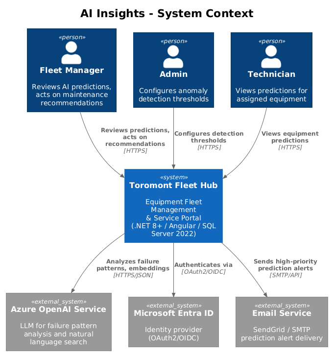
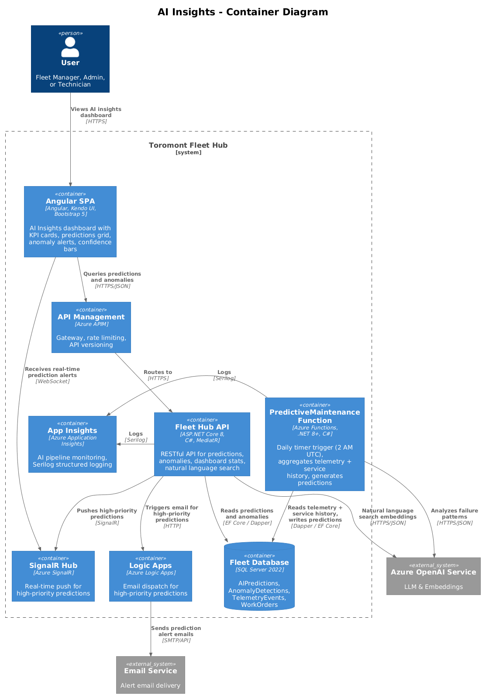
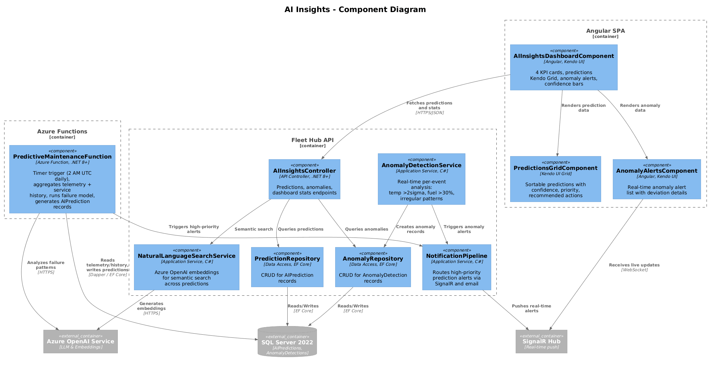
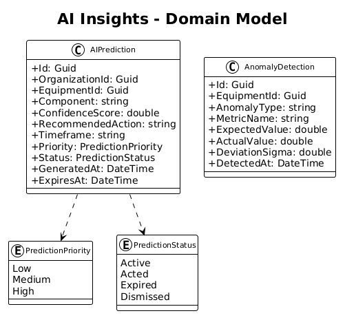
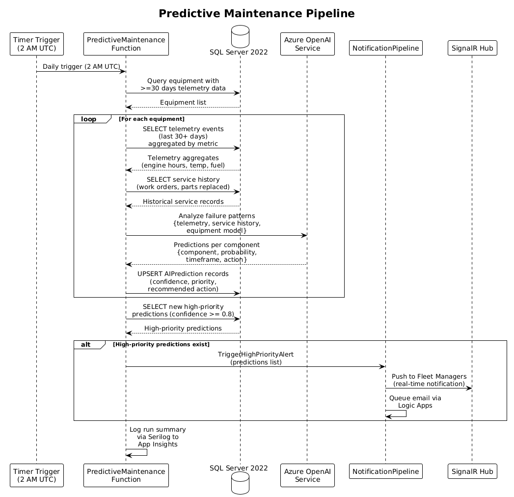

# AI Insights — Detailed Design

## 1. Overview

This feature provides AI-driven predictive maintenance recommendations and anomaly detection for the Toromont Fleet Hub. An Azure Function runs daily scheduled analysis (2 AM UTC) on historical telemetry data and service records to predict component failures before they occur using **Azure OpenAI Service**. Real-time anomaly detection identifies unusual patterns in telemetry streams (temperature deviations >2 sigma, fuel consumption >30% increase, irregular operating patterns). Results are displayed on a dedicated AI Insights dashboard with KPI cards, a predictions grid, anomaly alerts, and confidence score visualizations.

Per the UI design in `docs/ui-design.pen`, screen **"08 - AI Insights"** (frame `KAcQ5`) presents a sidebar (AI Insights active) with a header and content area containing 4 KPI cards, a predictions **Kendo UI Grid**, anomaly alerts list, and confidence score indicators.

**Tech Stack**: Angular SPA with **Kendo UI** components (Grid, progress bars) and **Bootstrap 5** responsive layout | **.NET 8+** RESTful API with **MediatR** (CQRS) | **Azure Functions** for predictive maintenance pipeline | **Azure OpenAI Service** for failure pattern analysis and natural language search embeddings | **SQL Server 2022** via **Entity Framework Core** and **Dapper** (for aggregation queries) | **SignalR** for real-time prediction alerts | **Azure App Services**, **Azure API Management** | **Serilog** structured logging to **Azure Application Insights**

**Traces to:** L1-006 | **L2:** L2-014, L2-015, L2-016

**Actors:** Fleet Manager, Admin, Technician

**ADRs:** [ADR-0003: Kendo UI for Angular](../../adr/frontend/0003-kendo-ui-data-components.md) (Grid for predictions table)

## 2. Architecture

### 2.1 C4 Context Diagram


### 2.2 C4 Container Diagram


### 2.3 C4 Component Diagram


## 3. Component Details

### 3.1 Predictive Maintenance Function (`PredictiveMaintenanceFunction`)
- **Runtime**: Azure Functions on **.NET 8+**, C#
- **Trigger**: Timer trigger — runs daily at 2:00 AM UTC
- **Process**: For each equipment with >=30 days of telemetry data in **SQL Server 2022**:
  1. Aggregates telemetry metrics (engine hours, temperature trends, fuel patterns) via **Dapper** optimized queries
  2. Correlates with past service history (what failed, when, under what conditions) from WorkOrders
  3. Sends aggregated data to **Azure OpenAI Service** for failure pattern analysis
  4. Generates/updates AIPrediction records with confidence scores via **Entity Framework Core**
- **Model**: **Azure OpenAI Service** deployed model endpoint for pattern analysis, with rule-based heuristics as fallback
- **Notifications**: High-priority predictions (confidence >= 0.8) trigger alerts via **SignalR** and email through **Azure Logic Apps**
- **Observability**: Run summaries logged via **Serilog** to **Azure Application Insights**

### 3.2 Anomaly Detection Service (`AnomalyDetectionService`)
- **Runtime**: **.NET 8+** application service, C#
- **Trigger**: Called from telemetry ingestion pipeline for every new event (real-time, per-event)
- **Detection Methods**:
  - Temperature: >2 sigma deviation from 30-day rolling average (L2-016 AC1), computed against **SQL Server 2022** via **Dapper**
  - Fuel: >30% increase vs 7-day average without proportional hours increase (L2-016 AC2)
  - Operating Pattern: Irregular on/off cycles compared to equipment baseline
- **Output**: Creates AnomalyDetection record and Alert record (type=Anomaly) via **Entity Framework Core**, triggers notification to Fleet Manager via **SignalR**

### 3.3 AI Insights Controller (`AIInsightsController`)
- **Runtime**: **.NET 8+** RESTful API with **MediatR**
- `GET /api/v1/ai/predictions` — all active predictions for org, sortable by confidence
- `GET /api/v1/ai/predictions?equipmentId=` — predictions for specific equipment
- `PUT /api/v1/ai/predictions/{id}/dismiss` — dismiss a prediction
- `GET /api/v1/ai/anomalies` — recent anomaly detections
- `GET /api/v1/ai/dashboard-stats` — KPI aggregates (total predictions, high priority count, anomalies detected, estimated cost savings)
- **Authorization**: All endpoints require authenticated user with tenant-scoped access via **Microsoft Entra ID** JWT claims

### 3.4 Natural Language Search Service (`NaturalLanguageSearchService`)
- **Runtime**: **.NET 8+** application service, C#
- **Responsibility**: Provides semantic search across predictions and anomalies using **Azure OpenAI Service** embeddings
- **Implementation**: Generates vector embeddings for prediction descriptions and recommended actions, enables natural language queries like "hydraulic issues on excavators"
- **Endpoint**: `GET /api/v1/ai/search?q=` — returns ranked results by semantic similarity

### 3.5 Angular AI Module
- **AIInsightsDashboardComponent**: 4 KPI cards (total predictions, high priority, anomalies detected, estimated savings), predictions **Kendo UI Grid**, anomaly alerts list — as shown in `docs/ui-design.pen`, screen "08 - AI Insights" (frame `KAcQ5`)
- **Confidence Visualization**: Progress bars with color coding — red (>=80% "High Priority"), amber (50-79% "Medium"), gray (<50% "Low Confidence")
- **Predictions Grid**: **Kendo UI Grid** with sorting, filtering, pagination — columns: Equipment, Component, Confidence, Priority, Recommended Action, Timeframe
- **Equipment Detail Integration**: AI Insights section injected into equipment detail page showing equipment-specific predictions
- **Responsive**: **Bootstrap 5** grid — KPI cards stack on mobile, grid switches to card layout below 768px
- **Real-time**: Anomaly alerts panel subscribes to **SignalR** hub for live anomaly detection push

## 4. Data Model

### 4.1 Class Diagram


### 4.2 Entity Descriptions

| Entity | Table | Description |
|--------|-------|-------------|
| AIPrediction | `AIPredictions` | Predictive maintenance recommendation. Fields: Id, OrganizationId, EquipmentId, Component, ConfidenceScore (0.0-1.0), RecommendedAction, Timeframe, Priority (Low/Medium/High), Status (Active/Acted/Expired/Dismissed), GeneratedAt, ExpiresAt. Nav to Equipment. Stored in **SQL Server 2022**. |
| AnomalyDetection | `AnomalyDetections` | Detected anomaly in telemetry stream. Fields: Id, EquipmentId, AnomalyType, MetricName, ExpectedValue, ActualValue, DeviationSigma, DetectedAt. Nav to Equipment. Stored in **SQL Server 2022**. |

### 4.3 Key Database Indexes
- `IX_AIPredictions_OrganizationId_Status_Priority` — dashboard predictions query
- `IX_AIPredictions_EquipmentId_GeneratedAt` — equipment-specific prediction lookup
- `IX_AnomalyDetections_EquipmentId_DetectedAt` — recent anomalies per equipment
- `IX_AnomalyDetections_DetectedAt` — chronological anomaly list

## 5. Key Workflows

### 5.1 Predictive Maintenance Pipeline


1. **Azure Functions** timer trigger fires daily at 2:00 AM UTC
2. `PredictiveMaintenanceFunction` queries **SQL Server 2022** for all equipment with >=30 days of telemetry data
3. For each equipment: aggregates telemetry metrics via **Dapper** and retrieves service history (WorkOrders, parts replaced)
4. Sends aggregated data to **Azure OpenAI Service** for failure pattern analysis
5. AI returns predictions per component with failure probability, timeframe, and recommended action
6. Function upserts AIPrediction records in **SQL Server 2022** via **Entity Framework Core**
7. High-priority predictions (confidence >= 0.8) trigger notifications: **SignalR** push to connected Fleet Managers, email queued via **Azure Logic Apps**
8. Run summary logged via **Serilog** to **Azure Application Insights**

### 5.2 Real-Time Anomaly Detection
1. Telemetry event arrives via ingestion pipeline (Feature 05)
2. `AnomalyDetectionService` is invoked per event in the **.NET 8+** API
3. Service queries 30-day rolling average for temperature and 7-day average for fuel from **SQL Server 2022** via **Dapper**
4. If temperature >2 sigma deviation or fuel >30% increase: AnomalyDetection record created via **Entity Framework Core**
5. Alert record created (type=Anomaly, severity based on deviation magnitude)
6. **SignalR** pushes real-time anomaly notification to Fleet Manager dashboard

### 5.3 Dashboard Rendering
1. User navigates to AI Insights dashboard in the **Angular SPA**
2. `GET /api/v1/ai/dashboard-stats` populates 4 KPI cards
3. `GET /api/v1/ai/predictions` populates **Kendo UI Grid** with sortable, filterable predictions
4. `GET /api/v1/ai/anomalies` populates anomaly alerts panel
5. **SignalR** connection receives live anomaly and prediction updates

## 6. API Contracts

### GET /api/v1/ai/predictions
```json
// Response 200
{
  "data": [{
    "id": "guid",
    "equipmentName": "CAT 320 GC Excavator",
    "component": "Hydraulic Pump",
    "confidenceScore": 0.86,
    "recommendedAction": "Schedule hydraulic pump inspection and seal replacement",
    "timeframe": "7-14 days",
    "priority": "High",
    "generatedAt": "2026-04-01T02:00:00Z"
  }],
  "pagination": { "page": 1, "pageSize": 20, "totalCount": 47 }
}
```

### GET /api/v1/ai/anomalies
```json
// Response 200
{
  "data": [{
    "id": "guid",
    "equipmentName": "CAT D6 Dozer",
    "anomalyType": "TemperatureAnomaly",
    "metricName": "EngineTemperature",
    "expectedValue": 185.2,
    "actualValue": 224.8,
    "deviationSigma": 2.7,
    "detectedAt": "2026-04-01T14:22:00Z"
  }],
  "pagination": { "page": 1, "pageSize": 20, "totalCount": 12 }
}
```

### GET /api/v1/ai/dashboard-stats
```json
// Response 200
{
  "totalPredictions": 47,
  "highPriorityCount": 8,
  "anomaliesDetected": 12,
  "estimatedCostSavings": 125000.00,
  "lastRunAt": "2026-04-01T02:00:00Z"
}
```

### PUT /api/v1/ai/predictions/{id}/dismiss
```json
// Response 200
{
  "id": "guid",
  "status": "Dismissed",
  "dismissedAt": "2026-04-01T10:15:00Z"
}
```

### GET /api/v1/ai/search?q=hydraulic+issues
```json
// Response 200
{
  "data": [{
    "type": "prediction",
    "id": "guid",
    "equipmentName": "CAT 320 GC Excavator",
    "summary": "Hydraulic Pump — 86% confidence of failure within 7-14 days",
    "relevanceScore": 0.94
  }],
  "totalCount": 3
}
```

## 7. Security Considerations

- **Tenant Isolation**: AI predictions and anomaly detections are tenant-scoped — users see only their organization's data. **Entity Framework Core** global query filter on `OrganizationId` against **SQL Server 2022**
- **Model Data Isolation**: Prediction model does not expose raw telemetry data across tenants when sent to **Azure OpenAI Service**
- **Anomaly Thresholds**: Sigma deviation thresholds configurable only by Admin role via RBAC enforced by **Microsoft Entra ID** JWT claims
- **API Authorization**: All endpoints require authenticated user with valid JWT from **Microsoft Entra ID** (OAuth2/OpenID Connect)
- **Rate Limiting**: **Azure API Management** enforces rate limits on AI search endpoints to manage **Azure OpenAI Service** costs
- **Input Validation**: All inputs validated server-side with FluentValidation in the **.NET 8+** API
- **Observability**: All AI pipeline events (predictions generated, anomalies detected, model calls) logged via **Serilog** to **Azure Application Insights**

## 8. Design Decisions (Resolved)

1. **Rule-based heuristics for v1** — Use rule-based anomaly detection and predictive maintenance (threshold comparisons, rolling averages, standard deviation). No Azure OpenAI model training or inference costs for predictions. The `AnomalyDetectionService` uses simple statistical rules (>2 sigma temperature, >30% fuel spike). This avoids Azure OpenAI per-token costs entirely for the prediction pipeline. NL parts search (Feature 04) still uses ada-002.
2. **Cold-start: use model-level defaults** — For equipment with <30 days of telemetry, fall back to global thresholds based on equipment model/category (e.g., "all CAT 320 excavators"). Store default thresholds in an `EquipmentModelThresholds` table seeded with manufacturer specs. No per-equipment predictions until 30 days of data.
3. **Cost savings: simple historical average** — Estimated savings = (average unplanned repair cost for that component) × (number of predictions acted on). Use a static lookup table of average repair costs per component type. No ML-based estimation — just multiplication against known averages.
4. **Global thresholds only** — Anomaly detection thresholds are configured globally, not per equipment model. One set of rules for temperature, fuel, and operating hours. Simplest to implement and maintain. Per-model tuning can be added later if needed.
5. **90-day retention for predictions** — Dismissed and expired predictions are hard-deleted after 90 days via the same nightly SQL Agent cleanup job used for telemetry. Consistent retention policy across the system.
