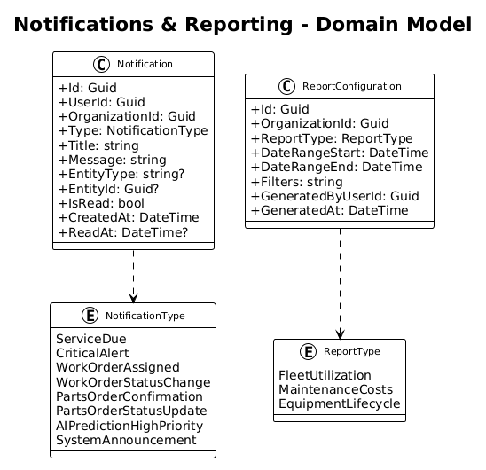

# Notifications & Reporting — Detailed Design

## 1. Overview

This feature provides multi-channel notifications (in-app via SignalR, email, SMS via Logic Apps) and configurable fleet reports with chart visualizations and export capabilities (PDF, Excel, CSV). Users can configure notification preferences per channel per event type.

**Traces to:** L1-008, L1-009 | **L2:** L2-019, L2-020, L2-021, L2-022

## 2. Component Details

### 2.1 Notification Hub (`NotificationHub` — SignalR)
- **Responsibility**: Pushes real-time notifications to connected users
- **Groups**: Users join SignalR group `org-{organizationId}` and `user-{userId}` on connect
- **Methods**: `ReceiveNotification(notification)`, `UpdateBadgeCount(count)`
- **Delivery**: When a notification is created, hub sends to user's group within 5 seconds (L2-019 AC3)

### 2.2 Notifications Controller (`NotificationsController`)
- `GET /api/v1/notifications?unreadOnly=true` — paginated, newest first (max 20)
- `PUT /api/v1/notifications/{id}/read` — mark single as read
- `PUT /api/v1/notifications/mark-all-read` — mark all as read
- `GET /api/v1/notifications/unread-count` — badge count
- `GET /api/v1/notifications/preferences` — user's notification preferences
- `PUT /api/v1/notifications/preferences` — update preferences

### 2.3 Notification Dispatch Service (`NotificationDispatchService`)
- **Responsibility**: Orchestrates notification delivery across channels based on user preferences
- **Flow**: Event occurs → create Notification record → check user preferences → dispatch to enabled channels (in-app always, email if enabled, SMS if enabled)
- **Email/SMS**: Delegated to Azure Logic Apps for reliable delivery with retry

### 2.4 Reports Controller (`ReportsController`)
- `POST /api/v1/reports/fleet-utilization` — generate report with filters, returns chart data
- `POST /api/v1/reports/maintenance-costs` — generate cost report
- `GET /api/v1/reports/export/{type}?format=pdf|excel|csv` — export report
- **Performance**: Uses Dapper with optimized SQL aggregation queries (L2-021 AC5: <3 seconds for 90 days/100+ equipment)

### 2.5 Report Generation Service (`ReportGenerationService`)
- **Fleet Utilization**: Aggregates telemetry data — calculates utilization rate, idle time, active hours per equipment and category. Uses `ROW_NUMBER()` and `SUM()` window functions via Dapper.
- **Maintenance Costs**: Aggregates work order costs by equipment, service type, month. Compares to budget if configured.
- **Export Engines**:
  - PDF: QuestPDF library for chart + table rendering
  - Excel: ClosedXML for tabular data with formatting
  - CSV: CsvHelper for raw data export

### 2.6 Angular Notifications Module
- **NotificationBellComponent**: Header bell icon with unread badge count, dropdown on click
- **NotificationDropdownComponent**: Scrollable list with type icons, message, relative time, click-to-navigate
- **PreferencesComponent**: Toggle grid — rows=notification types, columns=Email/SMS, save button

### 2.7 Angular Reports Module
- **ReportsPageComponent**: Report type selector cards, config form (date range, filters), export buttons
- **FleetUtilizationReportComponent**: Kendo Bar chart (utilization by equipment), Kendo Pie (hours breakdown)
- **MaintenanceCostReportComponent**: Kendo Line (cost trend), Kendo Bar (cost per equipment), Kendo Pie (by service type)

## 3. Data Model

### 3.1 Class Diagram


### 3.2 Key Indexes
- `IX_Notifications_UserId_IsRead_CreatedAt` — unread notifications query
- `IX_Notifications_UserId_CreatedAt` — recent notifications dropdown

## 4. API Contracts

### POST /api/v1/reports/fleet-utilization
```json
// Request
{
  "dateRangeStart": "2026-01-01",
  "dateRangeEnd": "2026-03-31",
  "categoryFilter": null,
  "locationFilter": null
}
// Response 200
{
  "summary": { "avgUtilization": 0.87, "totalHours": 45210, "totalIdleHours": 6782 },
  "byEquipment": [
    { "equipmentName": "CAT 320 GC", "utilizationRate": 0.92, "activeHours": 1240, "idleHours": 108 }
  ],
  "byCategory": [
    { "category": "Excavator", "totalHours": 18500, "percentage": 0.41 }
  ]
}
```

## 5. Security Considerations
- Notification preferences are per-user — users cannot modify other users' preferences
- Report generation respects tenant isolation — all queries scoped to organization
- Export files generated server-side and served via time-limited signed URLs

## 6. Open Questions
1. Should reports be cached for repeat access, or always generated fresh?
2. What SMS provider to use — Twilio, Azure Communication Services, or both?
3. Should there be a notification retention/cleanup policy (e.g., auto-delete after 90 days)?
