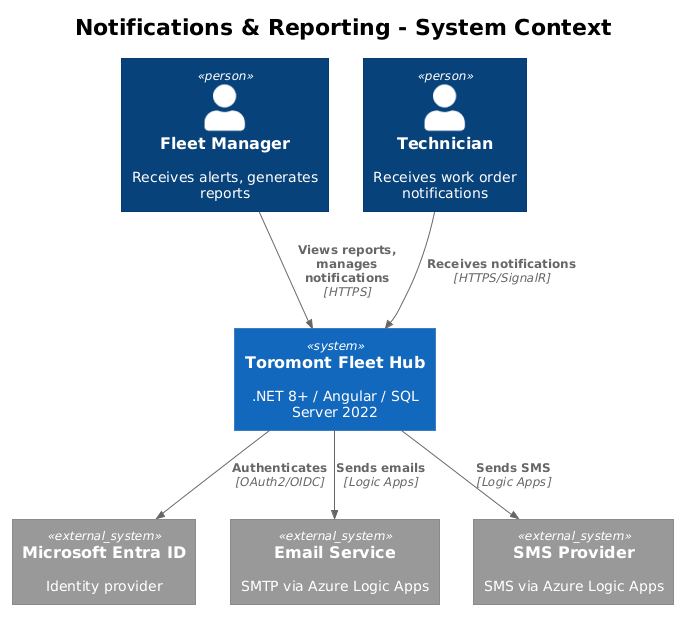
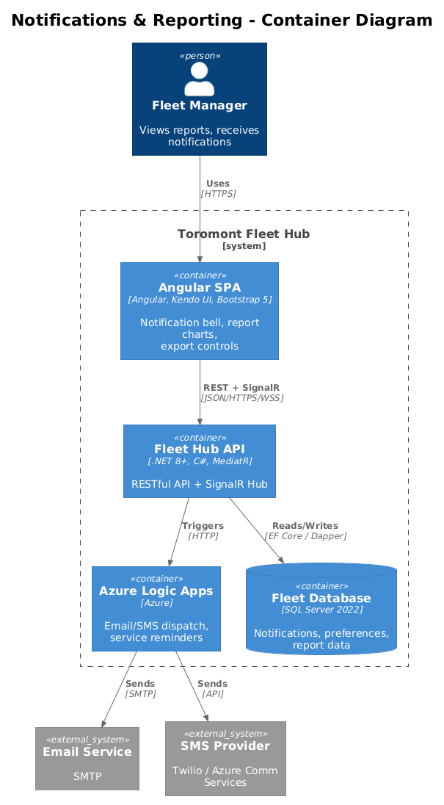
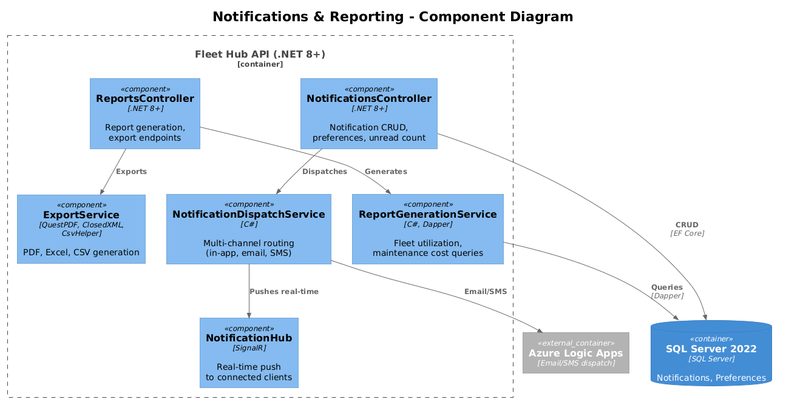
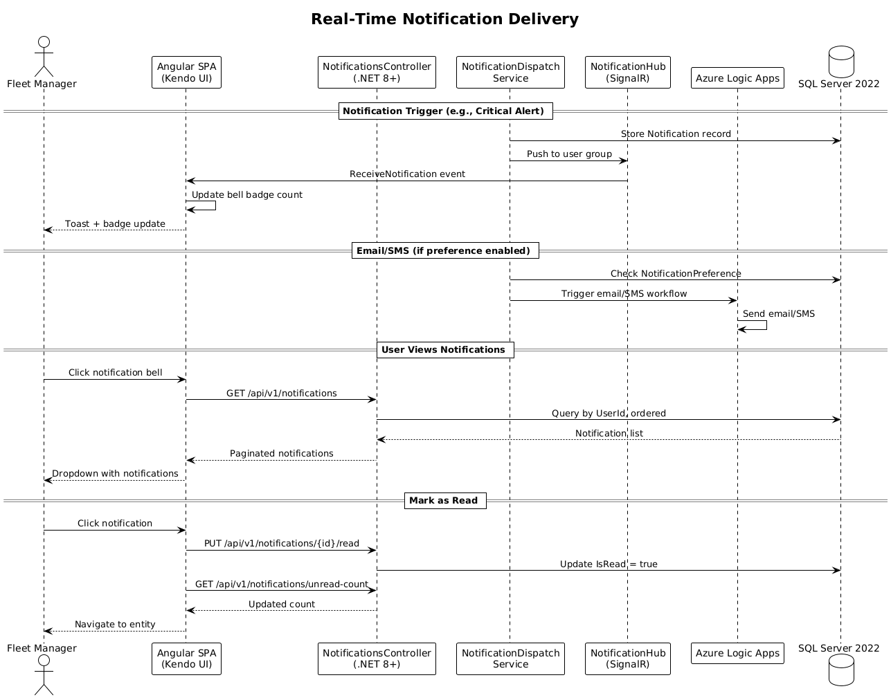
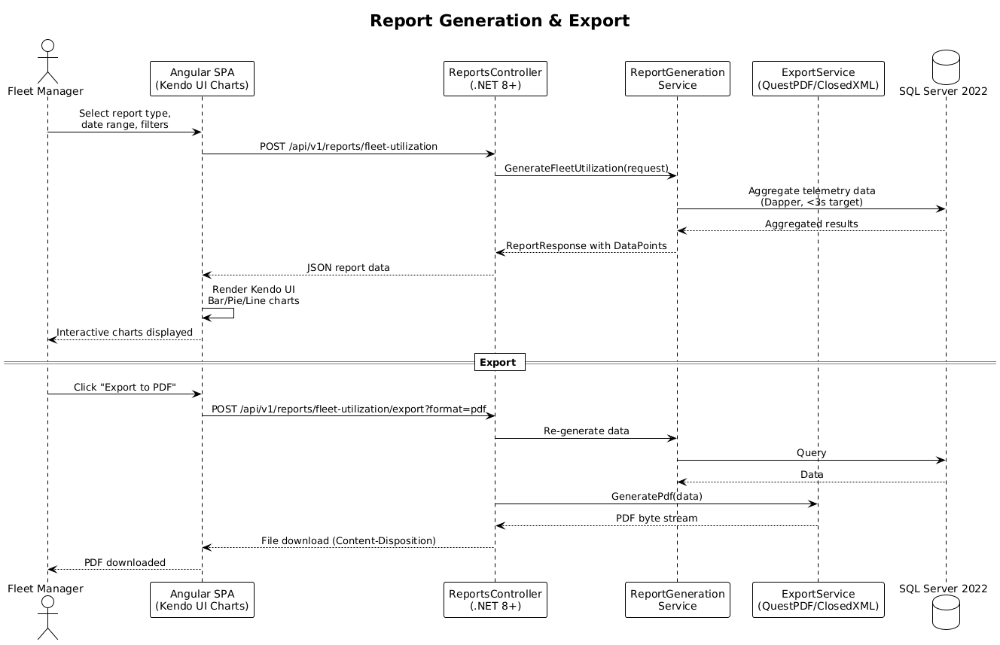

# Notifications & Reporting — Detailed Design

## 1. Overview

This feature provides multi-channel notifications (in-app via SignalR, email, SMS via Azure Logic Apps) and configurable fleet reports with chart visualizations and export capabilities (PDF, Excel, CSV). Users can configure notification preferences per channel per event type.

Per the UI design in `docs/ui-design.pen`, screen "09 - Reports" (frame `6w3G8`) shows the report generation interface with report category cards (Fleet Utilization, Maintenance Costs, Equipment Lifecycle), a configuration toolbar with date range picker, equipment filter, "Generate Report" button, and export buttons, plus two side-by-side chart panels. The notification bell icon appears in the header bar across all screens (component `CGqPj` in screen "02 - Dashboard", frame `pmjuI`), displaying an unread count badge. Screen "11 - Mobile Dashboard" (frame `6PALd`) provides a responsive 375px mobile layout with KPI cards and alerts.

**Tech stack:** Angular SPA with Kendo UI components (Bar, Pie, Line charts, Grid), Bootstrap 5 responsive layout, .NET 8+ RESTful API with MediatR, SignalR for real-time notifications, SQL Server 2022 with EF Core and Dapper (for report aggregation queries), Azure Logic Apps for email/SMS dispatch, QuestPDF / ClosedXML / CsvHelper for report exports, Azure Application Insights and Serilog for observability, OAuth2/OIDC with Microsoft Entra ID for authentication and RBAC + claims-based authorization.

**Traces to:** L1-008, L1-009 | **L2:** L2-019, L2-020, L2-021, L2-022

## 2. Architecture

### 2.1 System Context

The system context diagram shows how Fleet Managers and Technicians interact with the Toromont Fleet Hub for notifications and reporting, and how the system integrates with external services (Microsoft Entra ID for authentication, email/SMS providers via Azure Logic Apps).



### 2.2 Container Diagram

The container diagram shows the major deployable units: the Angular SPA (with Kendo UI and Bootstrap 5), the .NET 8+ API (with SignalR Hub), Azure Logic Apps for email/SMS orchestration, and the SQL Server 2022 database.



### 2.3 Component Diagram

The component diagram details the internal structure of the Fleet Hub API for this feature: NotificationsController, ReportsController, NotificationHub (SignalR), NotificationDispatchService, ReportGenerationService (Dapper), and ExportService (QuestPDF, ClosedXML, CsvHelper).



## 3. Component Details

### 3.1 Notification Hub (`NotificationHub` — SignalR)
- **Responsibility**: Pushes real-time notifications to connected users
- **Groups**: Users join SignalR group `org-{organizationId}` and `user-{userId}` on connect
- **Methods**: `ReceiveNotification(notification)`, `UpdateBadgeCount(count)`
- **Delivery**: When a notification is created, hub sends to user's group within 5 seconds (L2-019 AC3)

### 3.2 Notifications Controller (`NotificationsController`)
- `GET /api/v1/notifications?unreadOnly=true` — paginated, newest first (max 20)
- `PUT /api/v1/notifications/{id}/read` — mark single as read
- `PUT /api/v1/notifications/mark-all-read` — mark all as read
- `GET /api/v1/notifications/unread-count` — badge count
- `GET /api/v1/notifications/preferences` — user's notification preferences
- `PUT /api/v1/notifications/preferences` — update preferences

### 3.3 Notification Dispatch Service (`NotificationDispatchService`)
- **Responsibility**: Orchestrates notification delivery across channels based on user preferences
- **Flow**: Event occurs -> create Notification record -> check user preferences -> dispatch to enabled channels (in-app always, email if enabled, SMS if enabled)
- **Email/SMS**: Delegated to Azure Logic Apps for reliable delivery with retry

### 3.4 Reports Controller (`ReportsController`)
- `POST /api/v1/reports/fleet-utilization` — generate report with filters, returns chart data
- `POST /api/v1/reports/maintenance-costs` — generate cost report
- `POST /api/v1/reports/fleet-utilization/export?format=pdf|excel|csv` — export report
- `POST /api/v1/reports/maintenance-costs/export?format=pdf|excel|csv` — export report
- **Performance**: Uses Dapper with optimized SQL aggregation queries (L2-021 AC5: <3 seconds for 90 days/100+ equipment)

### 3.5 Report Generation Service (`ReportGenerationService`)
- **Fleet Utilization**: Aggregates telemetry data — calculates utilization rate, idle time, active hours per equipment and category. Uses `ROW_NUMBER()` and `SUM()` window functions via Dapper.
- **Maintenance Costs**: Aggregates work order costs by equipment, service type, month. Compares to budget if configured.
- **Export Engines**:
  - PDF: QuestPDF library for chart + table rendering
  - Excel: ClosedXML for tabular data with formatting
  - CSV: CsvHelper for raw data export

### 3.6 Angular Notifications Module
- **NotificationBellComponent**: Header bell icon with unread badge count (per UI design component `CGqPj`), dropdown on click
- **NotificationDropdownComponent**: Scrollable list with type icons, message, relative time, click-to-navigate
- **PreferencesComponent**: Toggle grid — rows=notification types, columns=Email/SMS, save button

### 3.7 Angular Reports Module
- **ReportsPageComponent**: Report type selector cards (per UI design screen "09 - Reports"), config form (date range picker, equipment filter), "Generate Report" button, export buttons (PDF/Excel/CSV)
- **FleetUtilizationReportComponent**: Kendo Bar chart (utilization by equipment), Kendo Pie chart (hours breakdown)
- **MaintenanceCostReportComponent**: Kendo Line chart (cost trend), Kendo Bar chart (cost per equipment), Kendo Pie chart (by service type)

## 4. Data Model

### 4.1 Class Diagram


### 4.2 Entities

**Notification**
| Field | Type | Description |
|-------|------|-------------|
| Id | Guid | Primary key |
| UserId | Guid | Target user |
| OrganizationId | Guid | Tenant isolation |
| Type | NotificationType | Enum: ServiceDue, CriticalAlert, WorkOrderAssigned, etc. |
| Title | string | Short title |
| Message | string | Full message body |
| EntityType | string? | Related entity type (e.g., "Equipment", "WorkOrder") |
| EntityId | Guid? | Related entity identifier for click-to-navigate |
| IsRead | bool | Read status |
| CreatedAt | DateTime | Creation timestamp |

**NotificationPreference**
| Field | Type | Description |
|-------|------|-------------|
| Id | Guid | Primary key |
| UserId | Guid | Owning user |
| NotificationType | NotificationType | Which notification type |
| EmailEnabled | bool | Send via email |
| SmsEnabled | bool | Send via SMS |

**ReportRequest** (DTO)
| Field | Type | Description |
|-------|------|-------------|
| StartDate | DateTime | Report period start |
| EndDate | DateTime | Report period end |
| Category | string? | Optional category filter |

**ReportResponse** (DTO)
| Field | Type | Description |
|-------|------|-------------|
| ReportType | string | Fleet Utilization or Maintenance Costs |
| StartDate | DateTime | Period start |
| EndDate | DateTime | Period end |
| DataPoints | List\<ReportDataPoint\> | Chart data |
| Summary | ReportSummary | Aggregated totals |

**ReportDataPoint** (DTO)
| Field | Type | Description |
|-------|------|-------------|
| Label | string | X-axis label |
| Value | decimal | Y-axis value |
| Category | string | Series/grouping |

**ReportSummary** (DTO)
| Field | Type | Description |
|-------|------|-------------|
| TotalUtilization | decimal | Sum of utilization |
| AverageUtilization | decimal | Mean utilization rate |
| TotalCost | decimal | Sum of costs |
| EquipmentCount | int | Number of equipment in report |

### 4.3 Key Indexes
- `IX_Notifications_UserId_IsRead_CreatedAt` — unread notifications query
- `IX_Notifications_UserId_CreatedAt` — recent notifications dropdown

## 5. Key Workflows

### 5.1 Real-Time Notification Delivery

This sequence shows the end-to-end notification flow: trigger event, store in SQL Server, push via SignalR, optionally dispatch email/SMS via Azure Logic Apps based on user preferences, and the user viewing and marking notifications as read.



### 5.2 Report Generation and Export

This sequence shows a Fleet Manager selecting report parameters in the Angular SPA, the API generating aggregated data via Dapper queries against SQL Server 2022, rendering Kendo UI charts in the frontend, and exporting to PDF (QuestPDF), Excel (ClosedXML), or CSV (CsvHelper).



## 6. API Contracts

### POST /api/v1/reports/fleet-utilization
```json
// Request
{
  "dateRangeStart": "2026-01-01",
  "dateRangeEnd": "2026-03-31",
  "categoryFilter": null,
  "locationFilter": null
}
// Response 200
{
  "summary": { "avgUtilization": 0.87, "totalHours": 45210, "totalIdleHours": 6782 },
  "byEquipment": [
    { "equipmentName": "CAT 320 GC", "utilizationRate": 0.92, "activeHours": 1240, "idleHours": 108 }
  ],
  "byCategory": [
    { "category": "Excavator", "totalHours": 18500, "percentage": 0.41 }
  ]
}
```

### GET /api/v1/notifications?unreadOnly=true&page=1&pageSize=20
```json
// Response 200
{
  "items": [
    {
      "id": "a1b2c3d4-...",
      "type": "CriticalAlert",
      "title": "High Engine Temperature",
      "message": "CAT 320 GC engine temp exceeded threshold",
      "entityType": "Equipment",
      "entityId": "e5f6g7h8-...",
      "isRead": false,
      "createdAt": "2026-03-31T14:22:00Z"
    }
  ],
  "totalCount": 42,
  "page": 1,
  "pageSize": 20
}
```

### PUT /api/v1/notifications/preferences
```json
// Request
{
  "preferences": [
    { "notificationType": "CriticalAlert", "emailEnabled": true, "smsEnabled": true },
    { "notificationType": "ServiceDue", "emailEnabled": true, "smsEnabled": false }
  ]
}
// Response 204 No Content
```

## 7. Security Considerations
- All endpoints require JWT authentication via Microsoft Entra ID (OAuth2/OIDC)
- Notification preferences are per-user — users cannot modify other users' preferences
- Report generation respects tenant isolation — all queries scoped to OrganizationId via claims-based authorization
- Export files generated server-side and served via time-limited signed URLs
- RBAC roles: Fleet Managers can generate all reports; Technicians receive notifications but cannot generate reports

## 8. Design Decisions (Resolved)

1. **No report caching** — Reports are always generated fresh. The Dapper queries target <3 second response time for 90 days / 100+ equipment, which is fast enough without caching. Avoids Redis/memory cache infrastructure costs and stale-data complexity.
2. **Azure Communication Services for SMS** — Use ACS over Twilio. ACS integrates natively with Azure Logic Apps (no third-party connector), has pay-per-message pricing (~$0.0075/SMS), and is already within the Azure ecosystem — no additional vendor relationship or billing setup.
3. **90-day notification retention** — Auto-delete notifications older than 90 days via the same nightly SQL Agent cleanup job used for telemetry and AI predictions. Consistent 90-day retention policy across the entire system minimizes storage growth.
