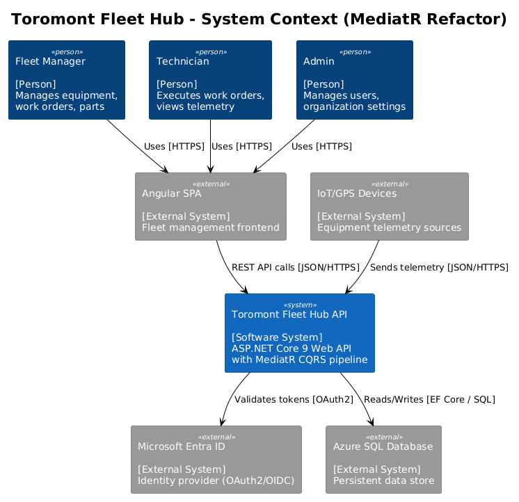
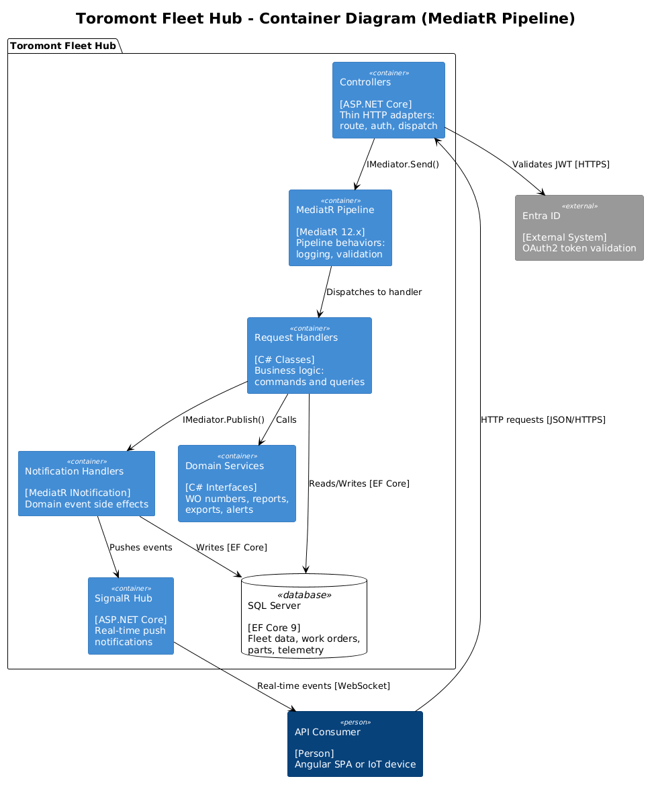
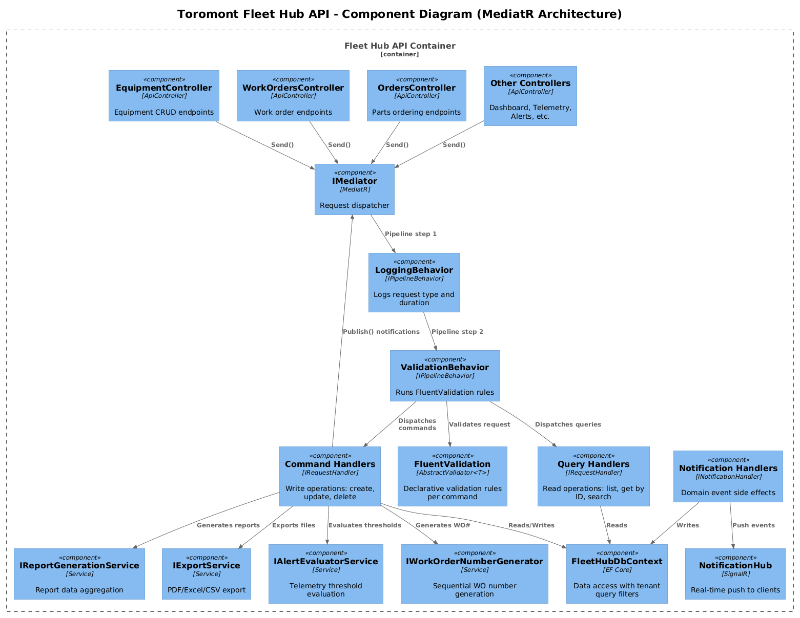
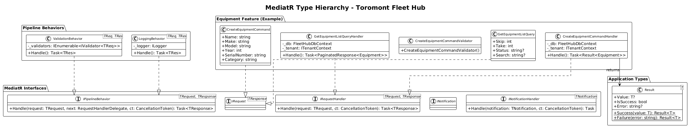
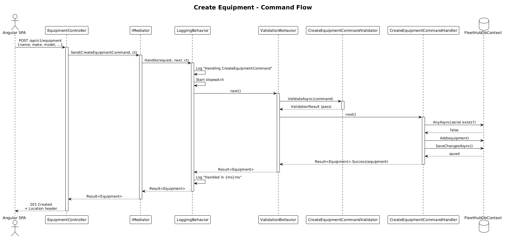
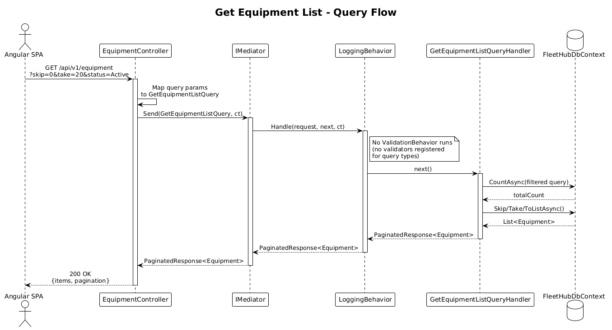
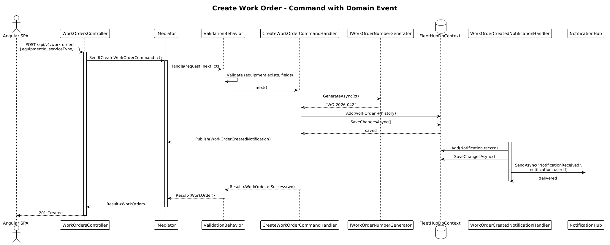
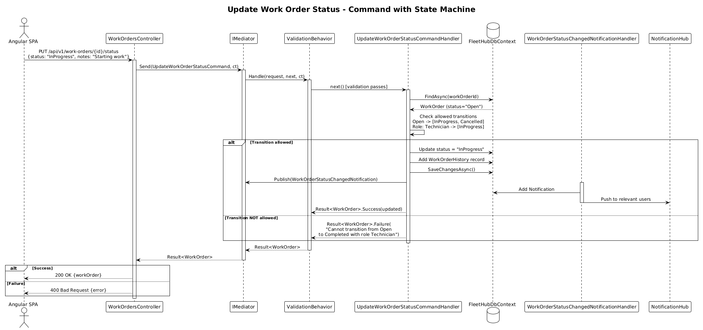

# MediatR CQRS Refactor — Detailed Design

## 1. Overview

The Ironvale Fleet Hub API currently embeds all business logic directly in ASP.NET Core controller actions. This design documents the refactoring of that logic into MediatR request handlers, implementing the CQRS (Command Query Responsibility Segregation) pattern mandated by [ADR-0008](../../adr/backend/0008-mediatr-cqrs-pattern.md).

**Problem:** All 12 controllers contain inline business logic — validation, entity construction, state machines, query composition, and side effects — making them difficult to test in isolation and tightly coupling HTTP concerns with domain logic.

**Solution:** Introduce a vertical-slice architecture where each controller action delegates to a dedicated MediatR request handler via `IMediator.Send()`. Controllers become thin HTTP adapters. Cross-cutting concerns (validation, logging) run automatically via MediatR pipeline behaviors.

**Scope:** This design covers all 12 existing controllers and approximately 35 endpoint actions that will be refactored into dedicated command/query handlers.

**Actors:**
- **API Consumers** (Angular SPA, future mobile clients) — send HTTP requests
- **Controllers** — translate HTTP to MediatR requests and MediatR results back to HTTP responses
- **MediatR Pipeline** — orchestrates validation, logging, and handler dispatch
- **Request Handlers** — contain all business logic

**MediatR Version:** Free/open-source MediatR 12.x (already referenced in the project's `.csproj`). No paid features are required.

## 2. Architecture

### 2.1 C4 Context Diagram

How the Fleet Hub API fits in the broader system landscape — unchanged by this refactor.



### 2.2 C4 Container Diagram

The internal structure of the API container showing the new MediatR pipeline layer between controllers and data access.



### 2.3 C4 Component Diagram

The internal component architecture after the refactor, showing the separation of HTTP, pipeline, handler, and data access layers.



## 3. Component Details

### 3.1 Thin Controllers (HTTP Adapter Layer)

- **Responsibility:** Translate HTTP requests into MediatR request objects, dispatch via `IMediator.Send()`, and map handler results to HTTP responses (status codes, headers).
- **What stays in controllers:** Route attributes, authorization policies (`[Authorize(Policy = "...")]`), `CancellationToken` propagation, HTTP-specific concerns like `CreatedAtAction` URL generation, `IFormFile` extraction.
- **What moves out:** All business logic, validation, entity construction, database queries, side-effect orchestration.

**Before (fat controller):**
```csharp
[HttpPost]
public async Task<ActionResult<Equipment>> Create(
    [FromBody] CreateEquipmentRequest request, CancellationToken ct)
{
    // 30+ lines of validation, entity construction, DB calls, logging
}
```

**After (thin controller):**
```csharp
[HttpPost]
public async Task<ActionResult<Equipment>> Create(
    [FromBody] CreateEquipmentCommand command, CancellationToken ct)
{
    var result = await _mediator.Send(command, ct);
    return CreatedAtAction(nameof(GetById), new { id = result.Id }, result);
}
```

### 3.2 MediatR Requests (Commands & Queries)

- **Responsibility:** Immutable data objects that represent an intent (command) or a question (query).
- **Naming Convention:**
  - Commands: `{Verb}{Noun}Command` — e.g., `CreateEquipmentCommand`, `UpdateWorkOrderStatusCommand`
  - Queries: `Get{Noun}Query` — e.g., `GetEquipmentListQuery`, `GetDashboardKpisQuery`
- **Interface:** Commands implement `IRequest<TResponse>`. Queries implement `IRequest<TResponse>`.
- **Tenant context:** Handlers receive tenant info via `ITenantContext` (injected), not embedded in the request. Requests carry only caller-provided data.

### 3.3 Request Handlers

- **Responsibility:** Contain all business logic for a single operation. Each handler has exactly one public method: `Handle(TRequest, CancellationToken)`.
- **Dependencies:** Inject `FleetHubDbContext`, `ITenantContext`, domain services (e.g., `IWorkOrderNumberGenerator`), and `ILogger<T>` as needed.
- **One handler per file.** The request class and handler class for the same operation live in the same file.
- **Interface:** `IRequestHandler<TRequest, TResponse>`

### 3.4 Pipeline Behaviors

Pipeline behaviors wrap every request/response cycle. They execute in registration order, forming a Russian-doll middleware pipeline.

| Behavior | Order | Responsibility |
|----------|-------|---------------|
| `LoggingBehavior<TRequest, TResponse>` | 1st | Logs request type, duration, success/failure |
| `ValidationBehavior<TRequest, TResponse>` | 2nd | Runs FluentValidation validators, throws `ValidationException` on failure |

**Registration in `Program.cs`:**
```csharp
builder.Services.AddMediatR(cfg =>
{
    cfg.RegisterServicesFromAssemblyContaining<Program>();
    cfg.AddBehavior(typeof(IPipelineBehavior<,>), typeof(LoggingBehavior<,>));
    cfg.AddBehavior(typeof(IPipelineBehavior<,>), typeof(ValidationBehavior<,>));
});
```

### 3.5 FluentValidation Validators

- **Responsibility:** Declarative validation rules for each command. Queries generally do not need validators.
- **Naming:** `{CommandName}Validator` — e.g., `CreateEquipmentCommandValidator`
- **Auto-discovery:** All `AbstractValidator<T>` implementations are registered via `builder.Services.AddValidatorsFromAssemblyContaining<Program>()`.
- **Pipeline integration:** `ValidationBehavior` collects all registered `IValidator<TRequest>` instances and runs them before the handler executes.

### 3.6 Notification Handlers (Domain Events)

- **Responsibility:** React to domain events that occur after a handler completes. Decouples side effects from the primary operation.
- **Interface:** Notifications implement `INotification`. Handlers implement `INotificationHandler<TNotification>`.
- **Use cases:**
  - `WorkOrderCreatedNotification` → push a SignalR notification to the assigned technician
  - `AlertTriggeredNotification` → create an in-app `Notification` record and push via SignalR
  - `OrderSubmittedNotification` → send a confirmation (future email integration)
- **Publishing:** Handlers call `_mediator.Publish(new SomeNotification { ... }, ct)` after completing the primary operation.

### 3.7 Error Handling

Errors are handled through a layered strategy:

| Error Type | Mechanism | HTTP Result |
|------------|-----------|-------------|
| Validation failure | `ValidationBehavior` throws `ValidationException` | 400 Bad Request (via exception middleware) |
| Entity not found | Handler returns `null` or a result wrapper | 404 Not Found (controller maps) |
| Business rule violation | Handler throws `BusinessRuleException` | 422 Unprocessable Entity |
| Unauthorized state transition | Handler throws `BusinessRuleException` | 422 Unprocessable Entity |
| Unexpected errors | Global exception handler middleware | 500 Internal Server Error |

**Result pattern:** For operations that can fail with business errors, handlers return a `Result<T>` wrapper:

```csharp
public class Result<T>
{
    public T? Value { get; init; }
    public bool IsSuccess { get; init; }
    public string? Error { get; init; }
    public static Result<T> Success(T value) => new() { Value = value, IsSuccess = true };
    public static Result<T> Failure(string error) => new() { Error = error, IsSuccess = false };
}
```

Controllers map `Result<T>` to HTTP status codes:
```csharp
var result = await _mediator.Send(command, ct);
if (!result.IsSuccess)
    return BadRequest(new { Error = result.Error });
return Ok(result.Value);
```

## 4. Data Model

### 4.1 Class Diagram — MediatR Type Hierarchy



### 4.2 Type Descriptions

| Type | Kind | Description |
|------|------|-------------|
| `IRequest<T>` | MediatR interface | Marker for a request that returns `T` |
| `IRequestHandler<TReq, TRes>` | MediatR interface | Handler contract with `Handle(TReq, CancellationToken)` |
| `IPipelineBehavior<TReq, TRes>` | MediatR interface | Pipeline middleware contract |
| `INotification` | MediatR interface | Marker for fire-and-forget domain events |
| `INotificationHandler<T>` | MediatR interface | Handles a specific notification type |
| `Result<T>` | Application type | Discriminated success/failure wrapper |
| `LoggingBehavior<TReq, TRes>` | Pipeline behavior | Logs request duration and outcome |
| `ValidationBehavior<TReq, TRes>` | Pipeline behavior | Runs FluentValidation before handler |

## 5. Key Workflows

### 5.1 Command Flow — Create Equipment

The full pipeline for a write operation: HTTP → Controller → MediatR → Validation → Handler → DB.



**Steps:**
1. Angular SPA sends `POST /api/v1/equipment` with JSON body.
2. `EquipmentController.Create` deserializes the body into `CreateEquipmentCommand` and calls `_mediator.Send(command, ct)`.
3. `LoggingBehavior` logs the incoming request type.
4. `ValidationBehavior` locates `CreateEquipmentCommandValidator` and runs the rules. On failure, throws `ValidationException` which the global exception middleware maps to 400.
5. `CreateEquipmentCommandHandler.Handle` checks serial number uniqueness, constructs the `Equipment` entity, persists via EF Core, and returns the created entity.
6. Controller receives the result and returns `201 Created` with a `Location` header.

### 5.2 Query Flow — Get Equipment List

The pipeline for a read operation: HTTP → Controller → MediatR → Handler → DB.



**Steps:**
1. Angular SPA sends `GET /api/v1/equipment?skip=0&take=20&status=Active`.
2. `EquipmentController.GetAll` maps query-string parameters into `GetEquipmentListQuery` and calls `_mediator.Send(query, ct)`.
3. Pipeline behaviors execute (logging only — no validator for queries).
4. `GetEquipmentListQueryHandler.Handle` builds the EF Core query with filters, sorting, and pagination, executes it, and returns `PaginatedResponse<Equipment>`.
5. Controller returns `200 OK` with the paginated result.

### 5.3 Command with Domain Event — Create Work Order

A command that publishes a notification after its primary operation completes.



**Steps:**
1. `POST /api/v1/work-orders` → `WorkOrdersController` → `CreateWorkOrderCommand`.
2. Validation behavior runs `CreateWorkOrderCommandValidator` (checks equipment exists, required fields).
3. `CreateWorkOrderCommandHandler` generates the WO number via `IWorkOrderNumberGenerator`, constructs the entity and initial history entry, persists, then publishes `WorkOrderCreatedNotification`.
4. `WorkOrderCreatedNotificationHandler` creates an in-app `Notification` record and pushes via `IHubContext<NotificationHub>` to the assigned user.
5. Controller returns `201 Created`.

### 5.4 Command with State Machine — Update Work Order Status

A command where the handler enforces business rules (allowed state transitions).



## 6. Handler Inventory

Complete list of MediatR requests to create, organized by feature area.

### 6.1 Equipment

| Request | Type | Current Controller Method |
|---------|------|--------------------------|
| `GetEquipmentListQuery` | Query | `EquipmentController.GetAll` |
| `GetEquipmentByIdQuery` | Query | `EquipmentController.GetById` |
| `CreateEquipmentCommand` | Command | `EquipmentController.Create` |
| `UpdateEquipmentCommand` | Command | `EquipmentController.Update` |
| `DeleteEquipmentCommand` | Command | `EquipmentController.Delete` |
| `ImportEquipmentCommand` | Command | `EquipmentController.Import` |

### 6.2 Work Orders

| Request | Type | Current Controller Method |
|---------|------|--------------------------|
| `GetWorkOrderListQuery` | Query | `WorkOrdersController.GetAll` |
| `GetWorkOrderByIdQuery` | Query | `WorkOrdersController.GetById` |
| `CreateWorkOrderCommand` | Command | `WorkOrdersController.Create` |
| `UpdateWorkOrderStatusCommand` | Command | `WorkOrdersController.UpdateStatus` |
| `GetWorkOrderCalendarQuery` | Query | `WorkOrdersController.GetCalendar` |

### 6.3 Parts

| Request | Type | Current Controller Method |
|---------|------|--------------------------|
| `GetPartsListQuery` | Query | `PartsController.GetAll` |
| `GetPartByIdQuery` | Query | `PartsController.GetById` |
| `SearchPartsQuery` | Query | `PartsController.Search` |

### 6.4 Cart

| Request | Type | Current Controller Method |
|---------|------|--------------------------|
| `GetCartQuery` | Query | `CartController.GetCart` |
| `AddCartItemCommand` | Command | `CartController.AddItem` |
| `UpdateCartItemCommand` | Command | `CartController.UpdateItem` |
| `RemoveCartItemCommand` | Command | `CartController.RemoveItem` |

### 6.5 Orders

| Request | Type | Current Controller Method |
|---------|------|--------------------------|
| `SubmitOrderCommand` | Command | `OrdersController.SubmitOrder` |
| `GetOrderListQuery` | Query | `OrdersController.GetAll` |
| `GetOrderByIdQuery` | Query | `OrdersController.GetById` |

### 6.6 Dashboard

| Request | Type | Current Controller Method |
|---------|------|--------------------------|
| `GetDashboardKpisQuery` | Query | `DashboardController.GetKpis` |
| `GetDashboardAlertsQuery` | Query | `DashboardController.GetAlerts` |

### 6.7 Telemetry

| Request | Type | Current Controller Method |
|---------|------|--------------------------|
| `IngestTelemetryCommand` | Command | `TelemetryController.Ingest` |
| `GetEquipmentMetricsQuery` | Query | `TelemetryController.GetMetrics` |
| `GetLatestTelemetryQuery` | Query | `TelemetryController.GetLatest` |
| `GetGpsTrailQuery` | Query | `TelemetryController.GetGpsTrail` |

### 6.8 Alerts

| Request | Type | Current Controller Method |
|---------|------|--------------------------|
| `GetAlertsListQuery` | Query | `AlertsController.GetAll` |
| `AcknowledgeAlertCommand` | Command | `AlertsController.Acknowledge` |
| `ResolveAlertCommand` | Command | `AlertsController.Resolve` |

### 6.9 AI Insights

| Request | Type | Current Controller Method |
|---------|------|--------------------------|
| `GetPredictionsQuery` | Query | `AIInsightsController.GetPredictions` |
| `GetEquipmentPredictionsQuery` | Query | `AIInsightsController.GetEquipmentPredictions` |
| `DismissPredictionCommand` | Command | `AIInsightsController.DismissPrediction` |
| `GetAnomaliesQuery` | Query | `AIInsightsController.GetAnomalies` |
| `GetAIDashboardStatsQuery` | Query | `AIInsightsController.GetDashboardStats` |

### 6.10 Notifications

| Request | Type | Current Controller Method |
|---------|------|--------------------------|
| `GetNotificationsQuery` | Query | `NotificationsController.GetAll` |
| `MarkNotificationReadCommand` | Command | `NotificationsController.MarkRead` |
| `MarkAllNotificationsReadCommand` | Command | `NotificationsController.MarkAllRead` |
| `GetUnreadCountQuery` | Query | `NotificationsController.GetUnreadCount` |
| `GetNotificationPreferencesQuery` | Query | `NotificationsController.GetPreferences` |
| `UpdateNotificationPreferencesCommand` | Command | `NotificationsController.UpdatePreferences` |

### 6.11 Reports

| Request | Type | Current Controller Method |
|---------|------|--------------------------|
| `GenerateFleetUtilizationReportCommand` | Command | `ReportsController.FleetUtilization` |
| `GenerateMaintenanceCostsReportCommand` | Command | `ReportsController.MaintenanceCosts` |
| `ExportReportCommand` | Command | `ReportsController.Export` |

### 6.12 Users

| Request | Type | Current Controller Method |
|---------|------|--------------------------|
| `GetUsersListQuery` | Query | `UsersController.GetAll` |
| `InviteUserCommand` | Command | `UsersController.Invite` |
| `ChangeUserRoleCommand` | Command | `UsersController.ChangeRole` |
| `DeactivateUserCommand` | Command | `UsersController.Deactivate` |
| `ActivateUserCommand` | Command | `UsersController.Activate` |

### 6.13 Domain Event Notifications

| Notification | Publisher | Handler(s) |
|--------------|----------|------------|
| `WorkOrderCreatedNotification` | `CreateWorkOrderCommandHandler` | Push SignalR notification to assigned technician |
| `WorkOrderStatusChangedNotification` | `UpdateWorkOrderStatusCommandHandler` | Push SignalR notification, create `Notification` record |
| `AlertTriggeredNotification` | `IngestTelemetryCommandHandler` | Create `Notification` record, push SignalR |
| `OrderSubmittedNotification` | `SubmitOrderCommandHandler` | Create `Notification` record |
| `EquipmentDeletedNotification` | `DeleteEquipmentCommandHandler` | Audit log (future) |

## 7. Project Structure

The refactored folder layout follows a **vertical-slice** organization — each feature's commands, queries, handlers, and validators are co-located.

```
src/backend/IronvaleFleetHub.Api/
├── Program.cs
├── Controllers/                          # Thin HTTP adapters (existing, refactored)
│   ├── EquipmentController.cs
│   ├── WorkOrdersController.cs
│   ├── ...
│
├── Features/                             # NEW — vertical slices
│   ├── Equipment/
│   │   ├── Commands/
│   │   │   ├── CreateEquipmentCommand.cs       # Command + Handler + Validator
│   │   │   ├── UpdateEquipmentCommand.cs
│   │   │   ├── DeleteEquipmentCommand.cs
│   │   │   └── ImportEquipmentCommand.cs
│   │   └── Queries/
│   │       ├── GetEquipmentListQuery.cs        # Query + Handler
│   │       └── GetEquipmentByIdQuery.cs
│   │
│   ├── WorkOrders/
│   │   ├── Commands/
│   │   │   ├── CreateWorkOrderCommand.cs
│   │   │   └── UpdateWorkOrderStatusCommand.cs
│   │   ├── Queries/
│   │   │   ├── GetWorkOrderListQuery.cs
│   │   │   ├── GetWorkOrderByIdQuery.cs
│   │   │   └── GetWorkOrderCalendarQuery.cs
│   │   └── Notifications/
│   │       ├── WorkOrderCreatedNotification.cs
│   │       └── WorkOrderStatusChangedNotification.cs
│   │
│   ├── Parts/
│   │   └── Queries/
│   │       ├── GetPartsListQuery.cs
│   │       ├── GetPartByIdQuery.cs
│   │       └── SearchPartsQuery.cs
│   │
│   ├── Cart/
│   │   ├── Commands/
│   │   │   ├── AddCartItemCommand.cs
│   │   │   ├── UpdateCartItemCommand.cs
│   │   │   └── RemoveCartItemCommand.cs
│   │   └── Queries/
│   │       └── GetCartQuery.cs
│   │
│   ├── Orders/
│   │   ├── Commands/
│   │   │   └── SubmitOrderCommand.cs
│   │   ├── Queries/
│   │   │   ├── GetOrderListQuery.cs
│   │   │   └── GetOrderByIdQuery.cs
│   │   └── Notifications/
│   │       └── OrderSubmittedNotification.cs
│   │
│   ├── Dashboard/
│   │   └── Queries/
│   │       ├── GetDashboardKpisQuery.cs
│   │       └── GetDashboardAlertsQuery.cs
│   │
│   ├── Telemetry/
│   │   ├── Commands/
│   │   │   └── IngestTelemetryCommand.cs
│   │   ├── Queries/
│   │   │   ├── GetEquipmentMetricsQuery.cs
│   │   │   ├── GetLatestTelemetryQuery.cs
│   │   │   └── GetGpsTrailQuery.cs
│   │   └── Notifications/
│   │       └── AlertTriggeredNotification.cs
│   │
│   ├── Alerts/
│   │   ├── Commands/
│   │   │   ├── AcknowledgeAlertCommand.cs
│   │   │   └── ResolveAlertCommand.cs
│   │   └── Queries/
│   │       └── GetAlertsListQuery.cs
│   │
│   ├── AIInsights/
│   │   ├── Commands/
│   │   │   └── DismissPredictionCommand.cs
│   │   └── Queries/
│   │       ├── GetPredictionsQuery.cs
│   │       ├── GetEquipmentPredictionsQuery.cs
│   │       ├── GetAnomaliesQuery.cs
│   │       └── GetAIDashboardStatsQuery.cs
│   │
│   ├── Notifications/
│   │   ├── Commands/
│   │   │   ├── MarkNotificationReadCommand.cs
│   │   │   ├── MarkAllNotificationsReadCommand.cs
│   │   │   └── UpdateNotificationPreferencesCommand.cs
│   │   └── Queries/
│   │       ├── GetNotificationsQuery.cs
│   │       ├── GetUnreadCountQuery.cs
│   │       └── GetNotificationPreferencesQuery.cs
│   │
│   ├── Reports/
│   │   └── Commands/
│   │       ├── GenerateFleetUtilizationReportCommand.cs
│   │       ├── GenerateMaintenanceCostsReportCommand.cs
│   │       └── ExportReportCommand.cs
│   │
│   └── Users/
│       ├── Commands/
│       │   ├── InviteUserCommand.cs
│       │   ├── ChangeUserRoleCommand.cs
│       │   ├── DeactivateUserCommand.cs
│       │   └── ActivateUserCommand.cs
│       └── Queries/
│           └── GetUsersListQuery.cs
│
├── Behaviors/                            # NEW — MediatR pipeline behaviors
│   ├── LoggingBehavior.cs
│   └── ValidationBehavior.cs
│
├── Common/                               # NEW — shared types
│   └── Result.cs
│
├── Models/                               # Existing — unchanged
├── DTOs/                                 # Existing — request DTOs remain for backward compat,
│                                         #   gradually replaced by MediatR command/query types
├── Services/                             # Existing — domain services remain
├── Data/                                 # Existing — DbContext unchanged
├── Middleware/                           # Existing — unchanged
├── Authentication/                       # Existing — unchanged
└── Hubs/                                 # Existing — unchanged
```

### 7.1 File Organization Conventions

- **One request + one handler per file.** The request record and its handler class are co-located in the same file. The file is named after the request (e.g., `CreateEquipmentCommand.cs`).
- **Validators in the same file** as the command they validate (or in a separate `{Command}Validator.cs` file if lengthy).
- **Notification + handler in the same file** for simple notification handlers.

## 8. Implementation Examples

### 8.1 Command with Validator

```csharp
// Features/Equipment/Commands/CreateEquipmentCommand.cs

namespace IronvaleFleetHub.Api.Features.Equipment.Commands;

public record CreateEquipmentCommand(
    string Name,
    string Make,
    string Model,
    int Year,
    string SerialNumber,
    string Category,
    string? Location,
    double? Latitude,
    double? Longitude,
    string? GpsDeviceId,
    DateTime? PurchaseDate,
    DateTime? WarrantyExpiration,
    string? Notes
) : IRequest<Result<Models.Equipment>>;

public class CreateEquipmentCommandValidator : AbstractValidator<CreateEquipmentCommand>
{
    public CreateEquipmentCommandValidator()
    {
        RuleFor(x => x.Name).NotEmpty();
        RuleFor(x => x.Make).NotEmpty();
        RuleFor(x => x.Model).NotEmpty();
        RuleFor(x => x.Year).InclusiveBetween(1900, DateTime.UtcNow.Year + 2);
        RuleFor(x => x.SerialNumber).NotEmpty();
        RuleFor(x => x.Category).NotEmpty();
    }
}

public class CreateEquipmentCommandHandler
    : IRequestHandler<CreateEquipmentCommand, Result<Models.Equipment>>
{
    private readonly FleetHubDbContext _db;
    private readonly ITenantContext _tenant;
    private readonly ILogger<CreateEquipmentCommandHandler> _logger;

    public CreateEquipmentCommandHandler(
        FleetHubDbContext db, ITenantContext tenant,
        ILogger<CreateEquipmentCommandHandler> logger)
    {
        _db = db;
        _tenant = tenant;
        _logger = logger;
    }

    public async Task<Result<Models.Equipment>> Handle(
        CreateEquipmentCommand request, CancellationToken ct)
    {
        var exists = await _db.Equipment.AnyAsync(
            e => e.SerialNumber == request.SerialNumber
              && e.OrganizationId == _tenant.OrganizationId, ct);

        if (exists)
            return Result<Models.Equipment>.Failure(
                "Equipment with this serial number already exists.");

        var equipment = new Models.Equipment
        {
            Id = Guid.NewGuid(),
            OrganizationId = _tenant.OrganizationId,
            Name = request.Name,
            Make = request.Make,
            Model = request.Model,
            Year = request.Year,
            SerialNumber = request.SerialNumber,
            Category = request.Category,
            Location = request.Location,
            Latitude = request.Latitude,
            Longitude = request.Longitude,
            GpsDeviceId = request.GpsDeviceId,
            PurchaseDate = request.PurchaseDate,
            WarrantyExpiration = request.WarrantyExpiration,
            Notes = request.Notes,
            CreatedAt = DateTime.UtcNow,
            UpdatedAt = DateTime.UtcNow
        };

        _db.Equipment.Add(equipment);
        await _db.SaveChangesAsync(ct);

        _logger.LogInformation("Equipment {EquipmentId} created by {UserId}",
            equipment.Id, _tenant.UserId);

        return Result<Models.Equipment>.Success(equipment);
    }
}
```

### 8.2 Refactored Thin Controller

```csharp
// Controllers/EquipmentController.cs (after refactor)

[ApiController]
[Route("api/v1/equipment")]
[Authorize]
public class EquipmentController : ControllerBase
{
    private readonly IMediator _mediator;

    public EquipmentController(IMediator mediator) => _mediator = mediator;

    [HttpGet]
    public async Task<ActionResult<PaginatedResponse<Equipment>>> GetAll(
        [FromQuery] int skip = 0, [FromQuery] int take = 20,
        [FromQuery] string? status = null, [FromQuery] string? category = null,
        [FromQuery] string? search = null, [FromQuery] string? sort = null,
        CancellationToken ct = default)
    {
        var result = await _mediator.Send(
            new GetEquipmentListQuery(skip, take, status, category, search, sort), ct);
        return Ok(result);
    }

    [HttpGet("{id:guid}")]
    public async Task<ActionResult<Equipment>> GetById(Guid id, CancellationToken ct)
    {
        var result = await _mediator.Send(new GetEquipmentByIdQuery(id), ct);
        return result is null ? NotFound() : Ok(result);
    }

    [HttpPost]
    [Authorize(Policy = "RequireAdminOrFleetManager")]
    public async Task<ActionResult<Equipment>> Create(
        [FromBody] CreateEquipmentCommand command, CancellationToken ct)
    {
        var result = await _mediator.Send(command, ct);
        if (!result.IsSuccess) return BadRequest(new { Error = result.Error });
        return CreatedAtAction(nameof(GetById), new { id = result.Value!.Id }, result.Value);
    }

    // ... remaining actions follow the same pattern
}
```

### 8.3 Validation Pipeline Behavior

```csharp
// Behaviors/ValidationBehavior.cs

namespace IronvaleFleetHub.Api.Behaviors;

public class ValidationBehavior<TRequest, TResponse>
    : IPipelineBehavior<TRequest, TResponse>
    where TRequest : notnull
{
    private readonly IEnumerable<IValidator<TRequest>> _validators;

    public ValidationBehavior(IEnumerable<IValidator<TRequest>> validators)
        => _validators = validators;

    public async Task<TResponse> Handle(
        TRequest request,
        RequestHandlerDelegate<TResponse> next,
        CancellationToken ct)
    {
        if (!_validators.Any()) return await next();

        var context = new ValidationContext<TRequest>(request);
        var results = await Task.WhenAll(
            _validators.Select(v => v.ValidateAsync(context, ct)));

        var failures = results
            .SelectMany(r => r.Errors)
            .Where(f => f is not null)
            .ToList();

        if (failures.Count > 0)
            throw new ValidationException(failures);

        return await next();
    }
}
```

### 8.4 Logging Pipeline Behavior

```csharp
// Behaviors/LoggingBehavior.cs

namespace IronvaleFleetHub.Api.Behaviors;

public class LoggingBehavior<TRequest, TResponse>
    : IPipelineBehavior<TRequest, TResponse>
    where TRequest : notnull
{
    private readonly ILogger<LoggingBehavior<TRequest, TResponse>> _logger;

    public LoggingBehavior(ILogger<LoggingBehavior<TRequest, TResponse>> logger)
        => _logger = logger;

    public async Task<TResponse> Handle(
        TRequest request,
        RequestHandlerDelegate<TResponse> next,
        CancellationToken ct)
    {
        var requestName = typeof(TRequest).Name;
        _logger.LogInformation("Handling {RequestName}", requestName);

        var sw = System.Diagnostics.Stopwatch.StartNew();
        var response = await next();
        sw.Stop();

        _logger.LogInformation("Handled {RequestName} in {ElapsedMs}ms",
            requestName, sw.ElapsedMilliseconds);

        return response;
    }
}
```

### 8.5 Notification Example

```csharp
// Features/WorkOrders/Notifications/WorkOrderCreatedNotification.cs

namespace IronvaleFleetHub.Api.Features.WorkOrders.Notifications;

public record WorkOrderCreatedNotification(
    Guid WorkOrderId,
    string WorkOrderNumber,
    Guid? AssignedToUserId,
    Guid OrganizationId
) : INotification;

public class WorkOrderCreatedNotificationHandler
    : INotificationHandler<WorkOrderCreatedNotification>
{
    private readonly FleetHubDbContext _db;
    private readonly IHubContext<NotificationHub> _hub;

    public WorkOrderCreatedNotificationHandler(
        FleetHubDbContext db, IHubContext<NotificationHub> hub)
    {
        _db = db;
        _hub = hub;
    }

    public async Task Handle(
        WorkOrderCreatedNotification notification, CancellationToken ct)
    {
        if (notification.AssignedToUserId is null) return;

        var record = new Notification
        {
            Id = Guid.NewGuid(),
            OrganizationId = notification.OrganizationId,
            UserId = notification.AssignedToUserId.Value,
            Type = "WorkOrderAssigned",
            Title = "New Work Order Assigned",
            Message = $"Work order {notification.WorkOrderNumber} has been assigned to you.",
            IsRead = false,
            CreatedAt = DateTime.UtcNow
        };

        _db.Notifications.Add(record);
        await _db.SaveChangesAsync(ct);

        await _hub.Clients
            .User(notification.AssignedToUserId.Value.ToString())
            .SendAsync("NotificationReceived", record, ct);
    }
}
```

## 9. DI Registration Changes

Updated `Program.cs` registration:

```csharp
// --- MediatR with pipeline behaviors ---
builder.Services.AddMediatR(cfg =>
{
    cfg.RegisterServicesFromAssemblyContaining<Program>();
    cfg.AddBehavior(typeof(IPipelineBehavior<,>), typeof(LoggingBehavior<,>));
    cfg.AddBehavior(typeof(IPipelineBehavior<,>), typeof(ValidationBehavior<,>));
});

// --- FluentValidation ---
builder.Services.AddValidatorsFromAssemblyContaining<Program>();
builder.Services.AddFluentValidationAutoValidation();
```

The existing `AddMediatR` call on line 60 of `Program.cs` is replaced with the expanded version that registers pipeline behaviors.

## 10. Migration Strategy

The refactor should be done **incrementally, one controller at a time**, with each step being a separately testable commit.

### Phase 1 — Infrastructure (1 commit)
1. Add `Behaviors/` folder with `LoggingBehavior.cs` and `ValidationBehavior.cs`.
2. Add `Common/Result.cs`.
3. Update `Program.cs` MediatR registration to include pipeline behaviors.
4. Add global exception handling middleware for `ValidationException` → 400 mapping.

### Phase 2 — Feature-by-Feature (1 commit per controller)
For each controller, in order of complexity (simplest first):
1. **DashboardController** (2 queries, no commands) — lowest risk starting point
2. **PartsController** (3 queries)
3. **AlertsController** (1 query, 2 commands)
4. **CartController** (1 query, 3 commands)
5. **NotificationsController** (3 queries, 3 commands)
6. **AIInsightsController** (4 queries, 1 command)
7. **OrdersController** (2 queries, 1 command with business logic)
8. **UsersController** (1 query, 4 commands)
9. **EquipmentController** (2 queries, 4 commands including XML import)
10. **TelemetryController** (3 queries, 1 command with alert evaluation)
11. **WorkOrdersController** (3 queries, 2 commands with state machine)
12. **ReportsController** (3 commands with export delegation)

Each step:
1. Create `Features/{Area}/Commands/` and `Features/{Area}/Queries/` folders.
2. Move business logic from controller action into handler.
3. Create FluentValidation validators for commands.
4. Refactor controller to inject `IMediator` and dispatch.
5. Run existing integration/E2E tests to verify no regressions (API contracts are unchanged).

### Phase 3 — Cleanup (1 commit)
1. Remove unused service injections from controllers.
2. Move any DTOs that are now superseded by MediatR request records to the feature folders.
3. Update imports and namespaces.

## 11. Security Considerations

- **Authorization stays on controllers.** `[Authorize(Policy = "...")]` attributes remain on controller actions — they are an HTTP concern, not a business logic concern. Handlers do not check authorization.
- **Tenant isolation stays in handlers.** Handlers filter by `_tenant.OrganizationId` as the controllers do today. The global query filter on `FleetHubDbContext` provides a safety net.
- **Validation runs before handlers.** The `ValidationBehavior` pipeline ensures no malformed data reaches handler logic.
- **No sensitive data in logs.** `LoggingBehavior` logs only request type names and durations, not request payloads.

## 12. Open Questions

1. **Result<T> vs exceptions for business errors:** This design proposes `Result<T>` for expected business failures (e.g., duplicate serial number) and exceptions for unexpected errors. An alternative is to use exceptions for all failures and rely on the global exception handler. The team should decide which pattern they prefer.

2. **Existing service interfaces:** Services like `IReportGenerationService` and `IExportService` contain significant logic. Should they remain as injected services called by handlers, or should their logic be absorbed into the handlers themselves? Recommendation: keep them as services — they represent reusable domain capabilities, not request-specific operations.

3. **DTOs vs MediatR records:** Existing request DTOs (e.g., `CreateEquipmentRequest`) overlap with the new MediatR command records. Should controllers accept the existing DTOs and map to commands, or should the MediatR commands be the API contract directly? Recommendation: use MediatR commands as the API contract to avoid mapping boilerplate.

4. **Notification handler failure isolation:** If a `INotificationHandler` fails (e.g., SignalR push fails), should it fail silently or propagate the exception? MediatR publishes notifications sequentially by default. Recommendation: wrap notification handlers in try/catch with logging — notification delivery should not fail the primary operation.
