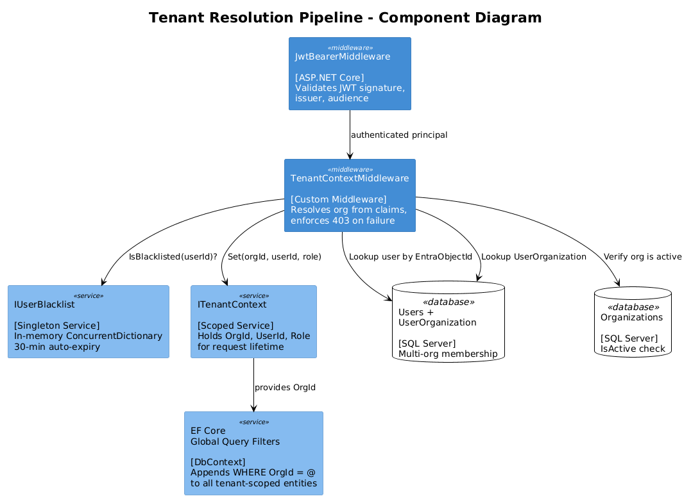
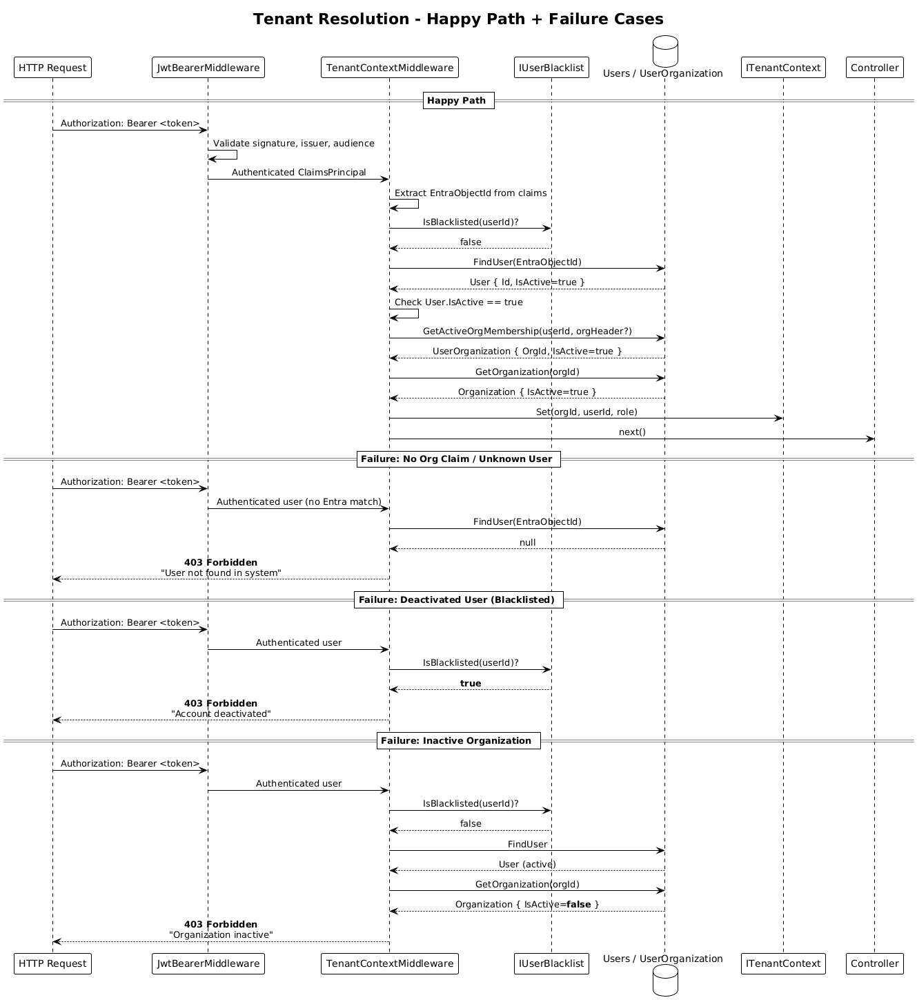
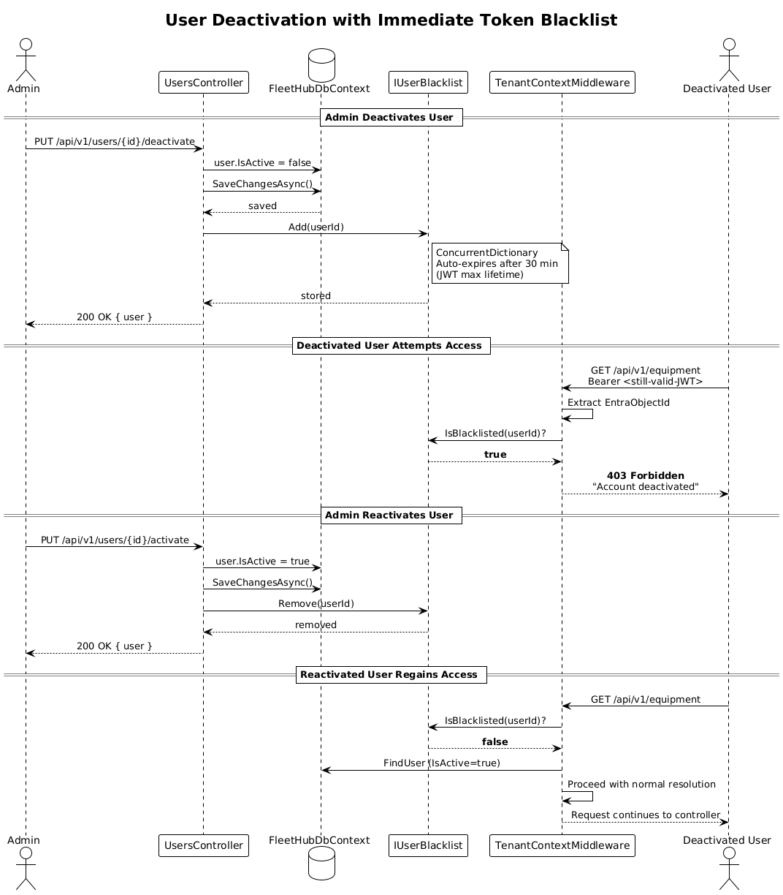
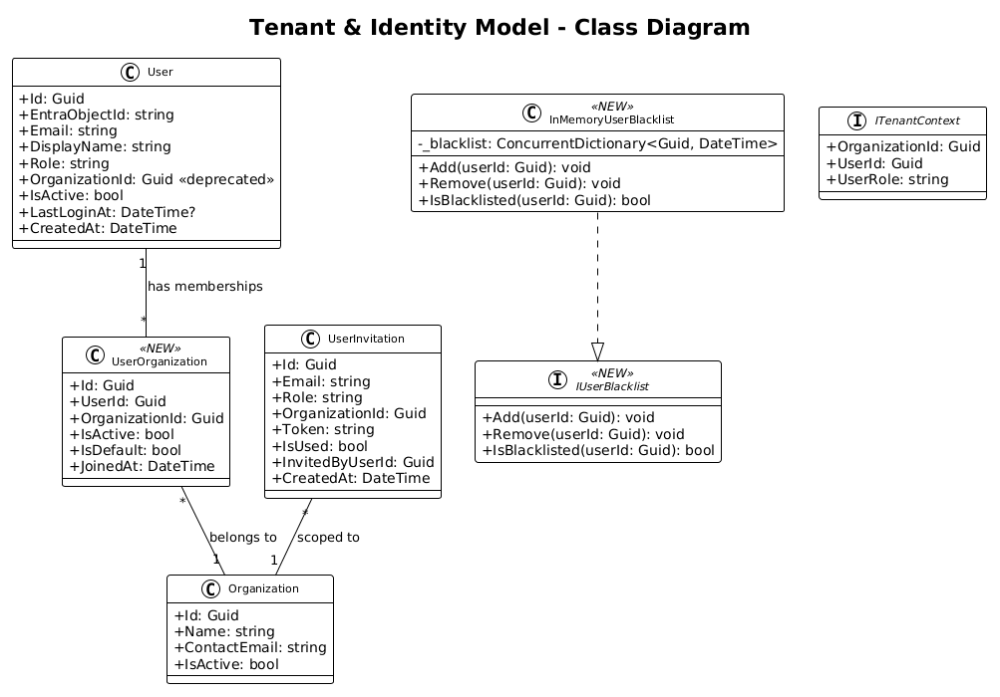

# Tenant & Identity Model Hardening — Detailed Design

## 1. Overview

**Audit Finding:** #2 — Tenant and identity model diverge from the authentication design.

The authentication detailed design (Feature 01) specifies: (a) `TenantContextMiddleware` must return 403 when the org claim is missing or the organization is inactive, (b) a `UserOrganization` join table supports multi-org membership with active-org switching, (c) deactivated users are immediately blocked via an in-memory token blacklist, and (d) header-based tenant override is not an approved production mechanism. The current implementation stores only a single `OrganizationId` on `User`, the middleware silently continues when tenant resolution fails, supports arbitrary header-based tenant override, and does not block deactivated users.

**Scope of this design:** Bring the tenant and identity implementation into alignment with the Feature 01 detailed design by implementing the four changes above, plus extending EF Core global query filters to all tenant-scoped entities (Finding #11 from the audit).

**References:**
- [Feature 01 — Authentication & Multi-Tenancy](../01-authentication/README.md)
- [ADR-0008: MediatR CQRS Pattern](../../adr/backend/0008-mediatr-cqrs-pattern.md)
- [Backend Implementation Audit](../../backend-implementation-audit.md) — Findings #2, #4, #11

## 2. Architecture

### 2.1 C4 Component Diagram — Tenant Resolution Pipeline



### 2.2 Sequence — Tenant Resolution (Happy Path + Failure)



### 2.3 Sequence — User Deactivation with Token Blacklist



## 3. Changes Required

### 3.1 New Entity: `UserOrganization` (Join Table)

```csharp
// Models/UserOrganization.cs
public class UserOrganization
{
    public Guid Id { get; set; }
    public Guid UserId { get; set; }
    public Guid OrganizationId { get; set; }
    public bool IsActive { get; set; } = true;   // membership active
    public bool IsDefault { get; set; } = false;  // default org on login
    public DateTime JoinedAt { get; set; }
    public User? User { get; set; }
    public Organization? Organization { get; set; }
}
```

The existing `User.OrganizationId` column is retained temporarily for backward compatibility but will be superseded by the `UserOrganization` table. All query logic moves to the join table.

### 3.2 Updated `TenantContextMiddleware`

The middleware must enforce the following rules:

1. **Authenticated requests only.** Unauthenticated requests skip tenant resolution (auth middleware handles 401).
2. **Resolve user from Entra ObjectId.** Look up `User` by `EntraObjectId` claim. If not found, return 403.
3. **Check deactivation blacklist.** If the user's ID is in the in-memory blacklist, return 403.
4. **Check user is active.** If `User.IsActive == false`, return 403.
5. **Resolve active organization.** Check the `X-Active-Organization` header (for org-switching) or fall back to the user's default `UserOrganization`. Validate the org exists, is active, and the user has an active membership. If any check fails, return 403.
6. **Populate `ITenantContext`.** Set org ID, user ID, and role for the request scope.
7. **No silent fallthrough.** If tenant resolution fails for any reason, the response is 403 with a descriptive error — never an empty tenant context.
8. **Dev auth only in Development.** The `organizationId` claim-based resolution path only runs when `IHostEnvironment.IsDevelopment()` is true. Header-based `X-Organization-Id` / `X-User-Id` / `X-User-Role` override is **removed entirely**.

### 3.3 Deactivated User Token Blacklist

```csharp
// Services/IUserBlacklist.cs
public interface IUserBlacklist
{
    void Add(Guid userId);
    void Remove(Guid userId);
    bool IsBlacklisted(Guid userId);
}

// Services/InMemoryUserBlacklist.cs (registered as Singleton)
public class InMemoryUserBlacklist : IUserBlacklist
{
    private readonly ConcurrentDictionary<Guid, DateTime> _blacklist = new();

    public void Add(Guid userId) =>
        _blacklist[userId] = DateTime.UtcNow;

    public void Remove(Guid userId) =>
        _blacklist.TryRemove(userId, out _);

    public bool IsBlacklisted(Guid userId) =>
        _blacklist.TryGetValue(userId, out var addedAt)
        && DateTime.UtcNow - addedAt < TimeSpan.FromMinutes(30);
}
```

- Registered as `Singleton` in DI.
- `UsersController.Deactivate` calls `_blacklist.Add(userId)` after setting `IsActive = false`.
- `UsersController.Activate` calls `_blacklist.Remove(userId)`.
- `TenantContextMiddleware` checks `_blacklist.IsBlacklisted(userId)` and returns 403 if true.
- Entries auto-expire after 30 minutes (JWT max lifetime), so no cleanup job is needed.

### 3.4 Accept-Invite Endpoint

Add `POST /api/v1/users/accept-invite` as a public endpoint (no `[Authorize]`):

1. Accept `{ "token": "..." }` body.
2. Look up `UserInvitation` by token, verify `IsUsed == false`.
3. Extract Entra ObjectId from the current authenticated user's claims.
4. Create `User` record linked to the invitation's org and role.
5. Create `UserOrganization` membership record.
6. Mark invitation as `IsUsed = true`.
7. Return 200 with the created user.

### 3.5 Extended Global Query Filters

Add query filters to these currently-unfiltered entities:

| Entity | Filter Expression | Rationale |
|--------|-------------------|-----------|
| `User` | `x.OrganizationId == orgId` (via UserOrganization) | Users list must be org-scoped |
| `UserInvitation` | `x.OrganizationId == orgId` | Invitations are org-scoped |
| `NotificationPreference` | `x.UserId` in org users | Preferences tied to user's org |
| `CartItem` | `x.UserId` in org users | Cart is user-scoped within tenant |
| `TelemetryEvent` | joined through `Equipment.OrganizationId` | Telemetry must not leak cross-tenant |

Note: `TelemetryEvent` does not have a direct `OrganizationId` column. The filter must join through `Equipment`. If this is too complex for a global query filter, add an `OrganizationId` FK directly to `TelemetryEvent` (denormalization for performance and safety).

### 3.6 DI Registration Changes

```csharp
// Program.cs additions
builder.Services.AddSingleton<IUserBlacklist, InMemoryUserBlacklist>();
```

## 4. Class Diagram



## 5. Backend Acceptance Tests

These tests are written for an xUnit integration test project using `WebApplicationFactory<Program>`. They are designed to **fail against the current implementation** and **pass once the changes are implemented**.

### 5.1 Test Project Setup

Create `tests/IronvaleFleetHub.Api.Tests/IronvaleFleetHub.Api.Tests.csproj` (xUnit + `Microsoft.AspNetCore.Mvc.Testing`).

### 5.2 Test: Tenant resolution returns 403 when org claim is missing

```csharp
[Fact]
public async Task Request_WithNoOrgClaim_Returns403()
{
    // Arrange: authenticated user with valid JWT but no organization claim
    var client = _factory.CreateClient();
    client.DefaultRequestHeaders.Authorization =
        new AuthenticationHeaderValue("Bearer", CreateTokenWithoutOrgClaim());

    // Act
    var response = await client.GetAsync("/api/v1/equipment");

    // Assert
    Assert.Equal(HttpStatusCode.Forbidden, response.StatusCode);
}
```

**Current behavior:** Returns 200 with empty tenant context (middleware continues silently).
**Expected behavior:** Returns 403.

### 5.3 Test: Tenant resolution returns 403 when organization is inactive

```csharp
[Fact]
public async Task Request_WithInactiveOrg_Returns403()
{
    // Arrange: seed an inactive org, create user in that org
    await SeedInactiveOrganization();
    var client = CreateAuthenticatedClient(orgId: _inactiveOrgId);

    // Act
    var response = await client.GetAsync("/api/v1/equipment");

    // Assert
    Assert.Equal(HttpStatusCode.Forbidden, response.StatusCode);
}
```

**Current behavior:** Returns 200 (no org-active check).
**Expected behavior:** Returns 403.

### 5.4 Test: Deactivated user is immediately blocked

```csharp
[Fact]
public async Task DeactivatedUser_IsImmediatelyBlocked()
{
    // Arrange: admin deactivates a user
    var adminClient = CreateAuthenticatedClient(role: "Admin");
    await adminClient.PutAsync($"/api/v1/users/{_targetUserId}/deactivate", null);

    // Act: deactivated user tries to access an endpoint
    var userClient = CreateAuthenticatedClient(userId: _targetUserId);
    var response = await userClient.GetAsync("/api/v1/equipment");

    // Assert
    Assert.Equal(HttpStatusCode.Forbidden, response.StatusCode);
}
```

**Current behavior:** Deactivated user can still make API calls (no blacklist check).
**Expected behavior:** Returns 403.

### 5.5 Test: Reactivated user is unblocked

```csharp
[Fact]
public async Task ReactivatedUser_IsUnblocked()
{
    // Arrange: deactivate then reactivate
    var adminClient = CreateAuthenticatedClient(role: "Admin");
    await adminClient.PutAsync($"/api/v1/users/{_targetUserId}/deactivate", null);
    await adminClient.PutAsync($"/api/v1/users/{_targetUserId}/activate", null);

    // Act
    var userClient = CreateAuthenticatedClient(userId: _targetUserId);
    var response = await userClient.GetAsync("/api/v1/equipment");

    // Assert
    Assert.Equal(HttpStatusCode.OK, response.StatusCode);
}
```

### 5.6 Test: Header-based tenant override is rejected in non-dev

```csharp
[Fact]
public async Task HeaderBasedTenantOverride_IsRejected()
{
    // Arrange: send X-Organization-Id header
    var client = CreateAuthenticatedClient();
    client.DefaultRequestHeaders.Add("X-Organization-Id", Guid.NewGuid().ToString());
    client.DefaultRequestHeaders.Add("X-User-Id", Guid.NewGuid().ToString());

    // Act
    var response = await client.GetAsync("/api/v1/equipment");

    // Assert: the header override should not affect tenant resolution
    // The request should use the JWT-based org, not the header value
    var body = await response.Content.ReadAsStringAsync();
    // Verify no cross-tenant data leaked
    Assert.DoesNotContain("other-org-equipment-name", body);
}
```

**Current behavior:** Header override takes effect as a last-resort fallback.
**Expected behavior:** Header-based override is removed.

### 5.7 Test: Multi-org user can switch active organization

```csharp
[Fact]
public async Task MultiOrgUser_CanSwitchActiveOrg()
{
    // Arrange: user belongs to org A and org B
    await SeedMultiOrgUser(_userId, _orgAId, _orgBId);
    var client = CreateAuthenticatedClient(userId: _userId);

    // Act: request with org A active
    client.DefaultRequestHeaders.Add("X-Active-Organization", _orgAId.ToString());
    var responseA = await client.GetAsync("/api/v1/equipment");

    // Act: request with org B active
    client.DefaultRequestHeaders.Remove("X-Active-Organization");
    client.DefaultRequestHeaders.Add("X-Active-Organization", _orgBId.ToString());
    var responseB = await client.GetAsync("/api/v1/equipment");

    // Assert: both succeed and return different data
    Assert.Equal(HttpStatusCode.OK, responseA.StatusCode);
    Assert.Equal(HttpStatusCode.OK, responseB.StatusCode);
    // Equipment from org A should not appear in org B response
}
```

**Current behavior:** Fails — `UserOrganization` table does not exist, no multi-org switching logic.
**Expected behavior:** User sees different data per active org.

### 5.8 Test: Accept-invite endpoint creates user and membership

```csharp
[Fact]
public async Task AcceptInvite_CreatesUserAndMembership()
{
    // Arrange: create invitation
    var adminClient = CreateAuthenticatedClient(role: "Admin");
    var invite = await CreateInvitation(adminClient, "newuser@test.com", "Technician");

    // Act: accept the invitation
    var response = await _anonClient.PostAsJsonAsync(
        "/api/v1/users/accept-invite",
        new { token = invite.Token });

    // Assert
    Assert.Equal(HttpStatusCode.OK, response.StatusCode);
    var user = await response.Content.ReadFromJsonAsync<UserDto>();
    Assert.Equal("newuser@test.com", user.Email);
    Assert.Equal("Technician", user.Role);
}
```

**Current behavior:** Returns 404 — endpoint does not exist.
**Expected behavior:** Returns 200 with created user.

### 5.9 Test: Global query filter on TelemetryEvent prevents cross-tenant access

```csharp
[Fact]
public async Task TelemetryEvent_QueryFilter_PreventsLeakage()
{
    // Arrange: telemetry exists for org A's equipment
    await SeedTelemetryForOrg(_orgAId);
    var orgBClient = CreateAuthenticatedClient(orgId: _orgBId);

    // Act: org B tries to access org A's equipment telemetry
    var response = await orgBClient.GetAsync(
        $"/api/v1/telemetry/{_orgAEquipmentId}/metrics");

    // Assert: not found (equipment doesn't exist in org B)
    Assert.Equal(HttpStatusCode.NotFound, response.StatusCode);
}
```

### 5.10 Test: Global query filter applied to User, UserInvitation, CartItem

```csharp
[Fact]
public async Task UserList_OnlyReturnsCurrentOrgUsers()
{
    // Arrange: users in org A and org B
    await SeedUsersForBothOrgs();
    var orgAClient = CreateAuthenticatedClient(orgId: _orgAId, role: "Admin");

    // Act
    var response = await orgAClient.GetAsync("/api/v1/users");
    var users = await response.Content.ReadFromJsonAsync<List<UserDto>>();

    // Assert: only org A users returned
    Assert.All(users, u => Assert.Equal(_orgAId, u.OrganizationId));
}
```

## 6. Frontend Playwright E2E Tests

These tests verify the user-facing behavior affected by the tenant/identity changes. They are designed to **fail against the current implementation**.

### 6.1 Test: Deactivated user sees access denied

```typescript
// e2e/tests/tenant-identity.spec.ts

import { test, expect } from '@playwright/test';

test.describe('Tenant & Identity Hardening', () => {

  test('deactivated user is redirected to access-denied page', async ({ page }) => {
    // Arrange: log in as admin, deactivate target user via API
    const adminContext = await page.request.newContext();
    await adminContext.put('/api/v1/users/{targetUserId}/deactivate');

    // Act: navigate as the deactivated user
    await page.goto('/dashboard');

    // Assert: user should see access denied or be redirected to login
    await expect(page.locator('[data-testid="access-denied-message"]'))
      .toBeVisible({ timeout: 5000 });
  });
```

**Current behavior:** Deactivated user can still navigate the app normally.
**Expected behavior:** User sees an access-denied page.

### 6.2 Test: Org switcher is visible for multi-org users

```typescript
  test('multi-org user sees organization switcher in header', async ({ page }) => {
    // Arrange: log in as a user with multiple org memberships
    await page.goto('/dashboard');

    // Assert: org switcher dropdown should be visible
    await expect(page.locator('[data-testid="org-switcher"]'))
      .toBeVisible();
  });
```

**Current behavior:** Fails — no org switcher exists in the UI.
**Expected behavior:** Multi-org users see a dropdown to switch active org.

### 6.3 Test: Switching org refreshes dashboard data

```typescript
  test('switching organization refreshes dashboard with new org data', async ({ page }) => {
    await page.goto('/dashboard');

    // Act: switch to a different org
    await page.locator('[data-testid="org-switcher"]').click();
    await page.locator('[data-testid="org-option-orgB"]').click();

    // Assert: KPI values change to reflect the new org's data
    await expect(page.locator('[data-testid="kpi-total-equipment"]'))
      .not.toHaveText('0');
    // And the org name in the header reflects the switch
    await expect(page.locator('[data-testid="current-org-name"]'))
      .toHaveText(/Org B/);
  });
```

### 6.4 Test: User management shows accept-invite flow

```typescript
  test('invited user can accept invitation and see dashboard', async ({ page }) => {
    // This test requires the accept-invite endpoint to exist
    // Arrange: admin creates invitation via API
    const response = await page.request.post('/api/v1/users/invite', {
      data: { email: 'newuser@test.com', role: 'Technician' }
    });
    expect(response.ok()).toBeTruthy();

    // Act: new user navigates to accept-invite URL
    const invite = await response.json();
    await page.goto(`/accept-invite?token=${invite.token}`);

    // Assert: user is onboarded and sees the dashboard
    await expect(page.locator('[data-testid="dashboard-header"]'))
      .toBeVisible({ timeout: 10000 });
  });
});
```

**Current behavior:** Fails — `POST /api/v1/users/accept-invite` returns 404.
**Expected behavior:** Invitation is accepted, user is created.

## 7. Security Considerations

- **Token blacklist is in-memory.** In a multi-instance deployment, each instance has its own blacklist. For immediate revocation across all instances, a shared store (Redis) would be needed. However, since JWTs are short-lived (30 min), the in-memory approach provides sufficient coverage for a single-instance deployment and an eventual-consistency model for multi-instance.
- **Removing header-based override** closes a privilege escalation vector where an attacker could spoof `X-Organization-Id` to access another tenant's data.
- **Global query filters on all tenant-scoped entities** provide defense-in-depth — even if controller-level filtering is missed, EF Core prevents cross-tenant data access.

## 8. Design Decisions (formerly Open Questions)

1. **Migration strategy for `UserOrganization`:** EF migration with a SQL data-motion step. The migration adds the `UserOrganization` table and includes a `Sql()` call that copies existing `User.OrganizationId` values into `UserOrganization` rows. This is the cheapest approach because it uses EF's existing migration tooling, runs as part of the normal `dotnet ef database update`, and keeps the migration auditable in version control. A separate script introduces operational risk (forgetting to run it) and requires documentation.
2. **Accept-invite authentication:** require Entra ID authentication first. The accept-invite endpoint needs the user's Entra ObjectId to link the identity to the `User` entity. A "public with valid token" approach would require the token to embed the ObjectId (leaking identity into an email link) or a two-step flow (validate token, then prompt login). Requiring authentication first is simpler: the user clicks the invite link, authenticates via Entra ID, and the endpoint extracts the ObjectId from claims and validates the invite token in a single request.
