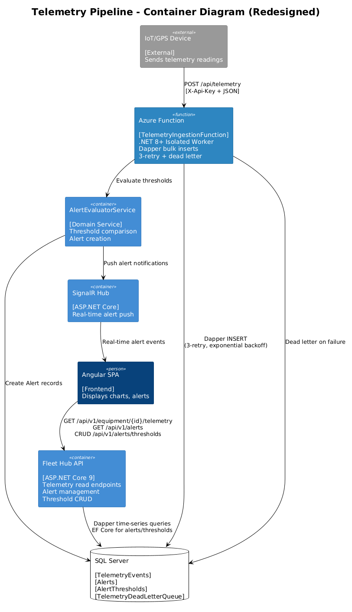
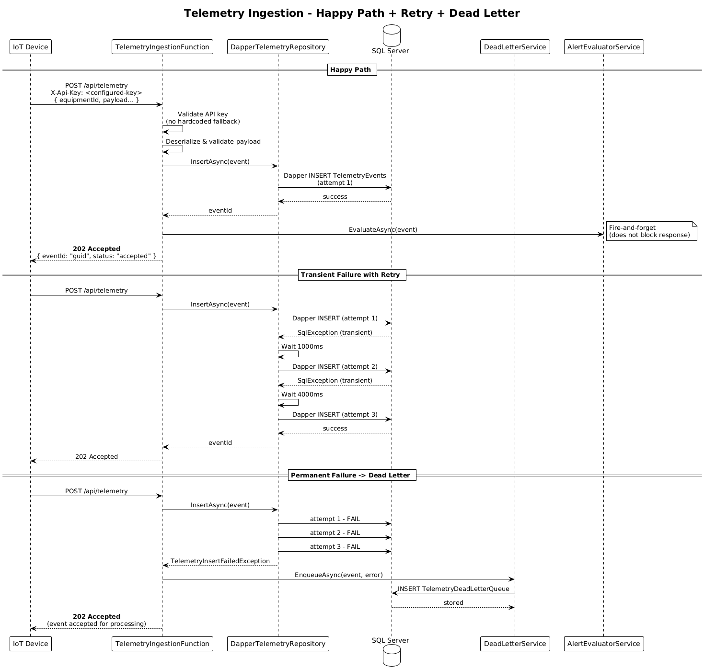
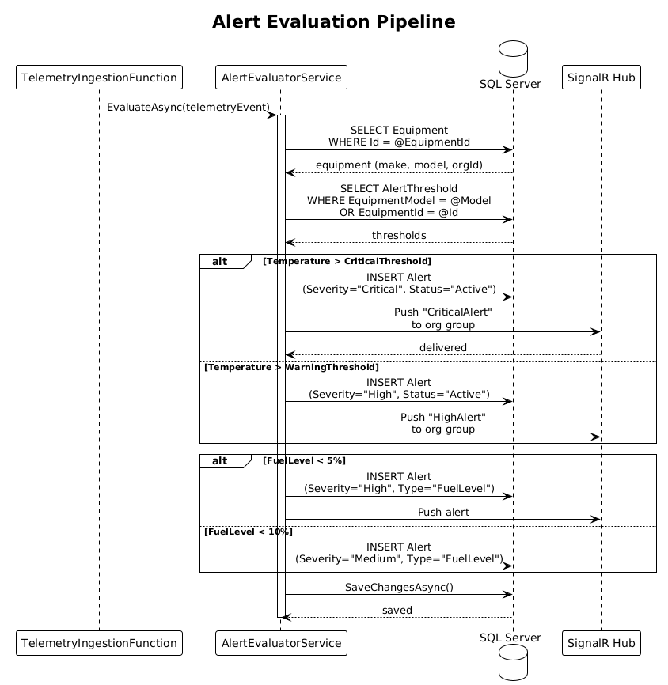
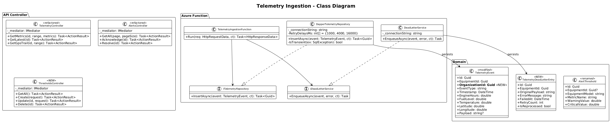

# Telemetry Ingestion Redesign — Detailed Design

## 1. Overview

**Audit Finding:** #3 — Telemetry ingestion architecture does not match the design.

The Feature 05 detailed design specifies: (a) an Azure Function at `POST /api/telemetry` for high-throughput ingestion using Dapper bulk inserts, (b) 3-retry exponential backoff with dead-letter queue for failed events, (c) API key validation via Azure API Management (not a hardcoded fallback), and (d) return of `202 Accepted` with event ID. The current implementation exposes ingestion via the main API controller, uses single EF Core inserts, falls back to a hardcoded default API key, calls the alert evaluator synchronously in-process, and has no retry or dead-letter handling.

**Scope of this design:** Redesign the telemetry ingestion endpoint to match the Feature 05 design, including: Dapper bulk inserts, retry with dead-letter, proper API key validation, async alert evaluation, and the documented response contract. Also addresses Finding #10 (alerts missing pagination and threshold management).

**References:**
- [Feature 05 — Telemetry & Monitoring](../05-telemetry-monitoring/README.md)
- [Backend Implementation Audit](../../backend-implementation-audit.md) — Findings #3, #10

## 2. Architecture

### 2.1 C4 Container Diagram — Telemetry Pipeline



### 2.2 Sequence — Telemetry Ingestion (Happy Path + Retry + Dead Letter)



### 2.3 Sequence — Alert Evaluation Pipeline



## 3. Changes Required

### 3.1 New Project: Azure Functions Telemetry Ingestion

Create a separate project `src/backend/ToromontFleetHub.Functions/` for the Azure Functions host:

```
src/backend/ToromontFleetHub.Functions/
├── ToromontFleetHub.Functions.csproj
├── host.json
├── local.settings.json
├── Functions/
│   └── TelemetryIngestionFunction.cs
├── Services/
│   ├── ITelemetryRepository.cs
│   ├── DapperTelemetryRepository.cs
│   ├── IDeadLetterService.cs
│   └── DeadLetterService.cs
└── Models/
    ├── TelemetryIngestionRequest.cs
    └── TelemetryDeadLetterEntry.cs
```

**Dependencies:** `Microsoft.Azure.Functions.Worker`, `Dapper`, `Microsoft.Data.SqlClient`

### 3.2 Telemetry Ingestion Function

```csharp
// Functions/TelemetryIngestionFunction.cs
[Function("TelemetryIngest")]
public async Task<HttpResponseData> Run(
    [HttpTrigger(AuthorizationLevel.Function, "post", Route = "telemetry")]
    HttpRequestData req, CancellationToken ct)
{
    // 1. Validate API key from X-Api-Key header (configured, not hardcoded)
    // 2. Deserialize and validate request body
    // 3. Verify equipment exists (Dapper query)
    // 4. Persist via Dapper bulk insert with retry policy
    // 5. Queue alert evaluation (fire-and-forget via channel/queue)
    // 6. Return 202 Accepted { eventId, status: "accepted" }
}
```

### 3.3 Dapper Bulk Insert with Retry

```csharp
// Services/DapperTelemetryRepository.cs
public class DapperTelemetryRepository : ITelemetryRepository
{
    private readonly string _connectionString;
    private static readonly int[] RetryDelaysMs = { 1000, 4000, 16000 };

    public async Task<Guid> InsertAsync(TelemetryEvent evt, CancellationToken ct)
    {
        for (int attempt = 0; attempt <= RetryDelaysMs.Length; attempt++)
        {
            try
            {
                using var conn = new SqlConnection(_connectionString);
                var id = Guid.NewGuid();
                await conn.ExecuteAsync(
                    @"INSERT INTO TelemetryEvents
                      (Id, EquipmentId, EventType, Timestamp, EngineHours,
                       FuelLevel, Temperature, Latitude, Longitude, Payload)
                      VALUES (@Id, @EquipmentId, @EventType, @Timestamp,
                       @EngineHours, @FuelLevel, @Temperature,
                       @Latitude, @Longitude, @Payload)",
                    new { Id = id, /* ... mapped fields ... */ });
                return id;
            }
            catch (SqlException ex) when (IsTransient(ex) && attempt < RetryDelaysMs.Length)
            {
                await Task.Delay(RetryDelaysMs[attempt], ct);
            }
        }
        throw new TelemetryInsertFailedException("All retries exhausted");
    }
}
```

### 3.4 Dead Letter Queue

Events that fail after all 3 retries are stored in a `TelemetryDeadLetterQueue` table:

```sql
CREATE TABLE TelemetryDeadLetterQueue (
    Id UNIQUEIDENTIFIER PRIMARY KEY DEFAULT NEWID(),
    EquipmentId UNIQUEIDENTIFIER NOT NULL,
    OriginalPayload NVARCHAR(MAX) NOT NULL,
    ErrorMessage NVARCHAR(2000) NOT NULL,
    FailedAt DATETIME2 NOT NULL DEFAULT GETUTCDATE(),
    RetryCount INT NOT NULL DEFAULT 3,
    IsReprocessed BIT NOT NULL DEFAULT 0
);
```

### 3.5 API Key Validation

Replace the hardcoded fallback key with configuration-only validation:

```csharp
var configuredKey = configuration["Telemetry:ApiKey"]
    ?? throw new InvalidOperationException(
        "TELEMETRY_API_KEY is not configured. " +
        "Set Telemetry:ApiKey in app settings.");

if (apiKeyHeader != configuredKey)
    return req.CreateResponse(HttpStatusCode.Unauthorized);
```

No fallback to `"default-telemetry-key"`.

### 3.6 Refactored API Controller Read Endpoints

The existing `TelemetryController` in the main API retains the **read** endpoints but changes to use Dapper for time-series queries (matching the design):

- `GET /api/v1/equipment/{id}/telemetry?range=7d&metrics=engineHours,temperature` — returns the designed structured response with `metrics` object keyed by metric name
- `GET /api/v1/equipment/{id}/telemetry/latest` — most recent reading
- `GET /api/v1/equipment/{id}/telemetry/gps-trail?range=7d` — GPS trail

The `POST /api/v1/telemetry/ingest` endpoint is **removed** from the API controller (moved to Azure Function).

### 3.7 Response Contract Alignment

**Ingestion response** (Azure Function):
```json
// 202 Accepted
{ "eventId": "guid", "status": "accepted" }
```

**Metrics response** (API Controller):
```json
// 200 OK
{
  "equipmentId": "guid",
  "range": "7d",
  "metrics": {
    "engineHours": [
      { "timestamp": "2026-03-25T00:00:00Z", "value": 4480.0 }
    ],
    "temperature": [
      { "timestamp": "2026-03-25T00:00:00Z", "value": 182.1 }
    ]
  }
}
```

### 3.8 Alerts: Pagination and Threshold Management

**Paginated alerts response:**
```json
{
  "data": [ { /* alert object */ } ],
  "pagination": { "page": 1, "pageSize": 20, "totalCount": 5 }
}
```

**New threshold management endpoints** (Admin/FleetManager only):
- `GET /api/v1/alerts/thresholds` — list all thresholds
- `POST /api/v1/alerts/thresholds` — create threshold
- `PUT /api/v1/alerts/thresholds/{id}` — update threshold
- `DELETE /api/v1/alerts/thresholds/{id}` — delete threshold

### 3.9 Add `OrganizationId` to `TelemetryEvent`

Denormalize by adding `OrganizationId` directly to `TelemetryEvent` (set at ingestion time from the equipment's org). This enables:
- Direct global query filter without joins
- Efficient tenant-scoped time-series queries

```csharp
// Add to TelemetryEvent model
public Guid OrganizationId { get; set; }
```

## 4. Class Diagram



## 5. Backend Acceptance Tests

These tests are written for xUnit integration tests. They **fail against the current implementation** and **pass once the redesign is complete**.

### 5.1 Test: Ingestion endpoint returns 202 with eventId and status

```csharp
[Fact]
public async Task Ingest_ValidEvent_Returns202WithEventIdAndStatus()
{
    // Arrange
    var client = CreateFunctionClient();
    client.DefaultRequestHeaders.Add("X-Api-Key", _configuredApiKey);
    var request = new TelemetryIngestionRequest
    {
        EquipmentId = _seededEquipmentId,
        EventType = "periodic_reading",
        EngineHours = 4500,
        FuelLevel = 75,
        Temperature = 180,
        Latitude = 43.7,
        Longitude = -79.4
    };

    // Act
    var response = await client.PostAsJsonAsync("/api/telemetry", request);

    // Assert
    Assert.Equal(HttpStatusCode.Accepted, response.StatusCode);
    var body = await response.Content.ReadFromJsonAsync<JsonElement>();
    Assert.True(body.TryGetProperty("eventId", out _));
    Assert.Equal("accepted", body.GetProperty("status").GetString());
}
```

**Current behavior:** Returns 202 from the API controller at `/api/v1/telemetry/ingest` with `{ Id = guid }` — wrong route, wrong response shape.
**Expected behavior:** Returns 202 from Azure Function at `/api/telemetry` with `{ eventId, status }`.

### 5.2 Test: Hardcoded default API key is rejected

```csharp
[Fact]
public async Task Ingest_WithDefaultApiKey_Returns401()
{
    // Arrange
    var client = CreateFunctionClient();
    client.DefaultRequestHeaders.Add("X-Api-Key", "default-telemetry-key");

    // Act
    var response = await client.PostAsJsonAsync("/api/telemetry",
        CreateValidTelemetryRequest());

    // Assert
    Assert.Equal(HttpStatusCode.Unauthorized, response.StatusCode);
}
```

**Current behavior:** Returns 202 (the hardcoded `"default-telemetry-key"` is accepted as a fallback).
**Expected behavior:** Returns 401 (only the configured key is accepted, no fallback).

### 5.3 Test: Failed ingestion goes to dead letter queue

```csharp
[Fact]
public async Task Ingest_WhenDbFails_EventIsDeadLettered()
{
    // Arrange: configure a bad connection string to force DB failure
    var client = CreateFunctionClientWithBrokenDb();
    client.DefaultRequestHeaders.Add("X-Api-Key", _configuredApiKey);

    // Act
    var response = await client.PostAsJsonAsync("/api/telemetry",
        CreateValidTelemetryRequest());

    // Assert: request accepted but event ends up in dead letter
    // Query dead letter table directly
    using var conn = new SqlConnection(_testConnectionString);
    var deadLetterCount = await conn.ExecuteScalarAsync<int>(
        "SELECT COUNT(*) FROM TelemetryDeadLetterQueue WHERE EquipmentId = @Id",
        new { Id = _seededEquipmentId });
    Assert.True(deadLetterCount > 0, "Failed event should be in dead letter queue");
}
```

**Current behavior:** No dead letter queue exists — failures just throw exceptions.
**Expected behavior:** Failed events are stored in `TelemetryDeadLetterQueue` table.

### 5.4 Test: Metrics endpoint returns structured response per design

```csharp
[Fact]
public async Task GetMetrics_ReturnsStructuredMetricsResponse()
{
    // Arrange: seed telemetry data
    await SeedTelemetryData(_equipmentId);
    var client = CreateAuthenticatedClient();

    // Act
    var response = await client.GetAsync(
        $"/api/v1/equipment/{_equipmentId}/telemetry?range=7d&metrics=engineHours,temperature");

    // Assert
    Assert.Equal(HttpStatusCode.OK, response.StatusCode);
    var body = await response.Content.ReadFromJsonAsync<JsonElement>();
    Assert.True(body.TryGetProperty("equipmentId", out _));
    Assert.True(body.TryGetProperty("range", out _));
    Assert.True(body.TryGetProperty("metrics", out var metrics));
    Assert.True(metrics.TryGetProperty("engineHours", out _));
    Assert.True(metrics.TryGetProperty("temperature", out _));
}
```

**Current behavior:** Returns a flat array `[{ timestamp, engineHours, fuelLevel, temperature }]`.
**Expected behavior:** Returns `{ equipmentId, range, metrics: { engineHours: [...], temperature: [...] } }`.

### 5.5 Test: Ingest endpoint no longer exists on main API

```csharp
[Fact]
public async Task IngestOnMainApi_Returns404()
{
    // Arrange: call the old route on the main API
    var client = CreateApiClient();
    client.DefaultRequestHeaders.Add("X-Api-Key", _configuredApiKey);

    // Act
    var response = await client.PostAsJsonAsync("/api/v1/telemetry/ingest",
        CreateValidTelemetryRequest());

    // Assert: endpoint removed from main API
    Assert.Equal(HttpStatusCode.NotFound, response.StatusCode);
}
```

**Current behavior:** Returns 202 (endpoint exists on main API).
**Expected behavior:** Returns 404 (endpoint moved to Azure Function).

### 5.6 Test: Alerts list returns paginated response

```csharp
[Fact]
public async Task GetAlerts_ReturnsPaginatedResponse()
{
    // Arrange: seed multiple alerts
    await SeedAlerts(25);
    var client = CreateAuthenticatedClient();

    // Act
    var response = await client.GetAsync("/api/v1/alerts?page=1&pageSize=10");

    // Assert
    var body = await response.Content.ReadFromJsonAsync<JsonElement>();
    Assert.True(body.TryGetProperty("data", out var data));
    Assert.True(body.TryGetProperty("pagination", out var pagination));
    Assert.Equal(10, data.GetArrayLength());
    Assert.Equal(25, pagination.GetProperty("totalCount").GetInt32());
}
```

**Current behavior:** Returns raw `List<Alert>` with no pagination.
**Expected behavior:** Returns `{ data: [...], pagination: { page, pageSize, totalCount } }`.

### 5.7 Test: Threshold management CRUD

```csharp
[Fact]
public async Task ThresholdManagement_CRUD()
{
    var client = CreateAuthenticatedClient(role: "Admin");

    // Create
    var createResponse = await client.PostAsJsonAsync("/api/v1/alerts/thresholds",
        new { equipmentModel = "CAT 320", metricName = "Temperature",
              warningValue = 200.0, criticalValue = 220.0 });
    Assert.Equal(HttpStatusCode.Created, createResponse.StatusCode);
    var threshold = await createResponse.Content.ReadFromJsonAsync<JsonElement>();
    var thresholdId = threshold.GetProperty("id").GetString();

    // Read
    var listResponse = await client.GetAsync("/api/v1/alerts/thresholds");
    Assert.Equal(HttpStatusCode.OK, listResponse.StatusCode);

    // Update
    var updateResponse = await client.PutAsJsonAsync(
        $"/api/v1/alerts/thresholds/{thresholdId}",
        new { warningValue = 210.0, criticalValue = 230.0 });
    Assert.Equal(HttpStatusCode.OK, updateResponse.StatusCode);

    // Delete
    var deleteResponse = await client.DeleteAsync(
        $"/api/v1/alerts/thresholds/{thresholdId}");
    Assert.Equal(HttpStatusCode.NoContent, deleteResponse.StatusCode);
}
```

**Current behavior:** All four requests return 404 — no threshold endpoints exist.
**Expected behavior:** Full CRUD lifecycle works.

### 5.8 Test: Threshold management requires Admin or FleetManager

```csharp
[Fact]
public async Task ThresholdManagement_RequiresAdminOrFleetManager()
{
    var techClient = CreateAuthenticatedClient(role: "Technician");

    var response = await techClient.PostAsJsonAsync("/api/v1/alerts/thresholds",
        new { equipmentModel = "CAT 320", metricName = "Temperature",
              warningValue = 200.0, criticalValue = 220.0 });

    Assert.Equal(HttpStatusCode.Forbidden, response.StatusCode);
}
```

### 5.9 Test: TelemetryEvent has OrganizationId for tenant isolation

```csharp
[Fact]
public async Task TelemetryEvent_HasOrganizationId()
{
    // Arrange: ingest telemetry
    await IngestTelemetryViaFunction(_equipmentId, _configuredApiKey);

    // Assert: the persisted event has OrganizationId set
    using var conn = new SqlConnection(_testConnectionString);
    var orgId = await conn.ExecuteScalarAsync<Guid>(
        "SELECT OrganizationId FROM TelemetryEvents WHERE EquipmentId = @Id",
        new { Id = _equipmentId });
    Assert.Equal(_expectedOrgId, orgId);
}
```

**Current behavior:** `TelemetryEvent` has no `OrganizationId` column.
**Expected behavior:** Column exists and is set from the equipment's org at ingestion time.

## 6. Frontend Playwright E2E Tests

### 6.1 Test: Telemetry dashboard shows structured metrics

```typescript
// e2e/tests/telemetry-redesign.spec.ts

import { test, expect } from '@playwright/test';

test.describe('Telemetry Ingestion Redesign', () => {

  test('telemetry dashboard renders charts from structured metrics API', async ({ page }) => {
    // Navigate to telemetry page for a specific equipment
    await page.goto('/telemetry/equipment/{equipmentId}');

    // Assert: at least one chart is rendered with data
    const chartPanel = page.locator('[data-testid="telemetry-chart-engine-hours"]');
    await expect(chartPanel).toBeVisible({ timeout: 10000 });

    // Assert: the chart has data points (not an empty state)
    const dataPoints = chartPanel.locator('.k-chart-point, svg circle, path[data-series]');
    await expect(dataPoints.first()).toBeVisible({ timeout: 5000 });
  });
```

**Current behavior:** May still work if frontend adapts to flat array. But the structured response requires frontend changes.
**Expected behavior:** Charts render from the new `{ metrics: { engineHours: [...] } }` shape.

### 6.2 Test: Alert list shows pagination controls

```typescript
  test('alerts page shows pagination controls', async ({ page }) => {
    await page.goto('/alerts');

    // Assert: pagination controls are visible
    await expect(page.locator('[data-testid="alerts-pagination"]'))
      .toBeVisible({ timeout: 5000 });

    // Assert: page info shows total count
    await expect(page.locator('[data-testid="alerts-total-count"]'))
      .toHaveText(/\d+ alerts/);
  });
```

**Current behavior:** Fails — no pagination UI since the API returns a flat list.
**Expected behavior:** Pagination controls are visible.

### 6.3 Test: Alert threshold management page accessible to Admins

```typescript
  test('admin can access threshold management page', async ({ page }) => {
    // Log in as admin
    await page.goto('/alerts/thresholds');

    // Assert: threshold management UI is visible
    await expect(page.locator('[data-testid="threshold-list"]'))
      .toBeVisible({ timeout: 5000 });

    // Assert: "Add Threshold" button is present
    await expect(page.locator('[data-testid="add-threshold-button"]'))
      .toBeVisible();
  });

  test('technician cannot access threshold management', async ({ page }) => {
    // Log in as technician
    await page.goto('/alerts/thresholds');

    // Assert: access denied or redirected
    await expect(page.locator('[data-testid="access-denied-message"]'))
      .toBeVisible({ timeout: 5000 });
  });
```

**Current behavior:** Fails — no threshold management page exists.
**Expected behavior:** Admin sees threshold management, technician sees access denied.

### 6.4 Test: Ingestion response reflected in real-time dashboard

```typescript
  test('new telemetry data appears on dashboard after ingestion', async ({ page }) => {
    // Navigate to telemetry dashboard
    await page.goto('/telemetry/equipment/{equipmentId}');

    // Ingest a new reading via API
    const ingestResponse = await page.request.post(
      'http://localhost:7071/api/telemetry',  // Azure Function local
      {
        headers: { 'X-Api-Key': process.env.TELEMETRY_API_KEY! },
        data: {
          equipmentId: '{equipmentId}',
          eventType: 'periodic_reading',
          engineHours: 9999,
          fuelLevel: 50,
          temperature: 190,
          latitude: 43.7,
          longitude: -79.4
        }
      }
    );
    expect(ingestResponse.status()).toBe(202);

    // Wait for auto-refresh (60s) or manually refresh
    await page.locator('[data-testid="refresh-telemetry"]').click();

    // Assert: new data point appears
    await expect(page.locator('[data-testid="latest-engine-hours"]'))
      .toHaveText(/9999/);
  });
});
```

**Current behavior:** Fails — ingestion is at `/api/v1/telemetry/ingest` on the main API, not the Azure Function URL.
**Expected behavior:** Ingestion via Azure Function, data reflected on dashboard.

## 7. Security Considerations

- **API key must be configured, never hardcoded.** The function throws `InvalidOperationException` at startup if `Telemetry:ApiKey` is missing. This prevents accidental deployment with the old hardcoded key.
- **Azure Function authorization level** is set to `Function`, requiring a function-level key in addition to the `X-Api-Key` header for double authentication.
- **Dead letter queue** does not store sensitive data beyond the telemetry payload (no API keys, no PII).
- **Threshold management** is restricted to Admin and FleetManager roles — Technicians and Operators cannot modify thresholds.
- **`OrganizationId` on `TelemetryEvent`** enables tenant-scoped query filters, closing the cross-tenant data leak potential identified in Finding #11.

## 8. Open Questions

1. **Azure Function hosting model.** Should the Function run in the same App Service Plan as the main API (cost savings) or in a separate Consumption Plan (auto-scaling for burst ingestion)? The design says "Azure Functions" without specifying the plan.
2. **Alert evaluation async mechanism.** The design says alert evaluation is triggered after ingestion. Should this be a direct service call within the Function, or should the Function publish a message (e.g., to a Channel or in-memory queue) and a background task picks it up? Direct call is simpler; async decouples ingestion latency from evaluation latency.
3. **Migration of existing `TelemetryEvent` data.** The existing data has no `OrganizationId` column. A migration must backfill this from the linked `Equipment.OrganizationId`. How large is the existing telemetry dataset? This affects migration strategy (online vs. offline).
