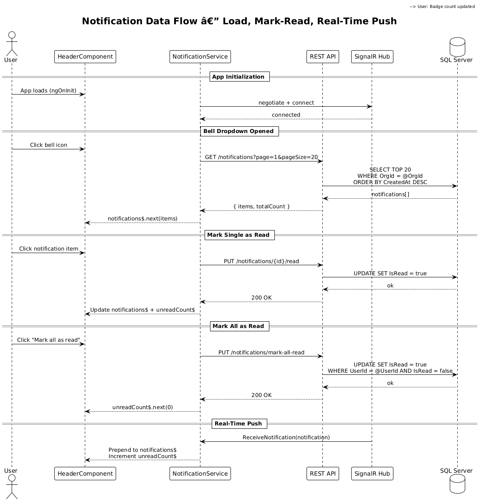
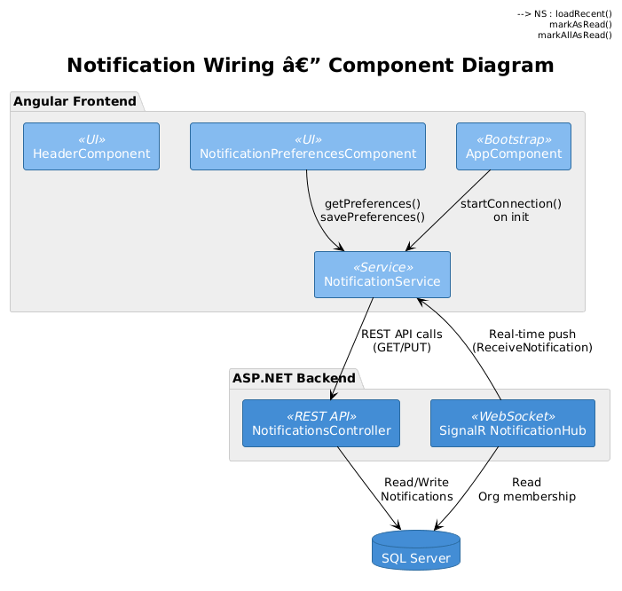

# Notification Wiring — Detailed Design

## 1. Overview

**Audit Finding:** Frontend Critical #1 — Notifications are not implemented according to the designed interaction model.

The Feature 07 detailed design specifies a fully wired notification system: bell with unread count, dropdown showing recent notifications loaded from REST API, mark-as-read via REST `PUT` endpoints, notification preferences persisted to the backend, SignalR connection started on app init for real-time push, and click-through navigation to valid entity routes. The current implementation only loads the initial unread count. The dropdown never loads notification history. `markAsRead()` calls a nonexistent SignalR hub method instead of the REST API. `startConnection()` is defined but never called. Preferences are static in-memory. Deep-link routes for work orders and parts orders are invalid.

**Scope:** Wire the notification bell, dropdown, mark-as-read, preferences, and SignalR connection to match the Feature 07 design.

**References:**
- [Feature 07 — Notifications & Reporting](../07-notifications-reporting/README.md)
- [Frontend Implementation Audit](../../frontend-implementation-audit.md) — Finding #1

## 2. Architecture

### 2.1 Notification Data Flow



### 2.2 Component Interaction



## 3. Changes Required

### 3.1 `NotificationService` — Load Notifications via REST

**Current:** `notifications$` is only populated from SignalR pushes. The dropdown is always empty on first open because no initial load occurs.

**Fix:** Add `loadRecentNotifications()` method that calls `GET /api/v1/notifications?unreadOnly=false&page=1&pageSize=20` and populates `notifications$`.

```typescript
loadRecentNotifications(): void {
  this.api.get<any>('/notifications', { page: 1, pageSize: 20 }).subscribe({
    next: (res) => {
      this.notifications$.next(res.items || []);
      this.unreadCount$.next(res.items?.filter((n: any) => !n.isRead).length ?? 0);
    }
  });
}
```

### 3.2 `NotificationService` — Mark-as-Read via REST, Not SignalR

**Current:** `markAsRead()` invokes `this.hubConnection.invoke('MarkAsRead', notificationId)` — a SignalR hub method that does not exist on the backend.

**Fix:** Change to REST API call:

```typescript
markAsRead(notificationId: string): void {
  this.api.put(`/notifications/${notificationId}/read`, {}).subscribe({
    next: () => {
      const current = this.notifications$.value.map(n =>
        n.id === notificationId ? { ...n, isRead: true } : n
      );
      this.notifications$.next(current);
      this.unreadCount$.next(current.filter(n => !n.isRead).length);
    }
  });
}
```

### 3.3 `NotificationService` — Mark-All-Read via REST

**Current:** `HeaderComponent.markAllAsRead()` loops over notifications and calls `markAsRead()` on each one via SignalR.

**Fix:** Add `markAllAsRead()` method that calls `PUT /api/v1/notifications/mark-all-read`:

```typescript
markAllAsRead(): void {
  this.api.put('/notifications/mark-all-read', {}).subscribe({
    next: () => {
      const current = this.notifications$.value.map(n => ({ ...n, isRead: true }));
      this.notifications$.next(current);
      this.unreadCount$.next(0);
    }
  });
}
```

### 3.4 `NotificationService` — Start SignalR on Init

**Current:** `startConnection()` is defined but never called anywhere in the app.

**Fix:** Call `startConnection()` from `AppComponent.ngOnInit()` (or from `AuthService` after successful login), passing the access token.

### 3.5 `HeaderComponent` — Load Notifications on Dropdown Open

**Current:** `toggleNotifications()` toggles visibility but never loads data.

**Fix:** Call `loadRecentNotifications()` when the dropdown opens:

```typescript
toggleNotifications(): void {
  this.notificationDropdownOpen = !this.notificationDropdownOpen;
  if (this.notificationDropdownOpen) {
    this.notificationService.loadRecentNotifications();
  }
}
```

### 3.6 `HeaderComponent` — Fix Deep-Link Routes

**Current:** `getRouteForEntity()` maps `'workorder'` → `['/service', entityId]` and `'partsorder'` → `['/parts', entityId]`. Neither route exists in `app.routes.ts`.

**Fix:** Map to valid routes:

```typescript
private getRouteForEntity(entityType: string, entityId: string): string[] | null {
  switch (entityType.toLowerCase()) {
    case 'equipment': return ['/equipment', entityId];
    case 'workorder': return ['/service'];  // navigate to list, detail loaded via modal
    case 'alert': return ['/telemetry'];
    default: return ['/dashboard'];
  }
}
```

### 3.7 `NotificationPreferencesComponent` — Wire to REST API

**Current:** Preferences are static in-memory. `savePreferences()` just sets `saveSuccess = true`.

**Fix:**
1. On init, call `GET /api/v1/notifications/preferences` and populate the form.
2. On save, call `PUT /api/v1/notifications/preferences` with the updated preferences array.
3. Add a route in `app.routes.ts` for `/settings/notifications`.

### 3.8 Route Table Updates

Add the missing route to `app.routes.ts`:

```typescript
{
  path: 'settings/notifications',
  loadComponent: () => import('./features/settings/notification-preferences.component')
}
```

## 4. Playwright E2E Tests

All tests are designed to **fail against the current implementation** and **pass once the fixes are applied**.

### Test File: `e2e/tests/notification-wiring.spec.ts`

```typescript
// Acceptance Tests — Notification Wiring
// Traces to: L2-019, L2-020
// Verifies: Frontend audit critical finding #1
// Intent: All tests FAIL before fix, PASS after fix

import { test, expect } from '@playwright/test';

test.describe('Notification Bell & Dropdown', () => {

  test.beforeEach(async ({ page }) => {
    await page.goto('/dashboard');
  });

  // FAIL: dropdown never loads notifications from REST API
  test('opening bell dropdown shows recent notifications from API', async ({ page }) => {
    await page.locator('[data-testid="notification-bell"]').click();
    const dropdown = page.locator('[data-testid="notification-dropdown"]');
    await expect(dropdown).toBeVisible();

    // Wait for notifications to load from REST API
    const items = dropdown.locator('[data-testid="notification-item"]');
    await expect(items.first()).toBeVisible({ timeout: 5000 });

    // Each notification should have title and message content
    const firstItem = items.first();
    await expect(firstItem.locator('.notification-title')).not.toBeEmpty();
    await expect(firstItem.locator('.notification-message')).not.toBeEmpty();
  });

  // FAIL: markAsRead calls nonexistent SignalR method instead of REST PUT
  test('clicking a notification marks it as read via REST API', async ({ page }) => {
    await page.locator('[data-testid="notification-bell"]').click();

    // Intercept the REST API call to verify it is made
    const markReadPromise = page.waitForRequest(
      req => req.url().includes('/notifications/') && req.url().includes('/read')
        && req.method() === 'PUT'
    );

    const firstItem = page.locator('[data-testid="notification-item"]').first();
    if (await firstItem.isVisible()) {
      await firstItem.click();

      // Should make a REST PUT call, not a SignalR invoke
      const request = await markReadPromise;
      expect(request.method()).toBe('PUT');
    }
  });

  // FAIL: markAllAsRead loops via SignalR instead of calling REST PUT mark-all-read
  test('mark all as read calls REST API and resets badge', async ({ page }) => {
    const markAllPromise = page.waitForRequest(
      req => req.url().includes('/notifications/mark-all-read') && req.method() === 'PUT'
    );

    await page.locator('[data-testid="notification-bell"]').click();
    await page.locator('[data-testid="mark-all-read"]').click();

    const request = await markAllPromise;
    expect(request.method()).toBe('PUT');

    // Badge should reset to 0 or disappear
    const badge = page.locator('[data-testid="notification-badge"]');
    await expect(badge).toBeHidden({ timeout: 3000 });
  });
});

test.describe('Notification Deep Links', () => {

  // FAIL: current routes /service/{id} and /parts/{id} do not exist
  test('equipment notification navigates to equipment detail', async ({ page }) => {
    await page.goto('/dashboard');
    await page.locator('[data-testid="notification-bell"]').click();

    // Find a notification with equipment entity type
    const items = page.locator('[data-testid="notification-item"]');
    await expect(items.first()).toBeVisible({ timeout: 5000 });

    await items.first().click();

    // Should navigate to a valid route (not stay on dashboard with error)
    await page.waitForTimeout(1000);
    const url = page.url();
    expect(url).not.toContain('/dashboard');
    // Should not have a console error about unknown route
  });
});

test.describe('SignalR Connection', () => {

  // FAIL: startConnection() is never called
  test('SignalR connection is established on app load', async ({ page }) => {
    // Listen for the SignalR negotiation request
    const signalrPromise = page.waitForRequest(
      req => req.url().includes('/hubs/notifications') && req.url().includes('negotiate'),
      { timeout: 10000 }
    );

    await page.goto('/dashboard');

    // Should attempt to establish SignalR connection
    const request = await signalrPromise;
    expect(request.url()).toContain('/hubs/notifications');
  });

  // FAIL: real-time notifications don't arrive because connection is never started
  test('real-time notification updates badge count', async ({ page }) => {
    await page.goto('/dashboard');

    // Get initial badge count
    const badge = page.locator('[data-testid="notification-badge"]');
    const initialCount = await badge.textContent().catch(() => '0');

    // Trigger a notification via API (e.g., create an alert)
    await page.request.post('/api/v1/telemetry/ingest', {
      headers: { 'X-Api-Key': process.env.TELEMETRY_API_KEY || 'test-key' },
      data: {
        equipmentId: 'test-equipment-id',
        eventType: 'periodic_reading',
        temperature: 999  // above threshold to trigger alert notification
      }
    });

    // Badge count should increment via SignalR push
    await expect(badge).not.toHaveText(initialCount || '0', { timeout: 10000 });
  });
});

test.describe('Notification Preferences', () => {

  // FAIL: no route for /settings/notifications
  test('notification preferences page is accessible', async ({ page }) => {
    await page.goto('/settings/notifications');

    // Should not redirect to dashboard (current: route doesn't exist)
    await expect(page).toHaveURL(/settings\/notifications/);
  });

  // FAIL: preferences are static in-memory, no API calls
  test('preferences load from API and save to API', async ({ page }) => {
    // Intercept GET preferences
    const getPrefsPromise = page.waitForRequest(
      req => req.url().includes('/notifications/preferences') && req.method() === 'GET'
    );

    await page.goto('/settings/notifications');

    const getRequest = await getPrefsPromise;
    expect(getRequest.method()).toBe('GET');

    // Toggle a preference and save
    const savePrefsPromise = page.waitForRequest(
      req => req.url().includes('/notifications/preferences') && req.method() === 'PUT'
    );

    // Find and toggle a preference checkbox
    const firstToggle = page.locator('[data-testid^="pref-"] input[type="checkbox"]').first();
    if (await firstToggle.isVisible()) {
      await firstToggle.click();
    }

    // Click save
    await page.locator('[data-testid="save-preferences"]').click();

    const saveRequest = await savePrefsPromise;
    expect(saveRequest.method()).toBe('PUT');
  });
});
```

## 5. Security Considerations

- Notification mark-as-read must only work for the current user's notifications — the backend enforces this via tenant context.
- SignalR connection must include the JWT access token for authentication.
- Notification preferences updates must not allow cross-user modification.

## 6. Open Questions

1. **Notification dropdown pagination.** The design shows max 20 notifications. Should there be a "View All" link that navigates to a full notification history page, or is the dropdown sufficient?
2. **SignalR reconnection.** `withAutomaticReconnect()` is already configured. Should the UI show a connection status indicator when SignalR is disconnected?
