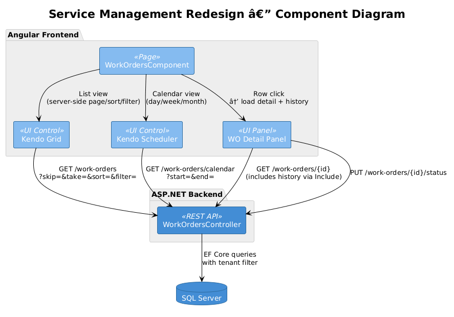
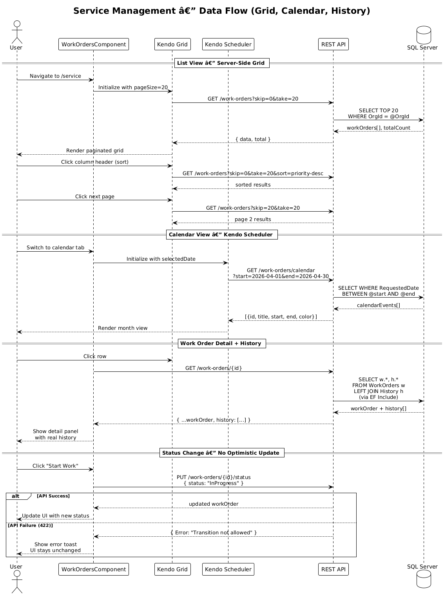

# Service Management UI Redesign — Detailed Design

## 1. Overview

**Audit Finding:** Frontend Critical #2 — Service management diverges substantially from the designed Kendo Grid + Scheduler workflow.

The Feature 03 detailed design specifies: (a) a Kendo UI Grid for the work-order list with server-side pagination, sorting, and filtering, (b) a Kendo UI Scheduler for the calendar view with day/week/month views and drag-drop rescheduling, (c) the calendar calls `GET /api/v1/work-orders/calendar?start=&end=`, (d) work-order history is loaded from the detail endpoint (included via `Include(w => w.History)`), not from a separate `/history` route. The current implementation uses a custom HTML table, a card-based calendar list, pulls all data from `/work-orders` instead of the calendar endpoint, fabricates fallback history when the nonexistent `/history` endpoint fails, and updates the UI optimistically even when API calls fail.

**Scope:** Replace the custom table and card calendar with Kendo Grid and Scheduler, wire the calendar endpoint, fix history loading, and stop optimistic updates on API failure.

**References:**
- [Feature 03 — Service Management](../03-service-management/README.md)
- [Frontend Implementation Audit](../../frontend-implementation-audit.md) — Finding #2

## 2. Architecture

### 2.1 Component Interaction



### 2.2 Data Flow — Calendar and List



## 3. Changes Required

### 3.1 Replace Custom Table with Kendo Grid

**Current:** `work-orders.component.html` uses a plain `<table>` with manually constructed `<tr>` rows.

**Fix:** Replace with `<kendo-grid>` configured for server-side operations:

```html
<kendo-grid
  [data]="gridData"
  [pageSize]="pageSize"
  [skip]="skip"
  [pageable]="true"
  [sortable]="true"
  [filterable]="true"
  (dataStateChange)="onDataStateChange($event)"
  (cellClick)="onRowClick($event.dataItem)"
  data-testid="work-orders-kendo-grid">
  <kendo-grid-column field="workOrderNumber" title="WO #" [width]="130"></kendo-grid-column>
  <kendo-grid-column field="equipment.name" title="Equipment" [width]="180"></kendo-grid-column>
  <kendo-grid-column field="serviceType" title="Service Type" [width]="140"></kendo-grid-column>
  <kendo-grid-column field="priority" title="Priority" [width]="110"></kendo-grid-column>
  <kendo-grid-column field="status" title="Status" [width]="120"></kendo-grid-column>
  <kendo-grid-column field="requestedDate" title="Due Date" [width]="130" format="{0:d}"></kendo-grid-column>
  <kendo-grid-column field="assignedTo.displayName" title="Assigned To" [width]="140"></kendo-grid-column>
</kendo-grid>
```

The `onDataStateChange()` handler sends pagination, sorting, and filtering parameters to the server.

### 3.2 Replace Card Calendar with Kendo Scheduler

**Current:** Calendar view renders `calendarEvents` as a flat list of cards. No day/week/month switching. No drag-drop.

**Fix:** Replace with `<kendo-scheduler>`:

```html
<kendo-scheduler
  [kendoSchedulerBinding]="schedulerEvents"
  [selectedDate]="selectedDate"
  [views]="schedulerViews"
  (dateChange)="onSchedulerDateChange($event)"
  (eventDblClick)="onSchedulerEventClick($event)"
  data-testid="service-kendo-scheduler">
  <kendo-scheduler-day-view></kendo-scheduler-day-view>
  <kendo-scheduler-week-view></kendo-scheduler-week-view>
  <kendo-scheduler-month-view></kendo-scheduler-month-view>
</kendo-scheduler>
```

### 3.3 Wire Calendar Endpoint

**Current:** `loadCalendarData()` calls `GET /work-orders` with `skip=0&take=100` and reshapes locally.

**Fix:** Call the designed calendar endpoint:

```typescript
loadCalendarData(): void {
  const start = this.getCalendarRangeStart().toISOString();
  const end = this.getCalendarRangeEnd().toISOString();

  this.api.get<any[]>('/work-orders/calendar', { start, end }).subscribe({
    next: (events) => {
      this.schedulerEvents = events.map(e => ({
        id: e.id,
        title: e.title,
        start: new Date(e.start),
        end: new Date(e.end),
        color: e.color
      }));
    }
  });
}
```

### 3.4 Fix History Loading

**Current:** `loadWorkOrderHistory()` calls `GET /work-orders/{id}/history` (does not exist), then fabricates fallback data.

**Fix:** History comes from the detail endpoint. The `GET /api/v1/work-orders/{id}` response already includes `history` via EF Core `Include`. Remove the separate history call:

```typescript
onRowClick(item: WorkOrder): void {
  this.api.get<any>(`/work-orders/${item.id}`).subscribe({
    next: (detail) => {
      this.selectedWorkOrder = detail;
      this.selectedWorkOrderHistory = (detail.history || []).map((h: any) => ({
        status: h.newStatus,
        user: h.changedBy?.displayName || 'System',
        timestamp: h.changedAt
      }));
    }
  });
}
```

**No fallback fabrication.** If the API call fails, show an error state, not fake data.

### 3.5 Stop Optimistic Updates on API Failure

**Current:** `startWork()` and `confirmComplete()` both update the UI in the `error` callback:

```typescript
error: () => {
  // Update locally even if API fails
  (this.selectedWorkOrder as any).status = 'In Progress';
}
```

**Fix:** Remove all UI updates from `error` callbacks. Only update the UI on successful API response:

```typescript
startWork(): void {
  this.api.put<any>(`/work-orders/${id}/status`, { status: 'InProgress' }).subscribe({
    next: (updated) => {
      this.selectedWorkOrder = updated;
      this.loadData();
    },
    error: (err) => {
      // Show error toast — do NOT update UI optimistically
      this.showError('Failed to update status: ' + (err.error?.Error || 'Unknown error'));
    }
  });
}
```

## 4. Playwright E2E Tests

All tests **fail against the current implementation** and **pass once the redesign is complete**.

### Test File: `e2e/tests/service-management-redesign.spec.ts`

```typescript
// Acceptance Tests — Service Management Redesign
// Traces to: L2-007, L2-008, L2-009
// Verifies: Frontend audit critical finding #2
// Intent: All tests FAIL before fix, PASS after fix

import { test, expect } from '@playwright/test';

test.describe('Work Order List — Kendo Grid', () => {

  test.beforeEach(async ({ page }) => {
    await page.goto('/service');
  });

  // FAIL: current impl uses plain <table>, not Kendo Grid
  test('work order list uses Kendo Grid component', async ({ page }) => {
    const kendoGrid = page.locator('[data-testid="work-orders-kendo-grid"]');
    await expect(kendoGrid).toBeVisible({ timeout: 5000 });

    // Verify Kendo Grid features are present
    await expect(kendoGrid.locator('.k-grid-header')).toBeVisible();
    await expect(kendoGrid.locator('.k-pager')).toBeVisible();
  });

  // FAIL: current impl does client-side pagination only
  test('grid pagination sends server-side request', async ({ page }) => {
    const apiCall = page.waitForRequest(
      req => req.url().includes('/work-orders') && req.url().includes('skip=')
    );

    const kendoGrid = page.locator('[data-testid="work-orders-kendo-grid"]');
    await expect(kendoGrid).toBeVisible();

    // Click next page in the pager
    await kendoGrid.locator('.k-pager .k-i-arrow-end-right, .k-pager-nav[title="Go to the next page"]').click();

    const request = await apiCall;
    expect(request.url()).toMatch(/skip=\d+/);
  });

  // FAIL: current impl has no column sort headers
  test('grid supports server-side sorting', async ({ page }) => {
    const apiCall = page.waitForRequest(
      req => req.url().includes('/work-orders') && req.url().includes('sort=')
    );

    // Click a column header to sort
    const header = page.locator('[data-testid="work-orders-kendo-grid"] .k-grid-header th').first();
    await header.click();

    const request = await apiCall;
    expect(request.url()).toContain('sort=');
  });
});

test.describe('Service Calendar — Kendo Scheduler', () => {

  test.beforeEach(async ({ page }) => {
    await page.goto('/service/calendar');
  });

  // FAIL: current impl is a flat card list, not Kendo Scheduler
  test('calendar uses Kendo Scheduler component', async ({ page }) => {
    const scheduler = page.locator('[data-testid="service-kendo-scheduler"]');
    await expect(scheduler).toBeVisible({ timeout: 5000 });

    // Verify scheduler has view switching buttons
    await expect(scheduler.locator('.k-scheduler-toolbar')).toBeVisible();
  });

  // FAIL: current impl does not call /work-orders/calendar endpoint
  test('calendar calls the calendar API endpoint with date range', async ({ page }) => {
    const apiCall = page.waitForRequest(
      req => req.url().includes('/work-orders/calendar')
        && req.url().includes('start=')
        && req.url().includes('end=')
    );

    const request = await apiCall;
    expect(request.url()).toContain('start=');
    expect(request.url()).toContain('end=');
  });

  // FAIL: current impl only has button toggles, no actual Scheduler views
  test('scheduler supports day/week/month view switching', async ({ page }) => {
    const scheduler = page.locator('[data-testid="service-kendo-scheduler"]');
    await expect(scheduler).toBeVisible();

    // Switch to week view
    await scheduler.locator('.k-scheduler-toolbar button, .k-view-week').click();
    await expect(scheduler.locator('.k-scheduler-weekview, .k-scheduler-body')).toBeVisible();

    // Switch to day view
    await scheduler.locator('.k-scheduler-toolbar button, .k-view-day').first().click();
    await expect(scheduler.locator('.k-scheduler-body')).toBeVisible();
  });
});

test.describe('Work Order History', () => {

  // FAIL: current impl calls /work-orders/{id}/history which 404s, then fabricates data
  test('work order detail shows real history from API', async ({ page }) => {
    await page.goto('/service');

    // Intercept the detail API call (includes history via Include)
    const detailCall = page.waitForRequest(
      req => req.url().match(/\/work-orders\/[a-f0-9-]+$/) && req.method() === 'GET'
    );

    // Click first work order row
    await page.locator('[data-testid="work-order-row"], .k-grid-content tr').first().click();

    const request = await detailCall;
    const response = await request.response();
    const body = await response?.json();

    // Response should include history array
    expect(body.history).toBeDefined();
    expect(Array.isArray(body.history)).toBe(true);

    // UI should display the history
    const historyItems = page.locator('[data-testid="wo-history-item"]');
    await expect(historyItems.first()).toBeVisible({ timeout: 5000 });

    // History should NOT show 'System' as user (fabricated fallback)
    const firstUser = await historyItems.first()
      .locator('[data-testid="history-user"]').textContent();
    expect(firstUser?.trim()).not.toBe('System');
  });

  // FAIL: current impl does NOT call /work-orders/{id}/history
  test('history is NOT loaded from a separate /history endpoint', async ({ page }) => {
    await page.goto('/service');

    // Ensure NO request is made to /work-orders/{id}/history
    let historyEndpointCalled = false;
    page.on('request', req => {
      if (req.url().includes('/history')) {
        historyEndpointCalled = true;
      }
    });

    await page.locator('[data-testid="work-order-row"], .k-grid-content tr').first().click();
    await page.waitForTimeout(2000);

    expect(historyEndpointCalled).toBe(false);
  });
});

test.describe('Status Change Error Handling', () => {

  // FAIL: current impl updates UI even when API call fails
  test('failed status change does NOT update UI optimistically', async ({ page }) => {
    await page.goto('/service');

    // Mock the status update endpoint to fail
    await page.route('**/work-orders/*/status', route => {
      route.fulfill({ status: 422, body: JSON.stringify({ Error: 'Transition not allowed' }) });
    });

    await page.locator('[data-testid="work-order-row"], .k-grid-content tr').first().click();

    // Get current status
    const statusBefore = await page.locator('[data-testid="wo-status"]').first().textContent();

    // Try to start work (mock will fail)
    const startBtn = page.locator('[data-testid="action-start-work"]');
    if (await startBtn.isVisible()) {
      await startBtn.click();
      await page.waitForTimeout(1000);

      // Status should NOT have changed since API failed
      const statusAfter = await page.locator('[data-testid="wo-status"]').first().textContent();
      expect(statusAfter).toBe(statusBefore);
    }
  });
});
```

## 5. Open Questions

1. **Kendo Scheduler drag-drop.** The design mentions drag-drop rescheduling. Should the drag-and-drop call `PUT /api/v1/work-orders/{id}/status` to update the `requestedDate`, or should there be a dedicated reschedule endpoint?
2. **Kendo Grid toolbar.** Should the Kendo Grid include an inline toolbar for bulk actions (e.g., bulk close completed work orders)?
