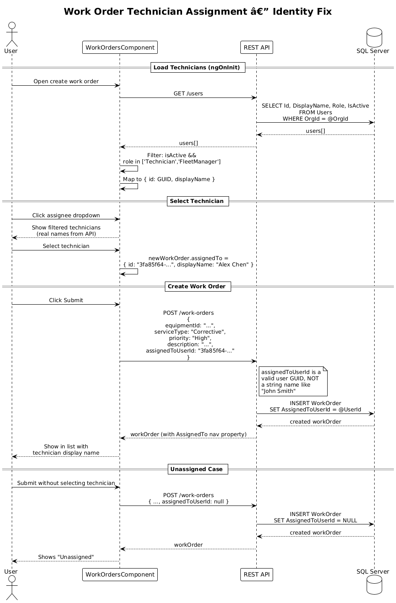

# Work Order Identity Fix — Detailed Design

## 1. Overview

**Audit Finding:** Frontend Critical #3 — Work-order creation uses placeholder technician data and sends invalid identity values.

The Feature 03 detailed design specifies that the assigned-technician dropdown loads actual tenant users from `GET /api/v1/users` and sends a valid `assignedToUserId` (a user GUID) in the create-work-order request. The current implementation uses a hardcoded list of names (`'John Smith'`, `'Jane Doe'`, `'Mike Johnson'`, `'Sarah Williams'`) and sends that string value as `assignedToUserId`, which is incompatible with the backend's expected GUID.

**Scope:** Replace the hardcoded technician list with a live user lookup from the API, and ensure the `assignedToUserId` field contains a valid user GUID.

**References:**
- [Feature 03 — Service Management](../03-service-management/README.md)
- [Frontend Implementation Audit](../../frontend-implementation-audit.md) — Finding #3

## 2. Architecture

### 2.1 Technician Assignment Data Flow



## 3. Changes Required

### 3.1 Load Technicians from API

**Current:** `work-orders.component.ts:69-80`
```typescript
technicians: string[] = ['John Smith', 'Jane Doe', 'Mike Johnson', 'Sarah Williams'];
```

**Fix:** Replace with an API call to load org users:

```typescript
technicians: { id: string; displayName: string }[] = [];

loadTechnicians(): void {
  this.api.get<any>('/users').subscribe({
    next: (users) => {
      // Include users who can be assigned work orders (Technicians and FleetManagers)
      this.technicians = (users || [])
        .filter((u: any) => u.isActive && ['Technician', 'FleetManager'].includes(u.role))
        .map((u: any) => ({
          id: u.id,
          displayName: u.displayName
        }));
    }
  });
}
```

Call `loadTechnicians()` in `ngOnInit()` alongside `loadEquipmentList()`.

### 3.2 Update Assignee Dropdown Template

**Current:** `work-orders.component.html:216-228` renders `technicians` as plain strings.

**Fix:** Render user objects with display name and send the user ID:

```html
<div *ngIf="assigneeDropdownOpen" class="dropdown-menu show w-100">
  <a *ngFor="let tech of technicians"
     data-testid="assignee-option"
     class="dropdown-item"
     (click)="selectAssignee(tech)">{{ tech.displayName }}</a>
</div>
```

Update the button label:
```html
{{ newWorkOrder.assignedTo?.displayName || 'Select technician...' }}
```

### 3.3 Update selectAssignee and createWorkOrder

**Current:**
```typescript
selectAssignee(tech: string): void {
  this.newWorkOrder.assignedTo = tech;  // sends string name as assignedToUserId
}
```

**Fix:**
```typescript
selectAssignee(tech: { id: string; displayName: string }): void {
  this.newWorkOrder.assignedTo = tech;
}

createWorkOrder(): void {
  const body = {
    equipmentId: this.newWorkOrder.equipmentItem?.value || '',
    serviceType: this.newWorkOrder.title,
    description: this.newWorkOrder.description,
    priority: this.newWorkOrder.priority,
    requestedDate: /* ... */,
    assignedToUserId: this.newWorkOrder.assignedTo?.id || null  // GUID, not string name
  };
  // ...
}
```

### 3.4 Display Assigned User from API Response

**Current:** `wo-assigned-to` column shows `item.assignedTo?.displayName || 'Unassigned'` — this already works correctly if the backend returns the `AssignedTo` navigation property (which it does via `Include(w => w.AssignedTo)`).

**No change needed** for the display column — only the creation payload needs fixing.

## 4. Playwright E2E Tests

All tests **fail against the current implementation** and **pass once the fix is applied**.

### Test File: `e2e/tests/work-order-identity-fix.spec.ts`

```typescript
// Acceptance Tests — Work Order Identity Fix
// Traces to: L2-007
// Verifies: Frontend audit critical finding #3
// Intent: All tests FAIL before fix, PASS after fix

import { test, expect } from '@playwright/test';

test.describe('Work Order Technician Assignment', () => {

  test.beforeEach(async ({ page }) => {
    await page.goto('/service');
  });

  // FAIL: current impl shows hardcoded names, not API-loaded users
  test('assignee dropdown loads real users from API', async ({ page }) => {
    // Intercept the users API call
    const usersCall = page.waitForRequest(
      req => req.url().includes('/users') && req.method() === 'GET'
    );

    await page.locator('[data-testid="create-work-order-btn"]').click();
    await page.locator('[data-testid="wo-assignee"]').click();

    // Verify the API was called to load users
    const request = await usersCall;
    expect(request.url()).toContain('/users');

    // Verify dropdown options are visible
    const options = page.locator('[data-testid="assignee-option"]');
    await expect(options.first()).toBeVisible({ timeout: 5000 });

    // Options should NOT contain the hardcoded names
    const allTexts = await options.allTextContents();
    expect(allTexts).not.toContain('John Smith');
    expect(allTexts).not.toContain('Jane Doe');
    expect(allTexts).not.toContain('Mike Johnson');
    expect(allTexts).not.toContain('Sarah Williams');
  });

  // FAIL: current impl sends string name as assignedToUserId
  test('creating work order sends valid GUID as assignedToUserId', async ({ page }) => {
    // Intercept the create work order API call
    const createCall = page.waitForRequest(
      req => req.url().includes('/work-orders') && req.method() === 'POST'
    );

    await page.locator('[data-testid="create-work-order-btn"]').click();

    // Fill out the form
    await page.locator('[data-testid="wo-equipment-select"]').click();
    await page.locator('[data-testid="equipment-option"]').first().click();
    await page.locator('[data-testid="wo-service-type"]').selectOption('Corrective');
    await page.locator('[data-testid="wo-priority"]').selectOption('High');
    await page.locator('[data-testid="wo-description"]').fill('Test WO with real technician');
    await page.locator('[data-testid="wo-requested-date"]').fill('2026-04-15');

    // Select a technician from the dropdown
    await page.locator('[data-testid="wo-assignee"]').click();
    await page.locator('[data-testid="assignee-option"]').first().click();

    // Submit
    await page.locator('[data-testid="wo-submit"]').click();

    // Verify the request payload
    const request = await createCall;
    const payload = request.postDataJSON();

    // assignedToUserId should be a valid GUID, not a string name
    expect(payload.assignedToUserId).toBeDefined();
    expect(payload.assignedToUserId).toMatch(
      /^[0-9a-f]{8}-[0-9a-f]{4}-[0-9a-f]{4}-[0-9a-f]{4}-[0-9a-f]{12}$/i
    );

    // Should NOT be a plain name string
    expect(payload.assignedToUserId).not.toBe('John Smith');
    expect(payload.assignedToUserId).not.toBe('Jane Doe');
  });

  // FAIL: current impl sends string, backend rejects or ignores it
  test('assigned technician displays correctly on created work order', async ({ page }) => {
    // Create a work order with a real technician
    await page.locator('[data-testid="create-work-order-btn"]').click();
    await page.locator('[data-testid="wo-equipment-select"]').click();
    await page.locator('[data-testid="equipment-option"]').first().click();
    await page.locator('[data-testid="wo-service-type"]').selectOption('Preventive');
    await page.locator('[data-testid="wo-priority"]').selectOption('Medium');
    await page.locator('[data-testid="wo-description"]').fill('Assigned technician display test');
    await page.locator('[data-testid="wo-requested-date"]').fill('2026-04-20');

    // Get the technician name before selecting
    await page.locator('[data-testid="wo-assignee"]').click();
    const techName = await page.locator('[data-testid="assignee-option"]').first().textContent();
    await page.locator('[data-testid="assignee-option"]').first().click();

    await page.locator('[data-testid="wo-submit"]').click();

    // Wait for the list to reload
    await page.waitForTimeout(2000);

    // The newly created work order should show the technician name
    const assignedCells = page.locator('[data-testid="wo-assigned-to"]');
    const allTexts = await assignedCells.allTextContents();

    // At least one cell should show the selected technician's actual name
    const found = allTexts.some(t => t.trim() === techName?.trim());
    expect(found).toBe(true);
  });

  // FAIL: dropdown includes all hardcoded users regardless of role
  test('assignee dropdown only shows active technicians and fleet managers', async ({ page }) => {
    await page.locator('[data-testid="create-work-order-btn"]').click();
    await page.locator('[data-testid="wo-assignee"]').click();

    const options = page.locator('[data-testid="assignee-option"]');
    await expect(options.first()).toBeVisible({ timeout: 5000 });

    // Count should be > 0 (real users exist in seed data)
    const count = await options.count();
    expect(count).toBeGreaterThan(0);

    // Each option should have a real user display name (not the hardcoded names)
    for (let i = 0; i < count; i++) {
      const text = await options.nth(i).textContent();
      expect(text?.trim()).not.toBe('');
      // Should not be any of the hardcoded placeholders
      expect(['John Smith', 'Jane Doe', 'Mike Johnson', 'Sarah Williams'])
        .not.toContain(text?.trim());
    }
  });

  // Verify unassigned option is handled gracefully
  test('work order can be created without assigning a technician', async ({ page }) => {
    const createCall = page.waitForRequest(
      req => req.url().includes('/work-orders') && req.method() === 'POST'
    );

    await page.locator('[data-testid="create-work-order-btn"]').click();
    await page.locator('[data-testid="wo-equipment-select"]').click();
    await page.locator('[data-testid="equipment-option"]').first().click();
    await page.locator('[data-testid="wo-service-type"]').selectOption('Emergency');
    await page.locator('[data-testid="wo-priority"]').selectOption('Critical');
    await page.locator('[data-testid="wo-description"]').fill('Unassigned emergency WO');

    // Do NOT select a technician
    await page.locator('[data-testid="wo-submit"]').click();

    const request = await createCall;
    const payload = request.postDataJSON();

    // assignedToUserId should be null, not an empty string
    expect(payload.assignedToUserId).toBeNull();
  });
});
```

## 5. Security Considerations

- The users API endpoint (`GET /api/v1/users`) requires Admin role. For technician assignment, either: (a) relax the endpoint to allow FleetManager access, or (b) create a dedicated `GET /api/v1/users/assignable` endpoint that returns only assignable users (Technician + FleetManager roles) and is accessible to any authenticated user with write access.
- The `assignedToUserId` must be validated server-side — the backend should verify the user exists in the same organization.

## 6. Design Decisions (formerly Open Questions)

1. **User list access:** resolved. `GET /api/v1/users/assignable` already exists with `RequireWrite` policy, returning active users with Technician or FleetManager roles. This endpoint was designed specifically for work-order assignment dropdowns. No additional endpoint is needed.
2. **User search:** simple dropdown for v1. The expected organization size (tens of users, not thousands) does not justify typeahead search complexity. A `<select>` populated by the assignable users endpoint is sufficient. If organizations grow beyond ~50 users, a Kendo ComboBox with server-side filtering can be introduced later.
