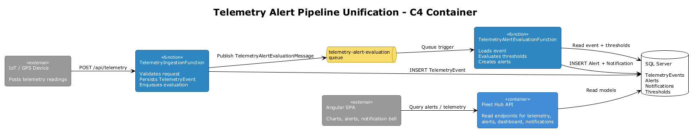
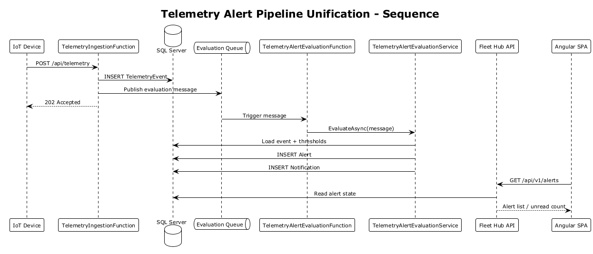
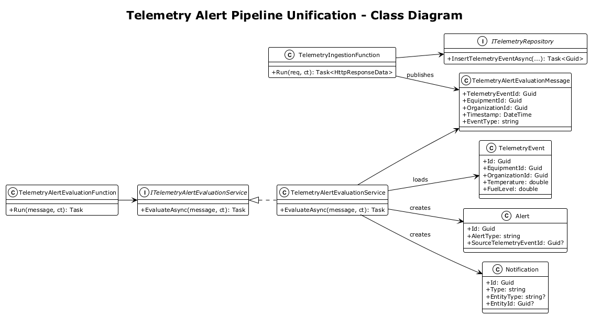

# Telemetry Alert Pipeline Unification — Detailed Design

## 1. Overview

**Architecture Finding:** #1 — Telemetry ingestion and alert evaluation are split across inactive and active runtime paths.

The current runtime topology has two different telemetry write paths:

- The Azure Functions host accepts the production ingestion request, persists `TelemetryEvent`, and returns `202 Accepted`.
- The API project still contains the only implementation that evaluates thresholds and creates alerts, but that code is no longer on the active ingestion path.

This leaves telemetry-triggered alerts disconnected from the canonical ingestion flow.

**Scope:** Make the Azure Functions ingestion path the single production write path for telemetry, and attach threshold evaluation, alert creation, and notification-record creation to that path in a durable and idempotent way.

**References:**
- [Feature 05 — Telemetry & Monitoring](../05-telemetry-monitoring/README.md)
- [Telemetry Ingestion Redesign](../10-telemetry-ingestion-redesign/README.md)
- [Feature 07 — Notifications & Reporting](../07-notifications-reporting/README.md)

## 2. Architecture

### 2.1 Runtime Components

The unified pipeline consists of:

- `TelemetryIngestionFunction` — validates API key, persists telemetry, enqueues evaluation
- `TelemetryAlertEvaluationFunction` — queue-triggered worker that evaluates thresholds
- SQL Server — source of truth for telemetry, alerts, thresholds, and notification records
- API read side — continues serving telemetry, alerts, dashboards, and reports



### 2.2 Canonical Flow

1. Client posts telemetry to `POST /api/telemetry`.
2. Azure Function validates the request and persists `TelemetryEvent`.
3. Function writes a durable `TelemetryAlertEvaluationMessage` to a queue.
4. Queue-triggered function loads the event, equipment, and thresholds.
5. Worker creates zero or more `Alert` rows and corresponding in-app `Notification` rows.
6. The API read side exposes the resulting state; real-time fan-out is handled by the notification contract in Feature 15.



### 2.3 Class Diagram



## 3. Changes Required

### 3.1 Declare a Single Canonical Ingestion Path

The Azure Functions endpoint remains the only supported telemetry write entry point.

- `POST /api/telemetry` in `IronvaleFleetHub.Functions` is authoritative.
- The API project must not expose or retain a second operational ingestion path.
- `IngestTelemetryCommand` and the API-side telemetry write workflow are removed, or repurposed into internal test helpers only after being detached from production DI.

This eliminates split ownership for telemetry writes.

### 3.2 Add a Durable Evaluation Message

Create a queue contract in the Functions project:

```csharp
public sealed record TelemetryAlertEvaluationMessage(
    Guid TelemetryEventId,
    Guid EquipmentId,
    Guid OrganizationId,
    DateTime Timestamp,
    string EventType);
```

The ingestion function publishes this message only after the telemetry insert commits successfully.

### 3.3 Add a Queue-Triggered Evaluation Function

Create `Functions/TelemetryAlertEvaluationFunction.cs`:

```csharp
[Function("TelemetryAlertEvaluation")]
public async Task Run(
    [QueueTrigger("telemetry-alert-evaluation")]
    TelemetryAlertEvaluationMessage message,
    CancellationToken ct)
{
    await _service.EvaluateAsync(message, ct);
}
```

This worker owns threshold evaluation. The API no longer owns that responsibility.

### 3.4 Move Evaluation Logic into a Shared Application Service

Extract threshold evaluation out of the API-only `AlertEvaluatorService` into a shared service that both the queue trigger and integration tests can use:

```csharp
public interface ITelemetryAlertEvaluationService
{
    Task EvaluateAsync(TelemetryAlertEvaluationMessage message, CancellationToken ct = default);
}
```

Recommended placement:

```text
src/backend/IronvaleFleetHub.Telemetry/
├── ITelemetryAlertEvaluationService.cs
├── TelemetryAlertEvaluationService.cs
├── Repositories/
└── Models/
```

The service is responsible for:

- Loading the persisted `TelemetryEvent`
- Resolving equipment and threshold configuration
- Producing deterministic alert decisions
- Persisting `Alert` and `Notification` records

### 3.5 Make Alert Generation Idempotent

Queue delivery and retry must not generate duplicate alerts.

Add `SourceTelemetryEventId` to `Alert`:

```csharp
public Guid? SourceTelemetryEventId { get; set; }
```

Add a unique index over the event and alert type:

```csharp
e.HasIndex(x => new { x.SourceTelemetryEventId, x.AlertType }).IsUnique();
```

The evaluation worker must upsert-or-skip when a duplicate message is replayed.

### 3.6 Persist Notification Records with Alerts

If an alert should surface in the notification bell, the evaluation worker creates an in-app `Notification` row as part of the same transactional unit as the alert.

This design intentionally stops at durable notification creation. Real-time SignalR delivery is addressed separately by [Notification Contract Unification](../15-notification-contract-unification/README.md).

### 3.7 Remove Dead API Registrations

Once the queue-based evaluation path is in place:

- Remove API DI registration for `IAlertEvaluatorService`
- Delete the unused API-side telemetry write handler
- Remove any integration tests that still assume alerts are created by an API POST route

### 3.8 Operational Telemetry

Emit structured logs and metrics for:

- Telemetry events accepted
- Evaluation messages enqueued
- Evaluation successes/failures
- Alerts created
- Evaluation duplicates skipped
- Dead-letter count for ingestion
- Dead-letter count for evaluation

## 4. Backend Acceptance Tests

These tests are designed to fail until the unified pipeline is implemented.

### 4.1 Ingested Telemetry Eventually Creates an Alert

```csharp
[Fact]
public async Task Ingested_threshold_exceedance_creates_alert_via_queue_pipeline()
{
    var client = CreateFunctionClient();
    client.DefaultRequestHeaders.Add("X-Api-Key", _configuredApiKey);

    var response = await client.PostAsJsonAsync("/api/telemetry", CreateHighTemperatureReading());

    Assert.Equal(HttpStatusCode.Accepted, response.StatusCode);

    await AssertEventually(async () =>
    {
        var count = await QueryAlertCountAsync(_equipmentId, "TemperatureExceeded");
        Assert.Equal(1, count);
    });
}
```

### 4.2 Duplicate Queue Delivery Does Not Create Duplicate Alerts

```csharp
[Fact]
public async Task Duplicate_evaluation_message_is_idempotent()
{
    var message = CreateEvaluationMessageForSeededTelemetryEvent();

    await _evaluationService.EvaluateAsync(message, CancellationToken.None);
    await _evaluationService.EvaluateAsync(message, CancellationToken.None);

    var count = await QueryAlertCountAsync(message.TelemetryEventId, "TemperatureExceeded");
    Assert.Equal(1, count);
}
```

### 4.3 Normal Readings Do Not Create Alerts

```csharp
[Fact]
public async Task Normal_reading_creates_no_alert()
{
    var client = CreateFunctionClient();
    client.DefaultRequestHeaders.Add("X-Api-Key", _configuredApiKey);

    await client.PostAsJsonAsync("/api/telemetry", CreateNormalReading());

    await AssertEventually(async () =>
    {
        var count = await QueryAlertsForEquipmentAsync(_equipmentId);
        Assert.Equal(0, count);
    });
}
```

### 4.4 Notification Record Is Created for User-Visible Alerts

```csharp
[Fact]
public async Task Alert_pipeline_persists_notification_record()
{
    await IngestThresholdExceedanceAsync();

    await AssertEventually(async () =>
    {
        var notifications = await QueryNotificationRowsAsync(_organizationId);
        Assert.Contains(notifications, n => n.Type == "Alert");
    });
}
```

## 5. Security Considerations

- Queue messages contain only the minimum routing data needed for evaluation.
- Evaluation must use persisted telemetry rows, not untrusted request payloads, as the source of truth.
- API keys remain validated only at the ingestion edge.
- Idempotent processing prevents replay-based alert amplification.

## 6. Design Decisions (formerly Open Questions)

1. **Durable message transport:** Azure Storage Queue. Storage Queues are significantly cheaper than Service Bus ($0.00036/10K operations vs Service Bus Basic at $0.05/million operations plus a base cost). The pipeline does not need Service Bus features (topics, sessions, scheduled delivery). Storage Queues provide at-least-once delivery and 7-day message retention, which is sufficient for alert evaluation messages.
2. **Alert-evaluation dead letters:** queue-native poison message support. Azure Storage Queues move messages to a `{queue-name}-poison` queue after the configured `maxDequeueCount` (default 5). This is zero-cost infrastructure — no additional SQL tables, no custom dead-letter logic. Poison messages are inspectable via Azure Storage Explorer or Azurite in local development.
3. **Alert notification recipient targeting:** organization-scoped notification creation for v1. Creating a `Notification` entity scoped to the organization (via `OrganizationId`) is sufficient. All org members with matching `NotificationPreference` settings receive the notification via SignalR broadcast. Per-user targeting (e.g., only the equipment's assigned technician) adds query complexity and can be introduced in a later iteration when user roles are more granular.
