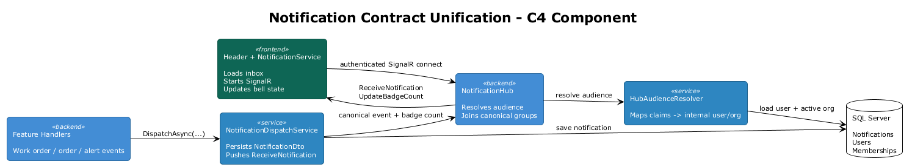
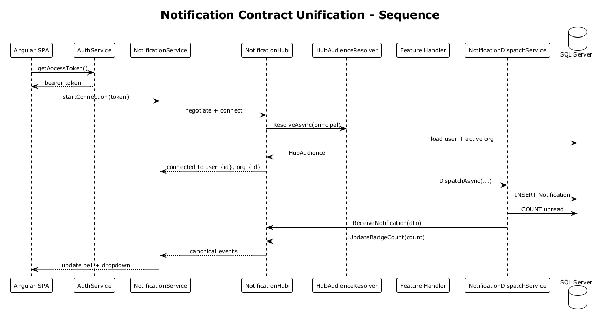

# Notification Contract Unification — Detailed Design

## 1. Overview

**Architecture Finding:** #2 — The notification protocol is inconsistent across authentication, hub identity, backend publishers, and the SPA client.

The current implementation mixes:

- raw JWT claims for hub groups
- internal Fleet Hub user GUIDs for persisted notifications
- multiple SignalR event names for the same domain concept
- direct `IHubContext` usage in feature handlers
- a client connection started without a real access token

This makes real-time delivery fragile and difficult to reason about.

**Scope:** Define one end-to-end notification contract covering identity resolution, hub group membership, payload DTOs, event names, publisher responsibilities, and frontend connection startup.

**References:**
- [Feature 07 — Notifications & Reporting](../07-notifications-reporting/README.md)
- [Notification Wiring](../11-notification-wiring/README.md)
- [Tenant & Identity Model Hardening](../09-tenant-identity-hardening/README.md)

## 2. Architecture

### 2.1 Canonical Audience Model

Real-time notification audiences are always expressed in Fleet Hub business identities:

- `user-{internalUserId}`
- `org-{activeOrganizationId}`

Raw Entra claim values are used only to authenticate the caller and resolve the corresponding Fleet Hub user.



### 2.2 Canonical Delivery Flow

1. Authenticated client establishes a SignalR connection using a real bearer token.
2. `NotificationHub` resolves the internal user ID and active organization ID.
3. Hub joins the connection to canonical user and org groups.
4. Application code publishes notifications only through `INotificationDispatchService`.
5. Dispatch service persists the notification row and sends the standard SignalR event.
6. SPA receives a stable DTO shape and updates inbox state.



## 3. Changes Required

### 3.1 Add a Shared Hub Audience Resolver

Create a service shared by the middleware and the SignalR hub:

```csharp
public interface IHubAudienceResolver
{
    Task<HubAudience?> ResolveAsync(ClaimsPrincipal principal, CancellationToken ct = default);
}

public sealed record HubAudience(Guid UserId, Guid OrganizationId);
```

Resolution rules:

1. Authenticate the principal via existing JWT/dev auth.
2. Resolve the Fleet Hub user by Entra object ID.
3. Resolve the active organization exactly the same way as `TenantContextMiddleware`.
4. Return the internal user GUID and active org GUID.

This removes duplicate identity logic inside the hub.

### 3.2 Standardize Group Membership in `NotificationHub`

`NotificationHub.OnConnectedAsync()` must:

- stop using `org_id`
- stop using `sub` as the canonical audience identifier
- join only `user-{internalUserId}` and `org-{organizationId}`

Example:

```csharp
var audience = await _resolver.ResolveAsync(Context.User!, Context.ConnectionAborted);
if (audience is null) throw new HubException("Unable to resolve notification audience.");

await Groups.AddToGroupAsync(Context.ConnectionId, $"user-{audience.UserId}");
await Groups.AddToGroupAsync(Context.ConnectionId, $"org-{audience.OrganizationId}");
```

### 3.3 Make `INotificationDispatchService` the Only Realtime Publisher

Feature handlers must stop publishing directly to `IHubContext<NotificationHub>`.

Required changes:

- `WorkOrderCreatedNotificationHandler` delegates to `INotificationDispatchService`
- `WorkOrderStatusChangedNotificationHandler` delegates to `INotificationDispatchService`
- future alert and order notifications do the same

This creates one place that owns:

- notification persistence
- unread-count refresh
- payload mapping
- event naming

### 3.4 Standardize Event Names

User-inbox events are standardized as:

- `ReceiveNotification`
- `UpdateBadgeCount`

If non-inbox domain events are required later, they must use separate DTOs and separate event names, but inbox updates do not get alternate names such as `NotificationReceived`.

### 3.5 Standardize the Notification DTO

Use a dedicated DTO rather than sending EF entities directly:

```csharp
public sealed record NotificationDto(
    Guid Id,
    Guid UserId,
    string Type,
    string Title,
    string Message,
    bool IsRead,
    DateTime CreatedAt,
    string? EntityType,
    Guid? EntityId);
```

The REST API and SignalR payload both return this shape.

The frontend model must align to the same names. `relatedEntityId` and `relatedEntityType` are replaced with `entityId` and `entityType`.

### 3.6 Start the Client Connection with a Real Access Token

`AuthService` must expose a silent token retrieval method:

```typescript
getAccessToken(): Promise<string | null>
```

`AppComponent` starts the hub connection only after:

- an account exists
- token acquisition succeeds

It must also stop the connection on logout.

Passing an empty string to `accessTokenFactory` is not valid design behavior.

### 3.7 Align Dropdown and Realtime Paths

The SPA must treat REST-loaded notifications and SignalR-delivered notifications as the same contract:

- same DTO
- same entity field names
- same unread-count semantics

This avoids dual-model logic in the header and notification service.

## 4. Acceptance Tests

### 4.1 Backend Integration Test: Dispatch Uses Canonical Event Names

```csharp
[Fact]
public async Task Dispatch_service_emits_receive_notification_and_badge_count()
{
    var fakeHub = new FakeNotificationHubContext();
    var service = CreateDispatchService(fakeHub);

    await service.DispatchAsync(_userId, "Alert", "High Temperature", "Threshold exceeded");

    Assert.Contains(fakeHub.Events, e => e.Method == "ReceiveNotification");
    Assert.Contains(fakeHub.Events, e => e.Method == "UpdateBadgeCount");
}
```

### 4.2 Backend Integration Test: Feature Handlers Do Not Publish Directly

```csharp
[Fact]
public void Notification_handlers_depend_on_dispatch_service_not_hub_context()
{
    typeof(WorkOrderCreatedNotificationHandler)
        .GetConstructors()
        .Single()
        .GetParameters()
        .Select(p => p.ParameterType)
        .Should()
        .NotContain(typeof(IHubContext<NotificationHub>));
}
```

### 4.3 Playwright Test: Hub Negotiation Uses Authenticated Connection

```typescript
test('notification hub negotiates after authenticated app bootstrap', async ({ page }) => {
  const negotiate = page.waitForRequest(req =>
    req.url().includes('/hubs/notifications/negotiate'));

  await page.goto('/dashboard');

  const request = await negotiate;
  expect(request.headers()['authorization'] || '').not.toBe('');
});
```

### 4.4 Playwright Test: Live Inbox Update Uses Canonical Event

```typescript
test('live notification appears in bell dropdown after domain event', async ({ page }) => {
  await page.goto('/dashboard');
  await triggerBackendNotification(page.request);

  await page.locator('[data-testid="notification-bell"]').click();
  await expect(page.locator('[data-testid="notification-item"]').first()).toBeVisible();
});
```

## 5. Security Considerations

- Group membership must be derived from authenticated server-side identity resolution, never from client-supplied IDs.
- Notification DTOs must expose only fields safe for the current user.
- Direct hub methods for arbitrary `SendToUser` and `SendToOrganization` should be restricted or removed to avoid misuse.

## 6. Open Questions

1. Should the hub remain app-hosted, or should the platform move to Azure SignalR Service for scale-out?
2. Should work-order status changes create inbox notifications for every org member, or remain an org broadcast plus optional inbox entry?
