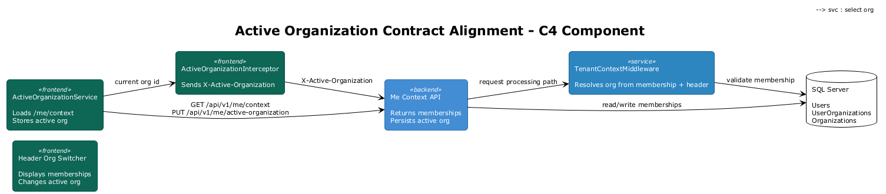
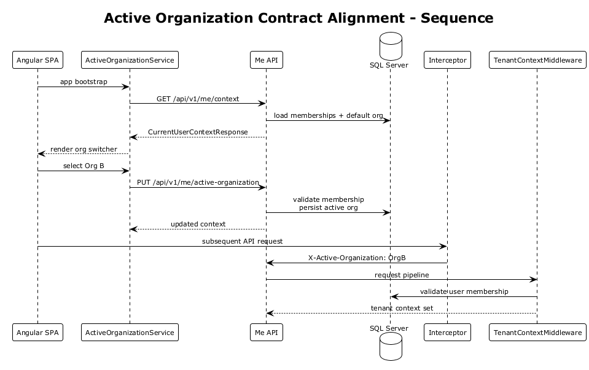
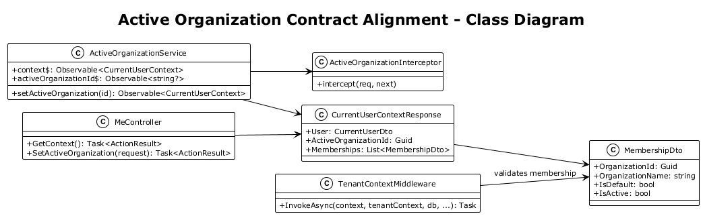

# Active Organization Contract Alignment — Detailed Design

## 1. Overview

**Architecture Finding:** #3 — The SPA and API disagree on what tenant context means.

The backend resolves Fleet Hub organization context from active memberships and the `X-Active-Organization` header. The frontend currently sends `X-Tenant-Id` using the Azure AD tenant ID, which is a different identity domain entirely and cannot support multi-organization switching inside Fleet Hub.

**Scope:** Replace the Azure AD tenant-based client contract with an explicit active-organization contract built around Fleet Hub organization GUIDs, server-returned membership context, and a visible org switcher in the SPA.

**References:**
- [Feature 01 — Authentication & Multi-Tenancy](../01-authentication/README.md)
- [Tenant & Identity Model Hardening](../09-tenant-identity-hardening/README.md)
- [Notification Contract Unification](../15-notification-contract-unification/README.md)

## 2. Architecture

### 2.1 Canonical Tenant Model

The platform distinguishes two concepts:

- `aadTenantId` — Entra directory tenant, used only for authentication
- `organizationId` — Fleet Hub business organization, used for authorization and data isolation

The SPA must never use `aadTenantId` as the business tenant header.



### 2.2 Active Organization Flow

1. User authenticates through Entra ID.
2. SPA calls `GET /api/v1/me/context`.
3. API returns user profile, memberships, and active organization.
4. Frontend stores the active Fleet Hub organization ID.
5. `X-Active-Organization` is sent on all API requests.
6. Header switcher updates the active organization and refreshes the page state.



### 2.3 Class Diagram



## 3. Changes Required

### 3.1 Add a Current-User Context Endpoint

Create `GET /api/v1/me/context` returning:

```json
{
  "user": {
    "id": "guid",
    "email": "admin@ironvale.com",
    "displayName": "Dev Admin",
    "role": "Admin"
  },
  "activeOrganizationId": "guid",
  "memberships": [
    {
      "organizationId": "guid",
      "organizationName": "Org A",
      "isDefault": true,
      "isActive": true
    }
  ]
}
```

This becomes the SPA's source of truth for Fleet Hub identity context.

### 3.2 Add an Active-Organization Mutation Endpoint

Create `PUT /api/v1/me/active-organization`:

```json
{ "organizationId": "guid" }
```

Behavior:

1. Validate the caller has an active membership in the requested organization.
2. Update the default membership flag, or otherwise persist the chosen active org for future sessions.
3. Return the updated `CurrentUserContextResponse`.

The server continues honoring `X-Active-Organization` per request, but this endpoint makes the switcher state durable and discoverable.

### 3.3 Replace `tenantInterceptor` with `activeOrganizationInterceptor`

Remove the current interceptor behavior:

```typescript
setHeaders: { 'X-Tenant-Id': account.tenantId }
```

Replace it with:

```typescript
setHeaders: { 'X-Active-Organization': activeOrganizationId }
```

The header value must be a Fleet Hub organization GUID returned from `/me/context`.

### 3.4 Introduce `ActiveOrganizationService`

Add a dedicated frontend service:

```typescript
export interface Membership {
  organizationId: string;
  organizationName: string;
  isDefault: boolean;
  isActive: boolean;
}

export class ActiveOrganizationService {
  context$: Observable<CurrentUserContext>;
  activeOrganizationId$: Observable<string | null>;
  setActiveOrganization(id: string): Observable<CurrentUserContext>;
}
```

Responsibilities:

- load `/api/v1/me/context` at app bootstrap
- expose memberships and active org
- switch org through the new endpoint
- provide the current org ID to the interceptor

### 3.5 Add an Organization Switcher to the Header

The shared header component gets:

- current organization label
- dropdown for memberships
- selection handler that calls `ActiveOrganizationService.setActiveOrganization()`

Visibility rules:

- hidden for single-org users
- visible for users with more than one active membership

### 3.6 Separate AAD Identity from Business User State

`AuthService.user$` must stop projecting Fleet Hub business fields from the MSAL account alone.

Specifically:

- `tenantId` is renamed to `aadTenantId` if retained at all
- `role`, `organizationId`, and memberships come from `/api/v1/me/context`

This prevents client-side role and organization drift.

## 4. Acceptance Tests

### 4.1 Backend Integration Test: Current Context Returns Memberships

```csharp
[Fact]
public async Task Me_context_returns_active_org_and_memberships()
{
    var client = CreateAuthenticatedClientWithMultipleMemberships();

    var response = await client.GetAsync("/api/v1/me/context");

    Assert.Equal(HttpStatusCode.OK, response.StatusCode);
    var body = await response.Content.ReadFromJsonAsync<CurrentUserContextResponse>();
    Assert.True(body!.Memberships.Count >= 2);
    Assert.NotEqual(Guid.Empty, body.ActiveOrganizationId);
}
```

### 4.2 Backend Integration Test: Switching Active Org Requires Membership

```csharp
[Fact]
public async Task Setting_active_org_without_membership_returns_403()
{
    var client = CreateAuthenticatedClient();

    var response = await client.PutAsJsonAsync("/api/v1/me/active-organization",
        new { organizationId = Guid.NewGuid() });

    Assert.Equal(HttpStatusCode.Forbidden, response.StatusCode);
}
```

### 4.3 Playwright Test: Switcher Sends `X-Active-Organization`

```typescript
test('org switcher uses fleet hub organization header', async ({ page }) => {
  const requestPromise = page.waitForRequest(req =>
    req.url().includes('/dashboard/kpis') &&
    !!req.headers()['x-active-organization']);

  await page.goto('/dashboard');
  await page.locator('[data-testid="org-switcher"]').click();
  await page.locator('[data-testid^="org-option-"]').nth(1).click();

  const request = await requestPromise;
  expect(request.headers()['x-active-organization']).toMatch(
    /^[0-9a-f-]{36}$/i);
});
```

### 4.4 Playwright Test: Switching Org Refreshes Page Data

```typescript
test('switching org refreshes dashboard with new organization data', async ({ page }) => {
  await page.goto('/dashboard');

  const before = await page.locator('[data-testid="kpi-total-equipment"]').textContent();

  await page.locator('[data-testid="org-switcher"]').click();
  await page.locator('[data-testid^="org-option-"]').nth(1).click();

  await expect(page.locator('[data-testid="kpi-total-equipment"]'))
    .not.toHaveText(before || '');
});
```

## 5. Security Considerations

- The server must validate active-organization switches against membership state on every request.
- The header remains advisory, not authoritative; the backend owns final tenant resolution.
- Client local state must never be treated as proof of org access.

## 6. Open Questions

1. Should `PUT /api/v1/me/active-organization` update `IsDefault`, or should the active org remain session-only?
2. Should the active organization also be reflected in the SignalR connection contract, or should the hub resolve it independently on connect?
