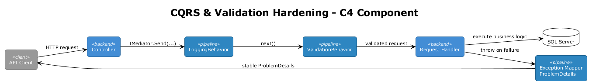
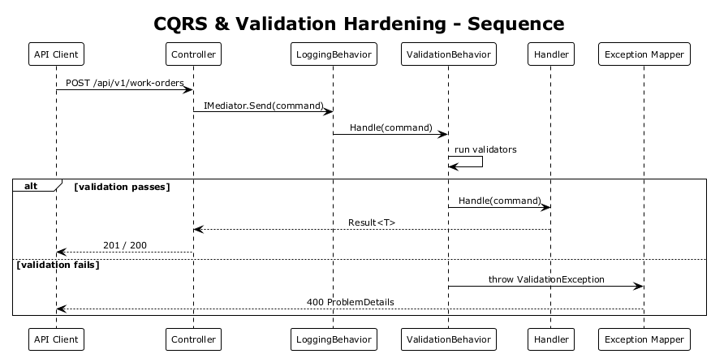
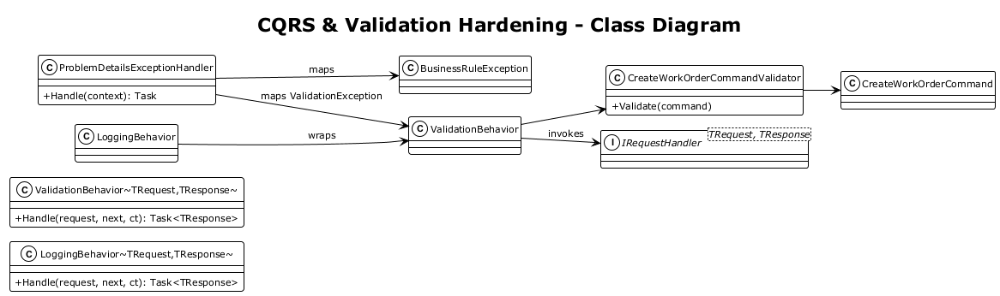

# CQRS & Validation Hardening — Detailed Design

## 1. Overview

**Architecture Finding:** #4 — CQRS and validation infrastructure exists, but it is not operationally complete.

The API already has MediatR request handlers and pipeline behaviors, but the current state still has major gaps:

- validation failures are thrown but not mapped to a stable HTTP problem contract
- validator coverage is partial
- there is no enforcement that new write commands add validators
- logging does not include enough request context to make the pipeline operationally useful

**Scope:** Complete the MediatR pipeline so validation, error handling, and request conventions are reliable and enforceable across the backend.

**References:**
- [MediatR CQRS Refactor](../08-mediatr-cqrs-refactor/README.md)
- [Service Management](../03-service-management/README.md)
- [Equipment Management](../02-equipment-management/README.md)

## 2. Architecture

### 2.1 Target Request Pipeline

1. ASP.NET controller accepts request
2. MediatR logs request start
3. FluentValidation validates command/query
4. Handler executes
5. Exceptions map to ProblemDetails
6. Controller returns stable HTTP contract



### 2.2 Error Mapping Strategy

| Source | HTTP Status | Contract |
|--------|-------------|----------|
| `ValidationException` | 400 | `application/problem+json` with field errors |
| `BusinessRuleException` | 422 | `application/problem+json` |
| Unexpected exception | 500 | `application/problem+json` |



### 2.3 Class Diagram



## 3. Changes Required

### 3.1 Add Global ProblemDetails Exception Handling

Register centralized exception handling in `Program.cs`:

```csharp
builder.Services.AddProblemDetails();

app.UseExceptionHandler(exceptionApp =>
{
    exceptionApp.Run(async context =>
    {
        // map ValidationException, BusinessRuleException, and fallback
    });
});
```

Validation failures must no longer surface as generic 500 responses.

### 3.2 Introduce a Formal Business Rule Exception

Add:

```csharp
public sealed class BusinessRuleException : Exception
{
    public BusinessRuleException(string message) : base(message) { }
}
```

Use it where the domain wants `422 Unprocessable Entity` rather than `400` or `404`.

### 3.3 Require Validator Coverage for All Write Commands

Policy:

- every public command in `Features/*/Commands` must have a corresponding FluentValidation validator
- exceptions require an explicit marker interface or attribute

Recommended opt-out:

```csharp
public interface ISkipValidation { }
```

Example:

```csharp
public record MarkAllNotificationsReadCommand() : IRequest<Unit>, ISkipValidation;
```

### 3.4 Add Missing Validators

Write-side commands needing validators include, at minimum:

- `CreateWorkOrderCommand`
- `UpdateWorkOrderStatusCommand`
- `SubmitOrderCommand`
- `CreateAlertThresholdCommand`
- `UpdateAlertThresholdCommand`
- `ExportReportCommand`
- `ChangeUserRoleCommand`
- `AcceptInviteCommand`

Validation rules should cover:

- required identifiers
- enum/string status values
- date ranges
- pagination bounds
- report/export format whitelists

### 3.5 Add a Reflection-Based Coverage Test

Create a test that fails when a new command is added without a validator or explicit opt-out:

```csharp
[Fact]
public void Every_command_has_validator_or_explicit_opt_out()
{
    // reflect over Features/*/Commands
}
```

This makes validator coverage an architectural rule instead of a convention.

### 3.6 Enrich `LoggingBehavior`

Enhance logging to include:

- request name
- correlation ID
- active organization ID
- user ID
- elapsed time
- success/failure outcome

Payload bodies remain excluded by default.

### 3.7 Keep Controllers Thin

Controllers remain responsible only for:

- routing
- authorization attributes
- cancellation token propagation
- mapping `Result<T>` to HTTP responses

They must not perform ad hoc validation once the validator exists.

## 4. Acceptance Tests

### 4.1 Integration Test: Validation Failure Returns ProblemDetails

```csharp
[Fact]
public async Task Invalid_create_equipment_returns_400_problem_details()
{
    var client = CreateAuthenticatedClient();

    var response = await client.PostAsJsonAsync("/api/v1/equipment", new
    {
        name = "",
        make = "",
        model = "",
        serialNumber = ""
    });

    Assert.Equal(HttpStatusCode.BadRequest, response.StatusCode);
    Assert.Equal("application/problem+json", response.Content.Headers.ContentType!.MediaType);
}
```

### 4.2 Integration Test: Invalid Work Order Status Returns 400 or 422 Predictably

```csharp
[Fact]
public async Task Invalid_status_transition_returns_unprocessable_entity()
{
    var client = CreateAuthenticatedClient();

    var response = await client.PutAsJsonAsync($"/api/v1/work-orders/{_id}/status",
        new { status = "NotARealStatus" });

    Assert.Equal(HttpStatusCode.UnprocessableEntity, response.StatusCode);
}
```

### 4.3 Unit Test: Command Coverage Convention

```csharp
[Fact]
public void All_commands_have_validator_or_skip_marker()
{
    // reflection-based convention test
}
```

## 5. Security Considerations

- Central validation reduces malformed-input attack surface.
- ProblemDetails responses must not leak stack traces in production.
- Logging must avoid request payloads for sensitive routes.

## 6. Design Decisions (formerly Open Questions)

1. **Result\<T\> vs exceptions for business-rule failures:** continue using `Result<T>` for expected failures. This is consistent with the decision in Design #08 (MediatR CQRS Refactor). `Result<T>` makes failure paths explicit in handler signatures, avoids exception-driven control flow for predictable scenarios (validation failures, not-found, authorization), and lets controllers map `Result<T>` to appropriate HTTP status codes without catch blocks. Exceptions remain for unexpected errors only.
2. **Query validation scope:** command-first validation only. Adding `FluentValidation` validators to read queries increases boilerplate for minimal safety gain — queries typically accept simple filter parameters (IDs, pagination) that are already constrained by route binding and model binding. If a query parameter is invalid, the handler returns an empty result or `Result<T>.NotFound`. Validators can be added to specific complex queries later if needed.
