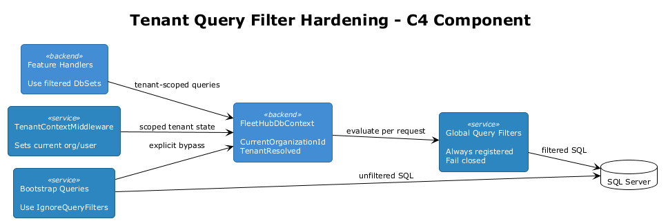
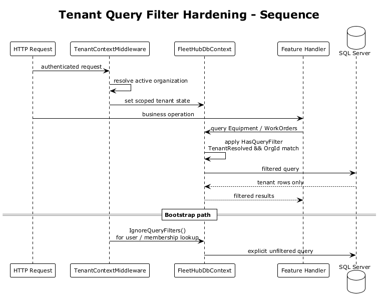
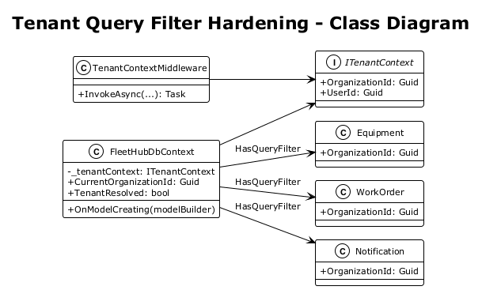

# Tenant Query Filter Hardening — Detailed Design

## 1. Overview

**Architecture Finding:** #5 — The EF Core tenant safety net is brittle because query filters are conditional and capture organization state during model creation.

The current `FleetHubDbContext` installs tenant filters only if a non-empty organization is present during `OnModelCreating()`, and it captures that organization in a local variable. This creates two architectural risks:

- filters may not exist at all if the context is constructed before tenant resolution
- filters can behave as though tenant state were fixed at model-build time

That forces handlers to duplicate tenant predicates everywhere.

**Scope:** Make EF Core query filters request-bound, fail-closed by default, and safe to use as true defense-in-depth rather than advisory boilerplate.

**References:**
- [Feature 01 — Authentication & Multi-Tenancy](../01-authentication/README.md)
- [Tenant & Identity Model Hardening](../09-tenant-identity-hardening/README.md)
- [Active Organization Contract Alignment](../16-active-organization-contract-alignment/README.md)

## 2. Architecture

### 2.1 Request-Bound Filter Model

Tenant query filters are always registered, and they always reference DbContext instance properties instead of captured local variables.

Core idea:

```csharp
public Guid CurrentOrganizationId => _tenantContext?.OrganizationId ?? Guid.Empty;
public bool TenantResolved => CurrentOrganizationId != Guid.Empty;
```

Each filter then references those properties directly.



### 2.2 Bootstrap Access Model

When the middleware or infrastructure needs pre-tenant access, it uses:

- `IgnoreQueryFilters()`, or
- a dedicated unfiltered query path for identity/bootstrap concerns

Application request handlers stay on the filtered path.



### 2.3 Class Diagram



## 3. Changes Required

### 3.1 Remove Conditional Filter Registration

Delete the current pattern:

```csharp
if (_tenantContext != null && _tenantContext.OrganizationId != Guid.Empty)
{
    var orgId = _tenantContext.OrganizationId;
    modelBuilder.Entity<Equipment>().HasQueryFilter(x => x.OrganizationId == orgId);
}
```

Filters must always be registered.

### 3.2 Use DbContext Instance Properties in Filters

Example:

```csharp
public Guid CurrentOrganizationId => _tenantContext?.OrganizationId ?? Guid.Empty;
public bool TenantResolved => CurrentOrganizationId != Guid.Empty;

modelBuilder.Entity<Equipment>()
    .HasQueryFilter(x => TenantResolved && x.OrganizationId == CurrentOrganizationId);
```

This ensures the filter is evaluated against the current scoped context state.

### 3.3 Fail Closed When Tenant Is Missing

For tenant-scoped entities, unresolved tenant state should yield zero rows rather than all rows:

```csharp
HasQueryFilter(x => TenantResolved && x.OrganizationId == CurrentOrganizationId);
```

This is safer than silently disabling filters.

### 3.4 Extend the Pattern to All Tenant-Scoped Entities

The hardened filter set must cover:

- `Equipment`
- `WorkOrder`
- `Alert`
- `AIPrediction`
- `AnomalyDetection`
- `Notification`
- `PartsOrder`
- `User`
- `UserInvitation`
- `TelemetryEvent`
- `AlertThreshold`
- membership-derived entities such as `CartItem` and `NotificationPreference`

### 3.5 Keep Bootstrap Queries Explicit

Identity bootstrap remains explicit:

- `TenantContextMiddleware` uses `IgnoreQueryFilters()` for user and membership lookup
- background jobs and admin maintenance paths do the same when cross-tenant access is intentional

This makes filter bypasses visible in code review.

### 3.6 Add a Conventions Test for Cross-Request Isolation

Create an integration test that issues two requests against the same app instance:

1. request with org A active
2. request with org B active

The returned entity sets must remain correctly isolated per request.

### 3.7 Reduce Redundant Tenant Predicates Gradually

Handlers may keep explicit `Where(x => x.OrganizationId == _tenant.OrganizationId)` clauses initially for defense-in-depth.

After filter hardening and coverage tests are stable, redundant tenant predicates can be removed incrementally in low-risk areas.

## 4. Acceptance Tests

### 4.1 Integration Test: Filters Respect Different Orgs Across Requests

```csharp
[Fact]
public async Task Sequential_requests_with_different_active_orgs_return_isolated_results()
{
    await using var factory = new ApiWebApplicationFactory();

    using var clientA = factory.CreateAuthenticatedClient();
    clientA.DefaultRequestHeaders.Add("X-Active-Organization", _orgAId.ToString());

    using var clientB = factory.CreateAuthenticatedClient();
    clientB.DefaultRequestHeaders.Add("X-Active-Organization", _orgBId.ToString());

    var responseA = await clientA.GetFromJsonAsync<PaginatedResponse<Equipment>>("/api/v1/equipment?skip=0&take=20");
    var responseB = await clientB.GetFromJsonAsync<PaginatedResponse<Equipment>>("/api/v1/equipment?skip=0&take=20");

    Assert.All(responseA!.Items, x => Assert.Equal(_orgAId, x.OrganizationId));
    Assert.All(responseB!.Items, x => Assert.Equal(_orgBId, x.OrganizationId));
}
```

### 4.2 Integration Test: Unresolved Tenant Does Not Leak Rows

```csharp
[Fact]
public async Task Unresolved_tenant_returns_no_filtered_rows()
{
    await using var scope = _factory.Services.CreateAsyncScope();
    var db = scope.ServiceProvider.GetRequiredService<FleetHubDbContext>();

    var rows = await db.Equipment.ToListAsync();

    Assert.Empty(rows);
}
```

### 4.3 Integration Test: Middleware Can Still Bootstrap with `IgnoreQueryFilters`

```csharp
[Fact]
public async Task Middleware_bootstrap_queries_use_ignore_query_filters()
{
    var response = await CreateAuthenticatedClient().GetAsync("/api/v1/equipment?skip=0&take=20");
    Assert.Equal(HttpStatusCode.OK, response.StatusCode);
}
```

## 5. Security Considerations

- Fail-closed filters reduce the blast radius of missed tenant predicates in handlers.
- Filter bypasses become explicit and auditable via `IgnoreQueryFilters()`.
- Background jobs must document every intentional cross-tenant query path.

## 6. Open Questions

1. Should the project introduce marker interfaces such as `IOrganizationScoped` to reduce filter boilerplate?
2. Are there any legitimate admin reporting paths that need a first-class filtered-bypass abstraction instead of repeated `IgnoreQueryFilters()` usage?
