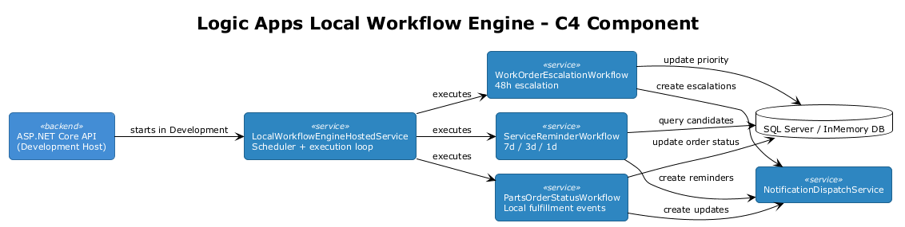
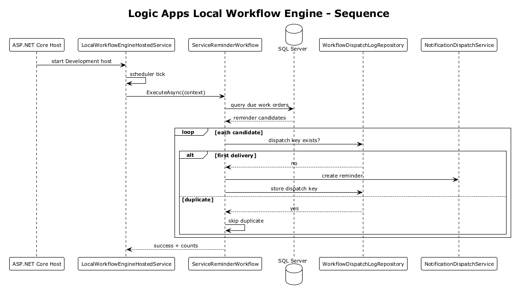
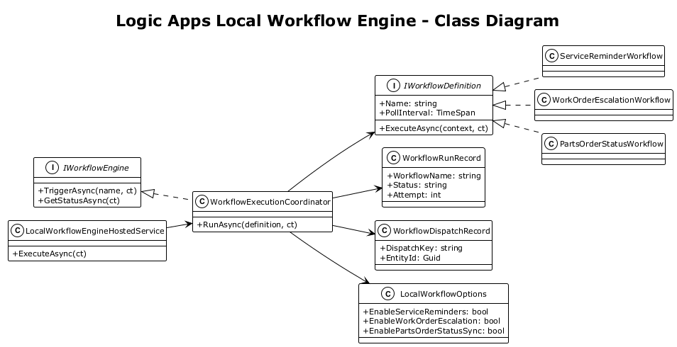

# Logic Apps Local Workflow Engine — Detailed Design

## 1. Overview

**Source:** `docs/local-development-strategy.md` Section 4.1 identifies Azure Logic Apps as a service without a complete local alternative available today.

The production architecture uses Azure Logic Apps for recurring service reminders, overdue work order escalations, and workflow-driven notification fan-out. That design is appropriate in Azure, but it leaves local development with no fully integrated way to execute, inspect, retry, and test the same workflows on a developer machine.

**Scope:** introduce a development-only local workflow engine that runs inside the ASP.NET Core host as an `IHostedService`, executes the same reminder and escalation rules as the cloud workflows, simulates inbound parts-order fulfillment updates, records run history, and exposes manual trigger hooks for deterministic testing.

**Goals:**

- Preserve the local inner loop with zero Azure dependency
- Keep workflow rules explicit and testable in C#
- Support the same functional outcomes as the production Logic Apps workflows
- Provide local run history, idempotency, and retry behavior that are good enough for developer verification

**References:**

- [Local Development Strategy](../../local-development-strategy.md)
- [ADR-0003 Azure Logic Apps Workflow Automation](../../adr/infrastructure/0003-azure-logic-apps-workflow-automation.md)
- [Feature 03 Service Management](../03-service-management/README.md)
- [Feature 07 Notifications & Reporting](../07-notifications-reporting/README.md)
- [Design 14 Telemetry Alert Pipeline Unification](../14-telemetry-alert-pipeline-unification/README.md)
- [Design 20 Communication Services Local Delivery](../20-communication-services-local-delivery/README.md)
- [Design 22 Azure Functions Local Development](../22-azure-functions-local-development/README.md)

## 2. Architecture

### 2.1 Runtime Components

The local replacement has five main runtime elements:

- `DevWorkflowEngineHostedService` schedules and executes development workflows
- `IWorkflowDefinition` implementations contain each workflow's business logic
- `WorkflowRunRecord` and `WorkflowDispatchRecord` entities persisted via `FleetHubDbContext`
- downstream application services perform notifications and work-order updates using the same contracts as the production app
- `AlertEvaluatorService` integration for workflows that react to existing alerts rather than re-evaluating thresholds

> **Naming convention:** all development-only types use the `Dev*` prefix (e.g., `DevWorkflowEngineHostedService`, `DevWorkflowController`) to match the existing codebase convention established by `DevAuthHandler`.



### 2.2 Canonical Execution Flow

1. The ASP.NET Core API starts in `Development`.
2. `DevWorkflowEngineHostedService` loads enabled workflow definitions and checks which are due.
3. The due workflow queries the application database for candidates.
4. The workflow computes a deterministic dispatch key per action.
5. New actions are executed through existing application services.
6. The engine writes a `WorkflowRunRecord` and updates the workflow cursor.



### 2.3 Class Diagram



## 3. Components, Types, and Classes

### 3.1 Core Abstractions

#### `IWorkflowEngine`

- **Type:** application service interface
- **Responsibility:** exposes manual triggering and status inspection for development tooling and tests
- **Key members:**
  - `Task TriggerAsync(string workflowName, CancellationToken ct = default)`
  - `Task<IReadOnlyList<WorkflowStatusDto>> GetStatusAsync(CancellationToken ct = default)`

#### `IWorkflowDefinition`

- **Type:** workflow contract
- **Responsibility:** defines one executable workflow unit
- **Key members:**

```csharp
public interface IWorkflowDefinition
{
    string Name { get; }
    TimeSpan PollInterval { get; }
    bool Enabled(DevWorkflowOptions options);
    Task ExecuteAsync(WorkflowExecutionContext context, CancellationToken ct);
}
```

Each definition owns one domain concern and should not branch across unrelated workflow families.

#### `WorkflowRunRecord` (DbContext Entity)

- **Type:** EF Core entity registered in `FleetHubDbContext`
- **Responsibility:** stores execution start/end times, attempt count, status, and error details
- **Persistence:** add `DbSet<WorkflowRunRecord>` to `FleetHubDbContext`, consistent with how existing entities like `Alert` and `Notification` are accessed directly by MediatR handlers and services
- **Used by:** hosted service, controller, tests

#### `WorkflowDispatchRecord` (DbContext Entity)

- **Type:** EF Core entity registered in `FleetHubDbContext`
- **Responsibility:** records dispatch keys such as `service-reminder:{workOrderId}:3d` or `escalation:{workOrderId}:high`
- **Persistence:** add `DbSet<WorkflowDispatchRecord>` to `FleetHubDbContext`
- **Used by:** each workflow before creating side effects

> **Architectural note:** the existing API codebase accesses entities directly via `FleetHubDbContext` `DbSet<T>` properties (e.g., `_db.Equipment.Where(...)` in MediatR handlers). These workflow entities follow the same pattern rather than introducing a separate repository abstraction. This keeps the local dev code consistent with the established data access approach.

#### `IWorkflowClock`

- **Type:** time abstraction
- **Responsibility:** makes schedule evaluation and tests deterministic
- **Default implementation:** `SystemWorkflowClock`

### 3.2 Hosted Runtime

#### `DevWorkflowEngineHostedService`

- **Type:** `BackgroundService`
- **Responsibility:** drives the scheduler loop in development only
- **Behavior:**
  - loads all registered `IWorkflowDefinition` instances
  - checks due state using `PollInterval` and last successful run
  - executes workflows serially by default to keep local behavior predictable
  - records success/failure in `WorkflowRunRecord` via `FleetHubDbContext`

This service replaces the schedule trigger aspect of Logic Apps locally.

> **Implementation guidance:** this is the first `BackgroundService` in the API project. Key patterns to follow:
> - Resolve scoped services (e.g., `FleetHubDbContext`) via `IServiceProvider.CreateScope()` within each iteration — never capture a scoped service in the constructor.
> - Respect the `CancellationToken` passed to `ExecuteAsync` for graceful shutdown.
> - Wrap the main loop body in `try/catch` so a single workflow failure does not crash the hosted service.
> - Log unhandled exceptions with `ILogger` and continue the loop rather than rethrowing.

#### `WorkflowExecutionCoordinator`

- **Type:** orchestration service
- **Responsibility:** wraps one workflow execution with logging, retries, idempotency wiring, and correlation IDs
- **Why separate:** keeps `BackgroundService` small and lets tests execute one workflow without starting the full host

#### `DevWorkflowController`

- **Type:** development-only API controller
- **Responsibility:** manual trigger and inspection endpoints
- **Recommended routes:**
  - `POST /api/dev/workflows/{name}/trigger`
  - `GET /api/dev/workflows`
  - `GET /api/dev/workflows/runs?name=ServiceReminderWorkflow`

This controller is guarded behind `IHostEnvironment.IsDevelopment()` and should not be registered in non-development environments.

### 3.3 Workflow Definitions

#### `ServiceReminderWorkflow`

- **Type:** `IWorkflowDefinition`
- **Responsibility:** finds scheduled service work orders due in 7, 3, and 1 day windows
- **Inputs:** due date, assigned technician, fleet manager, notification preferences
- **Outputs:** in-app notification, optional local email, optional local SMS
- **Idempotency key:** `service-reminder:{workOrderId}:{offsetDays}`

#### `WorkOrderEscalationWorkflow`

- **Type:** `IWorkflowDefinition`
- **Responsibility:** identifies open work orders overdue by more than 48 hours and escalates priority one level at a time
- **Inputs:** work order age, current status, priority, supervisor assignment
- **Outputs:** work order priority update plus escalation notifications
- **Idempotency key:** `work-order-escalation:{workOrderId}:{newPriority}`

#### `PartsOrderStatusWorkflow`

- **Type:** `IWorkflowDefinition`
- **Responsibility:** simulates the Logic App that would process fulfillment status updates from an external system
- **Inputs:** pending parts orders plus a local source of status events
- **Outputs:** order status changes, timeline entries, and notifications to the ordering user
- **Local source:** JSON fixture file or development table such as `DevPartsOrderEvents`
- **Idempotency key:** `parts-order-status:{externalEventId}`

### 3.4 Supporting Services

#### `ReminderCandidateQueryService`

- **Type:** query service
- **Responsibility:** loads reminder candidates with enough data to evaluate channel preferences and recipients

#### `EscalationPolicyService`

- **Type:** domain service
- **Responsibility:** computes the next priority level and prevents escalation past `Critical`

#### `DevPartsOrderEventSource`

- **Type:** infrastructure adapter
- **Responsibility:** reads simulated fulfillment updates from local fixtures or a dev table
- **Why needed:** local development still needs an event source even though no external vendor is present

#### `INotificationDispatchService` (Existing)

- **Type:** existing application boundary — **not a new abstraction**
- **File:** `src/backend/IronvaleFleetHub.Api/Services/NotificationDispatchService.cs`
- **Responsibility:** remains the single way workflows create inbox notifications and downstream email or SMS work
- **Existing behavior (lines 88–102):** already checks `NotificationPreference.EmailEnabled` and `SmsEnabled` per user per event type, but currently logs rather than dispatching. Design 20 extends these hooks with concrete email and SMS channel implementations.
- **Integration:** workflows call `INotificationDispatchService.DispatchAsync(userId, type, title, message, entityType, entityId)` — the same signature used everywhere in the application. This design does **not** introduce a parallel notification path.
- **Dependency:** this design depends on [Communication Services Local Delivery](../20-communication-services-local-delivery/README.md) for development email/SMS behavior. Design 20 wires channel implementations into the existing service's email/SMS hooks.

### 3.5 Data Contracts and Option Types

#### `WorkflowExecutionContext`

- **Type:** execution DTO
- **Fields:**
  - `Guid RunId`
  - `DateTime StartedAtUtc`
  - `string CorrelationId`
  - `Guid OrganizationId` — the tenant context for this workflow run; workflows that process all organizations should iterate org IDs explicitly
  - `IServiceProvider Services`
  - `DevWorkflowOptions Options`

#### `WorkflowRunRecord`

- **Type:** persistence model
- **Fields:**
  - `Guid Id`
  - `string WorkflowName`
  - `DateTime StartedAtUtc`
  - `DateTime? CompletedAtUtc`
  - `string Status`
  - `int Attempt`
  - `string? Error`

> **Multi-tenancy note:** `WorkflowRunRecord` is intentionally **not tenant-scoped** — it does not carry an `OrganizationId` or a global query filter. Run history is a development diagnostic tool, not a business entity. A single workflow run may process candidates across multiple organizations. This matches the concept that DevAuthHandler's admin user can inspect all development data.

#### `WorkflowDispatchRecord`

- **Type:** idempotency model
- **Fields:**
  - `string DispatchKey`
  - `string WorkflowName`
  - `DateTime CreatedAtUtc`
  - `string EntityType`
  - `Guid EntityId`

#### `DevWorkflowOptions`

- **Type:** configuration class bound via `IConfiguration`
- **Purpose:** toggles workflows and controls polling

```csharp
public sealed class DevWorkflowOptions
{
    public bool Enabled { get; set; }
    public bool EnableServiceReminders { get; set; }
    public bool EnableWorkOrderEscalation { get; set; }
    public bool EnablePartsOrderStatusSync { get; set; }
    public int SchedulerPeriodSeconds { get; set; } = 60;
    public int MaxRetryCount { get; set; } = 3;
}
```

> **Configuration pattern:** the existing codebase reads configuration via `builder.Configuration` in `Program.cs` (e.g., `builder.Configuration.GetValue<bool>("Authentication:UseDevMode")`). This design follows the same approach — `DevWorkflowOptions` values are read from configuration during DI registration rather than injected via `IOptions<T>`.

**`appsettings.Development.json` additions:**

```json
{
  "DevWorkflow": {
    "Enabled": true,
    "EnableServiceReminders": true,
    "EnableWorkOrderEscalation": true,
    "EnablePartsOrderStatusSync": true,
    "SchedulerPeriodSeconds": 60,
    "MaxRetryCount": 3
  }
}
```

## 4. Detailed Behavior

### 4.1 Scheduling Model

- The host wakes up every `SchedulerPeriodSeconds`.
- Each workflow definition declares its own `PollInterval`.
- The engine checks `lastSuccess + PollInterval <= now`.
- Missed runs after a restart execute once; the engine does not replay every missed interval.

This intentionally favors a predictable local loop over perfect cloud parity.

### 4.2 Idempotency Model

- Every externally visible action uses a deterministic dispatch key.
- Before sending notifications or mutating a work order, the workflow checks `_db.WorkflowDispatchRecords` for an existing dispatch key.
- If the key already exists, the action is skipped and the run is still marked successful.

This protects local development from duplicate reminders when a developer restarts the API or manually re-triggers a workflow.

### 4.3 Retry Model

- Transient failures retry in-process up to `MaxRetryCount`.
- Retries happen within the same scheduler tick.
- Final failure writes the exception text to `WorkflowRunRecord.Error`.
- A later scheduler tick may attempt the workflow again.

### 4.4 Observability

Each run logs:

- workflow name
- correlation ID
- candidate count
- actions created
- actions skipped for idempotency
- elapsed time
- error text on failure

The log format should align with Serilog structured logging already used by the API.

### 4.5 Integration with AlertEvaluatorService

The existing `AlertEvaluatorService` (`src/backend/IronvaleFleetHub.Api/Services/AlertEvaluatorService.cs`) evaluates telemetry events against `EquipmentModelThreshold` records to create `Alert` entities. The escalation workflow should **react to existing alerts** rather than re-evaluating thresholds:

- `WorkOrderEscalationWorkflow` queries `_db.Alerts.Where(a => a.Status == "Active")` to find unresolved alerts.
- Escalation rules reference alert severity (Critical, High) rather than raw telemetry values.
- This avoids duplicating threshold logic that already exists in `AlertEvaluatorService`.

The `DataSeeder` already seeds 5 alerts (ServiceDue, EngineFailure, FuelLevel, Geofence) and 5 `EquipmentModelThreshold` records, providing adequate test data for escalation workflows.

### 4.6 DI Registration

All workflow services are registered conditionally in `Program.cs`, following the established pattern:

```csharp
if (builder.Environment.IsDevelopment())
{
    var workflowConfig = builder.Configuration.GetSection("DevWorkflow");
    var workflowEnabled = workflowConfig.GetValue<bool>("Enabled");

    if (workflowEnabled)
    {
        builder.Services.AddHostedService<DevWorkflowEngineHostedService>();
        builder.Services.AddScoped<WorkflowExecutionCoordinator>();
        builder.Services.AddScoped<IWorkflowDefinition, ServiceReminderWorkflow>();
        builder.Services.AddScoped<IWorkflowDefinition, WorkOrderEscalationWorkflow>();
        builder.Services.AddScoped<IWorkflowDefinition, PartsOrderStatusWorkflow>();
        builder.Services.AddScoped<ReminderCandidateQueryService>();
        builder.Services.AddScoped<EscalationPolicyService>();
        builder.Services.AddScoped<DevPartsOrderEventSource>();
    }
}
```

The `DevWorkflowController` uses `[ApiExplorerSettings(IgnoreApi = true)]` and checks `IHostEnvironment.IsDevelopment()` at runtime as a defense-in-depth measure.

## 5. Acceptance Tests

> **Testing approach:** these tests run against `ApiWebApplicationFactory` (existing test infrastructure) with the workflow engine registered. Since `DevWorkflowEngineHostedService` is a `BackgroundService`, tests should invoke `WorkflowExecutionCoordinator` directly rather than starting the full scheduler. This avoids timer-based flakiness and makes assertions deterministic.

### 5.1 Reminder Workflow

- Given a work order due in 3 days, when `ServiceReminderWorkflow` runs, then exactly one reminder is recorded and the same run does not produce duplicates on retry.

**How to verify:** call `WorkflowExecutionCoordinator.ExecuteWorkflowAsync("ServiceReminderWorkflow")` in a test, then assert `_db.Notifications.Count(n => n.Type == "ServiceDue")` equals 1. Call it again and assert the count is still 1 (idempotency via dispatch key).

### 5.2 Escalation Workflow

- Given an open work order older than 48 hours with `Medium` priority, when `WorkOrderEscalationWorkflow` runs, then the priority becomes `High` and one escalation notification is created.

**How to verify:** seed a work order with `CreatedAt = DateTime.UtcNow.AddHours(-49)` and `Priority = "Medium"`, execute the workflow, then assert `workOrder.Priority == "High"` and one notification of type `"Escalation"` exists.

### 5.3 Parts Status Workflow

- Given a local fulfillment event `Shipped`, when `PartsOrderStatusWorkflow` runs, then the parts order status is updated once and the event is not re-applied on the next run.

**How to verify:** create a `DevPartsOrderEvent` fixture, execute the workflow, assert the order status changed, execute again, assert no additional status change.

### 5.4 Manual Trigger Endpoint

- Given a development environment, when `POST /api/dev/workflows/ServiceReminderWorkflow/trigger` is called, then the workflow executes immediately and a new `WorkflowRunRecord` is visible in the run history endpoint.

**How to verify:** send the POST via `HttpClient` in an integration test, then GET `/api/dev/workflows/runs?name=ServiceReminderWorkflow` and assert the latest run exists with `Status == "Completed"`.

## 6. Security Considerations

- The entire local workflow engine is registered only in `Development` via the `if (builder.Environment.IsDevelopment())` guard in `Program.cs`.
- Manual workflow endpoints must not be reachable in production builds. The `DevWorkflowController` should use both compile-time (`#if DEBUG` or `[ApiExplorerSettings(IgnoreApi = true)]`) and runtime (`IHostEnvironment.IsDevelopment()`) guards.
- Local run history should avoid storing full SMS or email bodies if those payloads contain sensitive content already stored elsewhere.
- Fixture-driven parts status events should be treated as trusted development data only.

## 7. Multi-Tenancy Considerations

Workflows in production (Azure Logic Apps) run as system-level processes with no user context. Locally, the same principle applies:

- **`WorkflowRunRecord` and `WorkflowDispatchRecord`** are development diagnostic entities. They are **not tenant-scoped** and do not have `OrganizationId` fields or global query filters. This is intentional — run history is developer tooling, not business data.
- **Candidate queries** within each workflow (e.g., finding overdue work orders) must respect tenant boundaries. Workflows should query across all organizations by using `_db.WorkOrders.IgnoreQueryFilters()` or by iterating known org IDs from `_db.Organizations`. This matches the production Logic Apps behavior where workflows are not scoped to a single tenant.
- **Notification dispatch** uses the existing `INotificationDispatchService` which resolves `OrganizationId` from the target user's record, so tenant isolation in notification delivery is preserved.
- **`DataSeeder` integration:** the seeded data includes two organizations (Northern Construction Ltd., Pacific Mining Corp.) with work orders, equipment, and alerts for both. Workflows should process both organizations to verify cross-tenant correctness.

## 8. Recommended Decomposition

This design covers the core engine plus three distinct workflow implementations. For incremental delivery, it may be decomposed into:

| Sub-design | Scope | Depends On |
|-----------|-------|------------|
| **19A: Core Workflow Engine** | `IWorkflowEngine`, `IWorkflowDefinition`, `DevWorkflowEngineHostedService`, `WorkflowExecutionCoordinator`, `WorkflowRunRecord`, `WorkflowDispatchRecord`, `DevWorkflowController` | — |
| **19B: Service Reminder Workflow** | `ServiceReminderWorkflow`, `ReminderCandidateQueryService` | 19A |
| **19C: Escalation Workflow** | `WorkOrderEscalationWorkflow`, `EscalationPolicyService`, `AlertEvaluatorService` integration | 19A |
| **19D: Parts Order Status Workflow** | `PartsOrderStatusWorkflow`, `DevPartsOrderEventSource` | 19A |

Each workflow (19B–19D) has distinct domain concerns and can be implemented and tested independently once the core engine (19A) is in place.

## 9. Design Decisions (formerly Open Questions)

1. **Workflow run history storage:** SQL tables via `FleetHubDbContext` (`WorkflowRunRecord` entity). Structured logging alone is insufficient because the `DevWorkflowController` needs to serve run history through the API, and tests need to assert on run state. The DbContext entity is already specified in Section 3.1.
2. **Parts-order local event source:** table-based. A `DevPartsOrderEvents` entity seeded by `DataSeeder` is cheaper than a file-based approach because it avoids file-path configuration, works with the in-memory database, and is queryable. File-based loading adds no value over a seeded DbSet.
3. **Serial vs parallel workflow execution:** serial only. Local development does not require high-volume load testing. Serial execution is simpler, more predictable for debugging, and avoids concurrency bugs in the hosted service. Parallel execution can be introduced later if needed.
