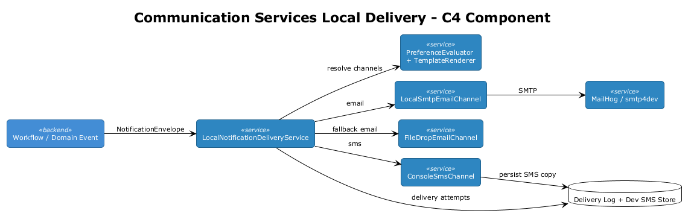
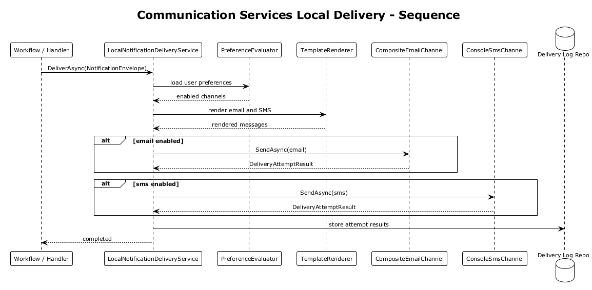
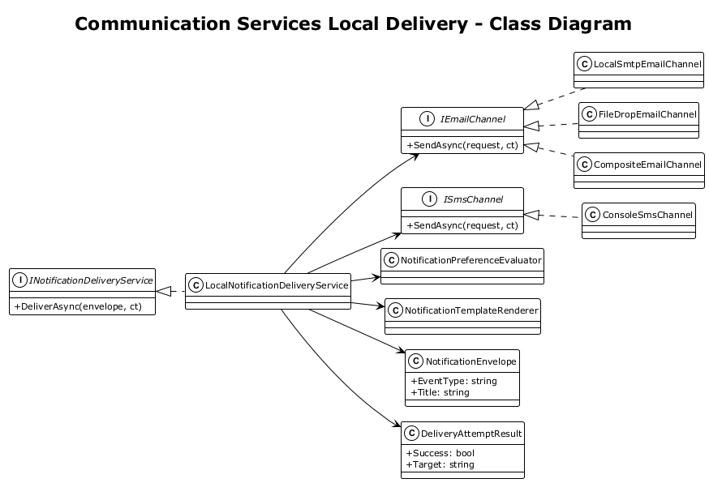

# Communication Services Local Delivery — Detailed Design

## 1. Overview

**Source:** `docs/local-development-strategy.md` Section 4.2 identifies Azure Communication Services as a service without an official local emulator and recommends local email and SMS stubs.

The production architecture uses Azure Communication Services for outbound email and SMS delivery. Local development needs the same notification flows to execute without sending real messages, while still honoring preferences, rendering templates, capturing outputs, and recording delivery attempts for troubleshooting.

**Scope:** introduce a development-only delivery stack that preserves the production notification contract but routes email to a local SMTP capture target or file drop, routes SMS to a console and repository-backed sink, and records every attempt for inspection.

**Goals:**

- Keep notification-triggering code unchanged across environments
- Support email capture without real delivery
- Support SMS inspection without carrier integration
- Preserve user preferences, templates, and audit logs locally

**References:**

- [Local Development Strategy](../../local-development-strategy.md)
- [ADR-0002 Azure Communication Services Notifications](../../adr/integration/0002-azure-communication-services-notifications.md)
- [Feature 07 Notifications & Reporting](../07-notifications-reporting/README.md)
- [Notification Contract Unification](../15-notification-contract-unification/README.md)

## 2. Architecture

### 2.1 Runtime Components

The development delivery stack consists of:

- `LocalNotificationDeliveryService` as the orchestration boundary used by application code
- `NotificationPreferenceEvaluator` to resolve channel eligibility
- `NotificationTemplateRenderer` to create channel-specific subjects and bodies
- `LocalSmtpEmailChannel` to send email to MailHog or smtp4dev
- `FileDropEmailChannel` as a no-dependency fallback when SMTP is unavailable
- `ConsoleSmsChannel` to write SMS messages to logs and a local repository
- `NotificationDeliveryLogRepository` to capture each attempt and result



### 2.2 Canonical Delivery Flow

1. A workflow or domain event asks `INotificationDeliveryService` to deliver a notification.
2. Preferences are loaded for the target user and event type.
3. Templates are rendered for the allowed channels.
4. Email is sent to local SMTP or written to a `.eml` file.
5. SMS is written to the console and persisted for inspection.
6. Delivery outcomes are stored in the delivery log.



### 2.3 Class Diagram



## 3. Components, Types, and Classes

### 3.1 Core Abstractions

#### `INotificationDeliveryService`

- **Type:** orchestration interface
- **Responsibility:** stable entry point for email and SMS delivery
- **Key member:**

```csharp
public interface INotificationDeliveryService
{
    Task DeliverAsync(NotificationEnvelope envelope, CancellationToken ct = default);
}
```

Application code should never depend directly on SMTP, file IO, or console logging.

#### `IEmailChannel`

- **Type:** delivery-channel interface
- **Responsibility:** send one rendered email message to a development sink
- **Implementations:** `LocalSmtpEmailChannel`, `FileDropEmailChannel`

#### `ISmsChannel`

- **Type:** delivery-channel interface
- **Responsibility:** write one rendered SMS message to a development sink
- **Implementation:** `ConsoleSmsChannel`

#### `INotificationTemplateRenderer`

- **Type:** application service
- **Responsibility:** render channel-specific message content from shared templates and tokens
- **Recommended implementation:** `NotificationTemplateRenderer` backed by RazorLight or a simple token replacement engine

### 3.2 Orchestration Layer

#### `LocalNotificationDeliveryService`

- **Type:** concrete service
- **Responsibility:** orchestrates preferences, template rendering, channel dispatch, and logging
- **Behavior:**
  - loads notification preferences by user and event type
  - renders content only for enabled channels
  - invokes the email and SMS channels independently
  - records success or failure for each attempt

This is the development equivalent of ACS-backed outbound delivery.

#### `NotificationPreferenceEvaluator`

- **Type:** policy service
- **Responsibility:** centralizes rules such as:
  - email disabled for service reminders
  - SMS enabled only for critical equipment alerts
  - in-app only for low-priority updates

By centralizing the rules, local and production delivery choose the same channels.

### 3.3 Email Channel Implementations

#### `LocalSmtpEmailChannel`

- **Type:** infrastructure adapter
- **Responsibility:** sends email to MailHog, smtp4dev, or any developer-configured SMTP server
- **Primary configuration:**
  - `Host`
  - `Port`
  - `UseSsl`
  - `FromAddress`
- **Expected usage:** MailHog on `localhost:1025`

#### `FileDropEmailChannel`

- **Type:** infrastructure adapter
- **Responsibility:** writes `.eml` or `.html` artifacts into a configured local folder
- **Why needed:** preserves zero-Docker local development when no SMTP capture tool is running
- **Output example:** `artifacts/dev-emails/20260403T181500Z-work-order-assigned.eml`

#### `CompositeEmailChannel`

- **Type:** channel combiner
- **Responsibility:** tries SMTP first and falls back to file drop if SMTP is unavailable
- **Benefit:** developers still see email output even when MailHog is not started

### 3.4 SMS Channel Implementation

#### `ConsoleSmsChannel`

- **Type:** infrastructure adapter
- **Responsibility:** writes the phone number and message body to structured logs and stores the message in a local repository
- **Why repository-backed:** console output is transient; developers need a queryable history for tests and manual verification

#### `DevSmsMessageRepository`

- **Type:** persistence abstraction
- **Responsibility:** stores SMS capture rows with timestamp, recipient, message, and originating event type

### 3.5 Delivery Logging and Inspection

#### `NotificationDeliveryLogRepository`

- **Type:** persistence abstraction
- **Responsibility:** stores each attempt per channel, including:
  - recipient
  - event type
  - channel
  - success
  - failure reason
  - provider target (`smtp`, `file-drop`, `console`)

#### `DevNotificationController`

- **Type:** development-only API controller
- **Responsibility:** exposes inspection endpoints such as:
  - `GET /api/dev/notifications/emails`
  - `GET /api/dev/notifications/sms`
  - `GET /api/dev/notifications/deliveries`

This controller is optional but strongly recommended because SMS otherwise has no visual inbox equivalent to MailHog.

### 3.6 Data Contracts and Option Types

#### `NotificationEnvelope`

- **Type:** top-level delivery DTO
- **Fields:**
  - `Guid UserId`
  - `string EventType`
  - `string Title`
  - `string Message`
  - `Dictionary<string, string> Tokens`
  - `NotificationPriority Priority`

#### `EmailDeliveryRequest`

- **Type:** rendered-email DTO
- **Fields:**
  - `string To`
  - `string Subject`
  - `string HtmlBody`
  - `string TextBody`

#### `SmsDeliveryRequest`

- **Type:** rendered-SMS DTO
- **Fields:**
  - `string To`
  - `string Message`

#### `DeliveryAttemptResult`

- **Type:** result DTO
- **Fields:**
  - `bool Success`
  - `string Channel`
  - `string Target`
  - `string? Error`

#### `LocalNotificationDeliveryOptions`

- **Type:** options class

```csharp
public sealed class LocalNotificationDeliveryOptions
{
    public bool Enabled { get; set; }
    public bool UseSmtp { get; set; } = true;
    public string? SmtpHost { get; set; } = "localhost";
    public int SmtpPort { get; set; } = 1025;
    public string EmailDropFolder { get; set; } = "artifacts/dev-emails";
    public bool EnableSmsConsoleSink { get; set; } = true;
}
```

## 4. Detailed Behavior

### 4.1 Channel Selection

- The delivery service first evaluates user preferences.
- In-app delivery remains handled by the existing notification table and SignalR path.
- Email and SMS are attempted only if the user has enabled that channel for the given event type.

### 4.2 Email Capture Strategy

- Preferred path: send via `LocalSmtpEmailChannel` to MailHog or smtp4dev.
- Fallback path: `FileDropEmailChannel` writes the message to disk if SMTP fails or is disabled.
- Delivery logs record which target actually received the message.

### 4.3 SMS Capture Strategy

- `ConsoleSmsChannel` emits a structured log event with a truncated preview.
- The full SMS body is also stored in `DevSmsMessageRepository`.
- Dev-only endpoints allow testers to inspect the captured messages without scanning console output.

### 4.4 Failure Handling

- One channel failing does not block the other channel from executing.
- Each channel returns its own `DeliveryAttemptResult`.
- Failures are surfaced in structured logs and the delivery log table.

## 5. Acceptance Tests

### 5.1 Email Capture

- Given MailHog is available, when a service reminder notification is delivered with email enabled, then one email appears in MailHog and the delivery log records `Target = smtp`.

### 5.2 File Fallback

- Given SMTP is unavailable, when a notification is delivered with email enabled, then one `.eml` artifact is written to the configured folder and the delivery log records `Target = file-drop`.

### 5.3 SMS Capture

- Given SMS is enabled for a critical alert, when the delivery service runs, then one SMS record is stored and the console logger emits the expected recipient and event type.

### 5.4 Preference Enforcement

- Given SMS is disabled for a user, when the notification is delivered, then no SMS attempt is created and the delivery log contains only the enabled channels.

## 6. Security Considerations

- The local delivery stack is registered only in `Development`.
- Message capture artifacts must remain out of source control.
- Logs should avoid printing full secrets or authorization links if those links are already persisted elsewhere.
- Dev notification inspection endpoints should not be enabled outside local development.

## 7. Open Questions

1. Should captured email bodies be stored only on disk, or also indexed in SQL for easier search?
2. Should `ConsoleSmsChannel` support a file sink in addition to repository storage for non-database local runs?
3. Is `CompositeEmailChannel` sufficient, or do we want an explicit switch between SMTP and file-drop behavior?
