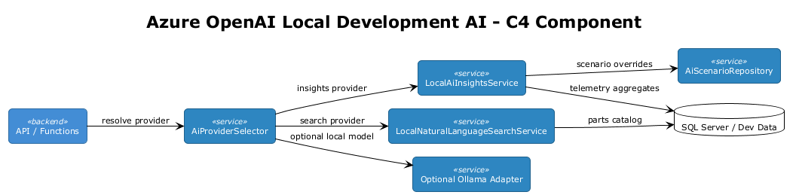
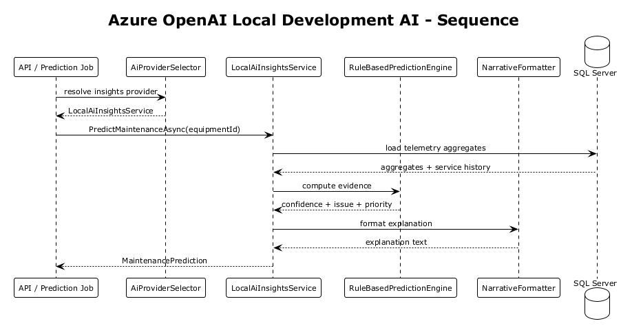
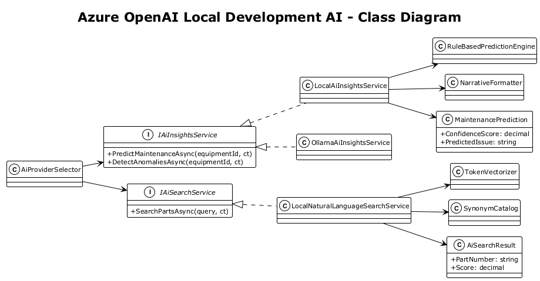

# Azure OpenAI Local Development AI — Detailed Design

## 1. Overview

**Source:** `docs/local-development-strategy.md` Section 4.3 identifies Azure OpenAI Service as a dependency without an official local emulator and recommends a mock service by default.

Azure OpenAI appears in the Fleet Hub architecture in two distinct ways:

- natural-language parts search
- AI-driven maintenance insights and anomaly narratives

Local development needs those features to behave meaningfully without making outbound cloud calls, while keeping the same API contracts that the frontend and batch jobs already expect.

**Scope:** introduce a development-only AI provider stack that keeps the production interfaces intact but swaps Azure OpenAI for deterministic local implementations by default, with an optional Ollama adapter for developers who want a higher-fidelity local model.

**Goals:**

- zero required cloud dependency for AI features in local development
- stable contracts for parts search and maintenance insight endpoints
- deterministic responses suitable for integration tests
- optional higher-fidelity local model integration without changing application code

**References:**

- [Local Development Strategy](../../local-development-strategy.md)
- [ADR-0001 Azure OpenAI AI-Powered Features](../../adr/integration/0001-azure-openai-ai-powered-features.md)
- [Feature 04 Parts & Ordering](../04-parts-ordering/README.md)
- [Feature 06 AI Insights](../06-ai-insights/README.md)
- [Design 14 Telemetry Alert Pipeline Unification](../14-telemetry-alert-pipeline-unification/README.md)

> **Naming convention:** all development-only types use the `Dev*` prefix (e.g., `DevAiInsightsService`, `DevNaturalLanguageSearchService`) to match the existing codebase convention established by `DevAuthHandler`.

## 2. Architecture

### 2.1 Runtime Components

The local replacement is split into four major pieces:

- `AiProviderSelector` chooses mock, rule-based, or optional Ollama-backed providers
- `DevAiInsightsService` produces deterministic maintenance predictions and anomaly narratives
- `DevNaturalLanguageSearchService` approximates semantic search using tokenization, synonym expansion, and weighted ranking
- `AiScenarioRepository` supplies repeatable seeded scenarios for tests and UI development



### 2.2 Canonical Prediction Flow

1. The API or prediction batch job requests AI insights for an equipment item.
2. `AiProviderSelector` resolves the configured local mode.
3. `DevAiInsightsService` loads telemetry aggregates and service history.
4. `RuleBasedPredictionEngine` computes confidence and issue candidates.
5. `NarrativeFormatter` creates the explanation text returned to the API.
6. Results are cached briefly for local responsiveness and deterministic test behavior.



### 2.3 Class Diagram



## 3. Components, Types, and Classes

### 3.1 Provider Selection

#### `AiProviderMode`

- **Type:** enum
- **Values:**
  - `Mock`
  - `RuleBased`
  - `Ollama`
- **Purpose:** controls which local implementation is active

#### `AiProviderSelector`

- **Type:** composition service
- **Responsibility:** resolves the active AI providers from configuration
- **Rules:**
  - default to `RuleBased` for insights and `Mock` for narrative embellishment
  - use `Ollama` only when explicitly enabled
  - never call Azure OpenAI when `IHostEnvironment.IsDevelopment()` and local mode is enabled

### 3.2 Insights Services

#### `IAiInsightsService`

- **Type:** application boundary
- **Responsibility:** returns predictive maintenance and anomaly insight contracts used by controllers and batch jobs
- **Key members:**

```csharp
public interface IAiInsightsService
{
    Task<MaintenancePrediction> PredictMaintenanceAsync(Guid equipmentId, CancellationToken ct = default);
    Task<IReadOnlyList<AnomalyInsight>> DetectAnomaliesAsync(Guid equipmentId, CancellationToken ct = default);
}
```

#### `DevAiInsightsService`

- **Type:** default development implementation
- **Responsibility:** coordinates telemetry loading, rule evaluation, narrative formatting, and optional scenario overrides
- **Behavior:**
  - checks `AiScenarioRepository` for an explicit seeded response
  - otherwise computes a deterministic result from telemetry aggregates
  - formats the human-readable explanation without an LLM by default

#### `RuleBasedPredictionEngine`

- **Type:** domain service
- **Responsibility:** converts telemetry and service-history aggregates into a prediction score and recommended action
- **Inputs:**
  - temperature deviation
  - fuel variance
  - repeated fault counts
  - days since last service
- **Output:** `PredictionEvidence`

#### `NarrativeFormatter`

- **Type:** formatter service
- **Responsibility:** turns evidence into explanation text such as:
  - predicted issue
  - confidence summary
  - recommended action
  - priority reason

This keeps the API payload shape useful for the frontend even without an LLM.

#### `OllamaAiInsightsService`

- **Type:** optional development implementation
- **Responsibility:** calls a local Ollama endpoint for richer explanation text or search expansion
- **Constraint:** optional only; the default local experience must not require Ollama

### 3.3 Parts Search Services

#### `IAiSearchService`

- **Type:** application boundary
- **Responsibility:** supports natural-language parts search
- **Key member:**

```csharp
public interface IAiSearchService
{
    Task<IReadOnlyList<AiSearchResult>> SearchPartsAsync(string query, CancellationToken ct = default);
}
```

#### `DevNaturalLanguageSearchService`

- **Type:** default development implementation
- **Responsibility:** approximates semantic parts search without embeddings
- **Pipeline:**
  - normalize query text
  - tokenize and stem words
  - expand terms from `SynonymCatalog`
  - issue SQL or in-memory filtering query
  - re-rank matches using weighted lexical similarity and equipment compatibility

#### `TokenVectorizer`

- **Type:** helper class
- **Responsibility:** converts query and catalog fields into weighted token maps
- **Why used:** gives a deterministic, embedding-free approximation of relevance scoring

#### `SynonymCatalog`

- **Type:** static data service
- **Responsibility:** maps domain terms such as:
  - `hydraulic cylinder -> ram, actuator`
  - `bucket tooth -> tooth, edge tooth`
  - `engine oil filter -> oil filter, filter`

This preserves some of the value of natural language search locally.

### 3.4 Seeded Scenario Support

#### `AiScenarioRecord` (DbContext Entity)

- **Type:** EF Core entity registered in `FleetHubDbContext`
- **Responsibility:** returns deterministic scenario overrides for development demos and tests
- **Persistence:** add `DbSet<AiScenarioRecord>` to `FleetHubDbContext`, consistent with the existing entity access pattern

> **Architectural note:** following the established codebase pattern, scenarios are accessed via `_db.AiScenarioRecords` directly rather than through a separate repository abstraction.

#### `AiScenarioRecord`

- **Type:** persistence model
- **Fields:**
  - `Guid EquipmentId`
  - `string ScenarioType`
  - `string PredictedIssue`
  - `decimal ConfidenceScore`
  - `string RecommendedAction`

### 3.5 DataSeeder Integration

AI scenarios should reference the same seeded equipment used by the rest of the application. The existing `DataSeeder` (`src/backend/IronvaleFleetHub.Api/Data/DataSeeder.cs`) already seeds:

- **3 AI predictions** for equipment items with confidence scores 0.87, 0.72, 0.45 and priorities High, Medium, Low
- **2 anomaly detections** (TemperatureAnomaly, FuelAnomaly)
- **7 days of telemetry** for the first 3 equipment items (temperature 80–110°C, fuel 40–90%)
- **5 equipment model thresholds** (MaxTemperature, MaxFuelConsumptionRate, MaxOperatingHoursPerDay)

`DevAiInsightsService` should use this data directly. Example seeded scenario mappings:

| Equipment ID | Equipment Name | Expected Scenario |
|-------------|----------------|-------------------|
| `c1b2c3d4-0001-*` | CAT 320 Excavator #1 | High confidence (0.87) — temperature trending above threshold |
| `c1b2c3d4-0002-*` | Komatsu PC210 Excavator | Medium confidence (0.72) — NeedsService status, fuel variance |
| `c1b2c3d4-0003-*` | Volvo L120H Loader | Low confidence (0.45) — limited telemetry data |
| `c1b2c3d4-0005-*` | Deere 410L Backhoe | Cold start — OutOfService, fewer than 30 days telemetry |

Additional scenario records should be added to `DataSeeder.SeedAsync()` to provide repeatable test fixtures alongside the existing predictions, rather than a separate JSON file or table.

### 3.5 Result Contracts and Option Types

#### `MaintenancePrediction`

- **Type:** API contract
- **Fields:**
  - `Guid EquipmentId`
  - `decimal ConfidenceScore`
  - `string PredictedIssue`
  - `string RecommendedAction`
  - `string Priority`
  - `string Explanation`

#### `AnomalyInsight`

- **Type:** API contract
- **Fields:**
  - `string Metric`
  - `decimal Baseline`
  - `decimal CurrentValue`
  - `decimal DeviationPercent`
  - `string Severity`
  - `string Explanation`

#### `AiSearchResult`

- **Type:** API contract
- **Fields:**
  - `Guid PartId`
  - `string PartNumber`
  - `string Description`
  - `decimal Score`
  - `string MatchReason`

#### `DevAiOptions`

- **Type:** configuration class bound via `IConfiguration`

```csharp
public sealed class DevAiOptions
{
    public bool Enabled { get; set; } = true;
    public AiProviderMode InsightsMode { get; set; } = AiProviderMode.RuleBased;
    public AiProviderMode SearchMode { get; set; } = AiProviderMode.Mock;
    public bool EnableOllama { get; set; }
    public string OllamaBaseUrl { get; set; } = "http://localhost:11434";
    public int CacheSeconds { get; set; } = 30;
}
```

> **Configuration pattern:** following the existing codebase convention, configuration values are read from `builder.Configuration` in `Program.cs` rather than injected via `IOptions<T>`.

**`appsettings.Development.json` additions:**

```json
{
  "DevAi": {
    "Enabled": true,
    "InsightsMode": "RuleBased",
    "SearchMode": "Mock",
    "EnableOllama": false,
    "OllamaBaseUrl": "http://localhost:11434",
    "CacheSeconds": 30
  }
}
```

## 4. Detailed Behavior

### 4.1 Predictive Maintenance

- Load the last 30 days of telemetry aggregates when available.
- If fewer than 30 days exist, return a low-confidence result with `Priority = Low` and an explanation that the equipment is in cold-start mode.
- Apply deterministic scoring based on thresholds already documented in the AI insights design.
- Format the response so the frontend still receives a human-readable recommendation.

### 4.2 Anomaly Detection

- Temperature anomalies trigger when readings exceed the rolling mean by more than 2 standard deviations.
- Fuel anomalies trigger when current usage exceeds the 7-day baseline by more than 30%.
- Explanation text comes from `NarrativeFormatter`, not from a remote model.

> **Integration with AlertEvaluatorService:** the existing `AlertEvaluatorService` already evaluates temperature and fuel thresholds to create `Alert` entities. Anomaly detection in this design **supplements** rather than replaces alert evaluation. `AlertEvaluatorService` creates binary alerts (threshold exceeded or not), while `DevAiInsightsService` provides richer anomaly context (deviation percentage, severity, explanation text). The two services share the same `EquipmentModelThreshold` data seeded by `DataSeeder`.

### 4.3 Parts Search

- Query text is normalized and tokenized.
- `SynonymCatalog` expands domain-specific equivalents.
- A SQL or in-memory candidate set is loaded from part descriptions, numbers, and compatibility tags.
- `TokenVectorizer` calculates a weighted similarity score.
- Results include a `MatchReason` field so developers can understand why a part ranked highly.

### 4.4 Optional Ollama Mode

- If enabled, `OllamaAiInsightsService` or an Ollama-backed search expander may enhance explanation text.
- If the Ollama endpoint is unavailable, the selector falls back to the default local provider (`DevAiInsightsService` or `DevNaturalLanguageSearchService`) and logs a warning.
- No feature should fail hard because Ollama is missing.

## 5. Acceptance Tests

> **Testing approach:** tests use `ApiWebApplicationFactory` with `DevAiInsightsService` and `DevNaturalLanguageSearchService` registered. The seeded telemetry and equipment data from `DataSeeder` provides deterministic inputs for all test scenarios.

### 5.1 Deterministic Prediction

- Given seeded telemetry with a high temperature deviation, when `PredictMaintenanceAsync` is called for equipment `c1b2c3d4-0001-0000-0000-000000000001` (CAT 320 Excavator #1), then the returned confidence score, issue text, and priority match the expected deterministic output.

**How to verify:** call `IAiInsightsService.PredictMaintenanceAsync(equipmentId)` in an integration test and assert `result.ConfidenceScore >= 0.8m`, `result.Priority == "High"`, and `result.PredictedIssue` is non-empty.

### 5.2 Cold Start Behavior

- Given fewer than 30 days of telemetry, when `PredictMaintenanceAsync` is called, then the result is low confidence and explicitly indicates cold-start mode.

**How to verify:** create a new equipment item with no telemetry history, call `PredictMaintenanceAsync`, and assert `result.ConfidenceScore < 0.5m` and `result.Explanation` contains "cold-start" or equivalent indicator.

### 5.3 Natural Language Parts Search

- Given the query `hydraulic ram for 320 excavator`, when `SearchPartsAsync` is called, then results include hydraulic cylinder parts with a non-zero score and a `MatchReason` derived from synonym expansion.

**How to verify:** call `IAiSearchService.SearchPartsAsync("hydraulic ram for 320 excavator")` and assert the results contain a part matching `HYD-PUMP-001` (Hydraulic Main Pump from `DataSeeder`) with `Score > 0` and `MatchReason` mentioning "synonym" or "hydraulic".

### 5.4 Ollama Fallback

- Given `EnableOllama = true` but the local endpoint is unreachable, when insights are requested, then the service returns the rule-based result and records a warning instead of failing the request.

**How to verify:** configure `DevAiOptions.EnableOllama = true` with `OllamaBaseUrl = "http://localhost:99999"` (unreachable port), call `PredictMaintenanceAsync`, and assert a successful result is returned. Verify the test log output contains a warning-level message about Ollama being unreachable.

## 6. Security Considerations

- Local mode must disable outbound Azure OpenAI calls by default. The `AiProviderSelector` enforces this when `IHostEnvironment.IsDevelopment()` and `DevAiOptions.Enabled` is true.
- Optional Ollama mode should stay on `localhost` unless explicitly configured otherwise.
- AI explanations must not leak cross-tenant data when aggregating telemetry (see Section 7).
- Scenario fixtures and cached results should stay in development-only stores.

## 7. Multi-Tenancy Considerations

- **`AiScenarioRecord`** is a development-only entity. It is **not tenant-scoped** — scenarios are shared across all organizations for development convenience. Developers can seed scenarios for equipment from both Org1 and Org2.
- **Prediction and anomaly queries** operate on telemetry data that is already tenant-filtered by `FleetHubDbContext` global query filters. When `DevAiInsightsService` queries `_db.TelemetryEvents.Where(t => t.EquipmentId == equipmentId)`, the `OrganizationId` filter from `ITenantContext` applies automatically.
- **Parts search** queries `_db.Parts` which is a shared catalog (parts are not tenant-scoped in the current data model). This is correct — parts are available across organizations.
- **DevAuthHandler context:** the dev user is authenticated as Org1 (`a1b2c3d4-0001-*`). AI predictions for Org2 equipment will not be visible through the API unless the developer switches active organization via the `X-Active-Organization` header.

## 8. DI Registration

```csharp
if (builder.Environment.IsDevelopment())
{
    var aiConfig = builder.Configuration.GetSection("DevAi");
    var aiEnabled = aiConfig.GetValue<bool>("Enabled");

    if (aiEnabled)
    {
        builder.Services.AddScoped<AiProviderSelector>();
        builder.Services.AddScoped<IAiInsightsService, DevAiInsightsService>();
        builder.Services.AddScoped<IAiSearchService, DevNaturalLanguageSearchService>();
        builder.Services.AddScoped<RuleBasedPredictionEngine>();
        builder.Services.AddScoped<NarrativeFormatter>();
        builder.Services.AddScoped<TokenVectorizer>();
        builder.Services.AddSingleton<SynonymCatalog>();

        var enableOllama = aiConfig.GetValue<bool>("EnableOllama");
        if (enableOllama)
        {
            builder.Services.AddScoped<OllamaAiInsightsService>();
            builder.Services.AddHttpClient("Ollama", client =>
            {
                client.BaseAddress = new Uri(aiConfig["OllamaBaseUrl"] ?? "http://localhost:11434");
            });
        }
    }
}
```

In production, `IAiInsightsService` and `IAiSearchService` are registered with Azure OpenAI-backed implementations. The interface contracts remain identical.

## 9. Open Questions

1. Should the synonym catalog live in code, JSON, or a database table for easier updates?
2. Is the rule-based local search good enough, or do we want to support local embeddings in a later iteration?
3. Should the optional Ollama integration cover only explanation text, or also parts-search query expansion?
